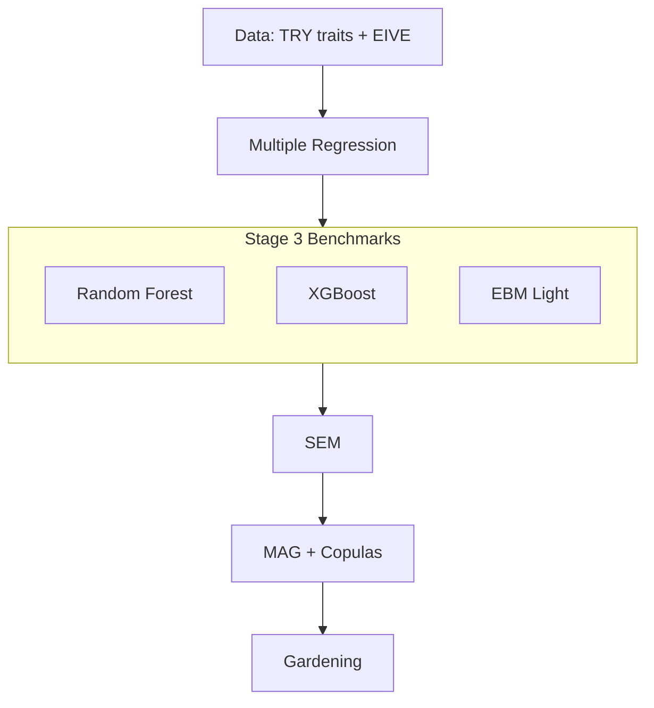

# From Plant Traits to Gardening Requirements

<p align="left">
  <a href="LICENSE"></a>
  
  
  
</p>
<p>
  <strong>Purpose:</strong> Build an initial model that maps TRY curated species‑level means (six numeric traits: Leaf area (LA), Nmass, LMA, Plant height (H), Diaspore/Seed mass (SM), Wood density (SSD) — Díaz et al., 2022) to EIVE (Ecological Indicator Values for Europe) indicators (0–10), and then convert those predictions into simple, expert‑aligned gardening recommendations with quantified uncertainty. These six traits are high‑quality and widely available, but on their own they are not sufficient to adequately predict all five EIVE axes. This first build is explicitly exploratory and diagnostic: we systematically measure what the six traits can and cannot explain, so we can identify the missing ingredients with evidence rather than guesswork. Accordingly, we plan to expand the model in upcoming iterations with additional traits and data as outlined in <a href="#future-developments">Future Developments</a>.
</p>

<p>
  This predictive model is especially useful for species with measured traits but no EIVE entry: the model predicts EIVE from traits and outputs clear recommendations with uncertainty. 
</p>

### Pipeline at a Glance



### Core Traits (Initial Model)

| Abbrev | Trait                   |
|:------:|-------------------------|
|  LA    | Leaf area               |
| Nmass  | Leaf nitrogen per mass  |
|  LMA   | Leaf mass per area      |
|   H    | Plant height            |
|  SM    | Diaspore/Seed mass      |
|  SSD   | Wood density            |


### Final SEM Equations (Adopted)

Composites
- LES_core (pure): negative LMA, positive Nmass (trained as a composite; scaled within train folds)
- SIZE: +logH + logSM (used for L/T/R; M/N use logH and logSM directly)

Equations (pwSEM; Run 7c adopted)
```
# Light (L): non‑linear GAM (rf_plus; deconstructed SIZE)
L ~ s(LMA,k=5) + s(logSSD,k=5) + s(logH,k=5) + s(logLA,k=5) + Nmass + LMA:logLA + t2(LMA,logSSD,k=c(5,5)) + ti(logLA,logH,bs=c('ts','ts'),k=c(5,5)) + ti(logH,logSSD,bs=c('ts','ts'),k=c(5,5))

# Temperature (T) and Reaction (R): linear SIZE
T ~ LES_core + SIZE + logSSD + logLA
R ~ LES_core + SIZE + logSSD + logLA

# Moisture (M) and Nutrients (N): deconstructed SIZE
M ~ LES_core + logH + logSM + logSSD + logLA
N ~ LES_core + logH + logSM + logSSD + logLA + LES_core:logSSD
```

Notes
- Transforms: log10 for LA, H, SM, SSD; predictors standardized within training folds.
- Interaction: LES_core:logSSD kept for N only (optional for T; not adopted). L uses `LMA:logLA` and two 2‑D smooths `ti(logLA,logH)` and `ti(logH,logSSD)`; SIZE is deconstructed to `s(logH)` for L.
- Group moderation: SSD→{L,T,R} is strongest in woody groups; treat SSD paths as woody‑only in strict d‑sep, with global SSD→{M,N}.

| Axis | SEM R² (±SD) | XGBoost R² (±SD) | Random Forest R² (±SD) | EBM R² (±SD) | Best |
|:----:|:------------:|:-----------------:|:-----------------------:|:-------------:|:----:|
| L | 0.300±0.077 | 0.297±0.046 | 0.321±0.039 | 0.300±0.044 | RF |
| T | 0.231±0.065 | 0.168±0.051 | 0.209±0.048 | — | SEM |
| M | 0.408±0.081 | 0.217±0.047 | 0.249±0.054 | — | SEM |
| R | 0.155±0.060 | 0.044±0.023 | 0.062±0.040 | — | SEM |
| N | 0.425±0.076 | 0.404±0.047 | 0.412±0.044 | — | SEM |

> [!NOTE]
> Planned expansions include root traits (SRL, diameter, RTD, N), light‑specific leaf traits (thickness, N per area), categorical syndromes (woodiness, growth form, phenology, mycorrhiza), and climate/soil covariates — see [Future Developments](#future-developments).

## Table of Contents
- [Quick Start — Non‑EIVE Species](#quick-start--non-eive-species)
- [Data Methodology](#data-methodology)
- [Multiple Regression — Predictive Baseline](#multiple-regression--predictive-baseline)
- [Structural Equation Modeling (SEM) — Structure, Fit, and Final Forms](#structural-equation-modeling-sem--structure-fit-and-final-forms)
- [Mixed Acyclic Graph (MAG) + Copulas — Residual Dependence for Joint Decisions](#mixed-acyclic-graph-mag--copulas--residual-dependence-for-joint-decisions)
- [Gardening Plan — Simple, Confidence‑Aware Recommendations](#gardening-plan--simple-confidence-aware-recommendations)
  - [How Gardening Requirements Are Derived](#how-gardening-requirements-are-derived)
  - [What The Outputs Contain](#what-the-outputs-contain)
- [Reproducibility — Effective Settings](#reproducibility--effective-settings)
- [Performance & Diagnostics](#performance--diagnostics)
- [Bottom Line](#bottom-line)
- [Future Developments](#future-developments)
  - [Light — Multi‑Regression vs SEM](#light--multi-regression-vs-sem)
  - [Future Additions To Improve L (beyond the six)](#future-additions-to-improve-l-beyond-the-six)
  - [Candidate Additions for L (table)](#candidate-additions-for-l-table)
  - [Temperature (T) — Gaps and Remedies](#temperature-t--gaps-and-remedies)
  - [Candidate Additions for T (table)](#candidate-additions-for-t-table)
  - [Reaction / Soil pH (R) — Gaps and Remedies](#reaction--soil-ph-r--gaps-and-remedies)
  - [Candidate Additions for R (table)](#candidate-additions-for-r-table)
  - [Root Traits — Future Additions](#root-traits--future-additions)
  - [Candidate Additions for Root Traits (table)](#candidate-additions-for-root-traits-table)
- [Traits → Strategies and Services](#traits--strategies-and-services)
- [License](#license)
- [References](#references)

## Quick Start — Non‑EIVE Species
- Prepare a CSV with columns: `LMA`, `Nmass`, `LeafArea`, `PlantHeight`, `DiasporeMass`, `SSD`. One row per species; include an identifier column (e.g., `Species`) if desired.
- Generate predictions from traits (MAG equations):

```bash
Rscript src/Stage_5_Apply_Mean_Structure/apply_mean_structure.R \
  --input_csv data/new_traits.csv \
  --output_csv results/mag_predictions_no_eive.csv \
  --equations_json results/MAG_Run8/mag_equations.json \
  --composites_json results/MAG_Run8/composite_recipe.json
```

- Turn predictions into gardening requirements (with joint options):

```bash
Rscript src/Stage_6_Gardening_Predictions/calc_gardening_requirements.R \
  --predictions_csv results/mag_predictions_no_eive.csv \
  --output_csv results/gardening/garden_requirements_no_eive.csv \
  --bins 0:3.5,3.5:6.5,6.5:10 \
  --borderline_width 0.5 \
  --copulas_json results/MAG_Run8/mag_copulas.json \
  --metrics_dir artifacts/stage4_sem_pwsem_run7_pureles \
  --nsim_joint 20000 \
  --joint_requirement L=high,M=med,R=med \
  --joint_min_prob 0.6
```

Optional — Group‑Aware Uncertainty and Copulas
- Why: residual scales (σ) and axis co‑movement (ρ) differ by groups such as mycorrhiza or woodiness; using group‑specific σ and ρ improves joint‑probability calibration without changing the means.
- How to score presets or a single gate with group‑aware σ + ρ:
  - Ensure the copulas JSON contains per‑group matrices (run Stage 4 with `--group_col` once; see below).
  - Add to either joint command above:
    - `--group_col Myco_Group_Final --group_ref_csv artifacts/model_data_complete_case_with_myco.csv --group_ref_id_col wfo_accepted_name --group_ref_group_col Myco_Group_Final`
    - or for woodiness: `--group_col Woodiness --group_ref_group_col Woodiness` (same reference CSV).
- Notes: When `--group_col` is supplied, Stage 6 uses per‑group σ (from Run 7 CV preds) and per‑group ρ from `mag_copulas.json` if present; otherwise it falls back to the global matrices. 

<details>
<summary>Advanced: score multiple preset scenarios and annotate the best‑passing</summary>

```bash
Rscript src/Stage_6_Gardening_Predictions/joint_suitability_with_copulas.R \
  --predictions_csv results/mag_predictions_no_eive.csv \
  --copulas_json results/MAG_Run8/mag_copulas.json \
  --metrics_dir artifacts/stage4_sem_pwsem_run7_pureles \
  --presets_csv results/gardening/garden_joint_presets_defaults.csv \
  --nsim 20000 \
  --summary_csv results/gardening/garden_joint_summary.csv
```

</details>

<p align="right"><a href="#from-plant-traits-to-gardening-requirements">Back to top ↑</a></p>

---

## Data Methodology

Sources and matching
- Traits: TRY curated species‑level means (six numeric traits): Leaf area (LA), Nmass, LMA, Plant height (H), Diaspore/Seed mass (SM), Wood density (SSD) (Díaz et al., 2022).
- Indicators: Ecological Indicator Values for Europe (EIVE) 1.0 — continuous 0–10 indicator values for five environmental gradients: Light (L), Temperature (T), Moisture (M), Reaction/soil pH (R), and Nutrients (N). EIVE quantifies each species’ realized niche position in European vegetation, harmonizing and extending the classic Ellenberg system to a continuous European scale. Higher values indicate preference toward the higher end of each gradient (e.g., high‑light, warmer, wetter, more alkaline, more fertile sites) (Dengler et al., 2023; Dengler et al., 2024 IAVS).
- Name alignment: WFO‑accepted names via `data/EIVE/EIVE_TaxonConcept_WFO_EXACT.csv`; unified normalization (hybrid sign ×/" x ", diacritics, whitespace/case).

Datasets (assembled)
- `artifacts/traits_matched.{rds,csv}` — ~5,800 rows; 5,799 unique species matched to EIVE.
- `artifacts/model_data_complete_case.csv` — 1,069 spp. with all six traits present (complete‑case; SSD combined).
- `artifacts/model_data_complete_case_observed_ssd.csv` — 389 spp. requiring observed SSD only (sensitivity set).
- SSD provenance in complete‑case: 389 observed; 680 imputed (from LDMC) and used via `SSD combined`; predictor column `SSD used` equals observed when present else imputed.

Assumptions and pipeline scripts
- Assumptions: species linked via WFO‑accepted names (`data/EIVE/EIVE_TaxonConcept_WFO_EXACT.csv`); curated TRY means provide six numeric traits per species; EIVE main table carries five indicator columns and derivatives (e.g., `.nw3`, `.n`).
- Extraction/assembly scripts: Excel→CSV converter (`src/Stage_1_Data_Extraction/convert_excel_to_csv.py`), EIVE→WFO normalization (`src/Stage_1_Data_Extraction/normalize_eive_to_wfo_EXACT.R`), TRY↔EIVE matcher (`src/Stage_1_Data_Extraction/match_trycurated_species_to_eive_wfo.R`), model dataset assembly (`src/Stage_2_Data_Processing/assemble_model_data.R`).
- Coverage snapshot (repo state): 5,799 unique species matched; complete‑case 1,069 spp (SSD combined) with SSD provenance 389 observed / 680 imputed; observed‑SSD‑only sensitivity set 389 spp.

Preprocessing (standard across stages unless noted)
- Transforms: log10 for LA, H, SM, SSD (small positive offsets recorded); z‑score predictors in train folds.
- Targets: EIVEres‑{L,T,M,R,N} (0–10); optional logit transform for lavaan fits.
- Validation: repeated, stratified CV — 5×5 (Stage 1, early SEM) or 10×5 (later SEM); seed 42/123 as recorded per run; no winsorization; no replicate‑aware weights by default.

Anchoring to prior work
- Extends Shipley et al. (2017, JVS) from ordinal Ellenberg ranks (1–9) with four traits to continuous EIVE (0–10) with six traits and structured SEM; leverages global trait spectra (Díaz et al., 2022) and wood economics (Chave et al., 2009) for SSD interpretation.

<p align="right"><a href="#from-plant-traits-to-gardening-requirements">Back to top ↑</a></p>

---

## Multiple Regression — Predictive Baseline

Setup
- Script: `src/Stage_3_Multi_Regression/run_multi_regression.R`; input: complete‑case (1,069 spp.).
- Predictors: LA, Nmass, LMA, H, SM, SSD used (Díaz et al., 2022); transforms/log‑z as above (cf. Shipley et al., 2017); CV 5×5.
- Targets: EIVEres‑{L,T,M,R,N} (Dengler et al., 2023; IAVS 2024).

Cross‑validated performance (mean ± SD)
- L: R² 0.152±0.045; RMSE 1.407±0.058; MAE 1.048±0.037 (n≈1,068)
- T: R² 0.102±0.039; RMSE 1.260±0.053; MAE 0.924±0.028 (n≈1,069)
- M: R² 0.130±0.049; RMSE 1.401±0.060; MAE 1.063±0.040 (n≈1,066)
- R: R² 0.036±0.029; RMSE 1.518±0.033; MAE 1.161±0.023 (n≈1,050)
- N: R² 0.356±0.039; RMSE 1.508±0.048; MAE 1.223±0.041 (n≈1,049)

Signals (standardized directions)
- L: +LMA, −Height; small −LA, −SM; +SSD (small)
- T: +Height, +SM (modest)
- M: +Height, +LA; −SSD, −SM; slight −LMA
- R: weak/noisy
- N: +Height, +LA, +Nmass; −LMA, −SSD

Additional diagnostics
- Out‑of‑fold correlations (r, ρ): L r=0.391 (ρ=0.434), T r=0.320 (ρ=0.310), M r=0.361 (ρ=0.366), R r=0.196 (ρ=0.169), N r=0.597 (ρ=0.604).
- Hit rates (|pred−true| in EIVE units):
  - L: ±1 → 60.4%; ±2 → 86.9%
  - T: ±1 → 65.9%; ±2 → 87.2%
  - M: ±1 → 57.9%; ±2 → 86.2%
  - R: ±1 → 54.7%; ±2 → 82.4%
  - N: ±1 → 47.1%; ±2 → 81.8%
- Collinearity: VIFs ≈ 1.3–2.4 across predictors — low.

Comparison to 2017 (Shipley et al., 2017)
- 2017 JVS (ordinal Ellenberg, four traits) reported mean predictive errors ≈ 1.3 (Light), 1.8 (Moisture), 1.8 (Nutrients), with ≈70–90% within ±1 rank and ≥90% within ±2 ranks.
- Our continuous EIVE baseline shows broadly comparable error magnitudes (RMSE) and moderate r, with lower “within‑1” hit rates expected from continuous targets and different scales. Ordinal comparators on binned EIVE (1–10 and 1–9) yield similar errors and bring hit rates closer to 2017, supporting that most disparity arises from target scaling rather than model misspecification.

Hit‑rate vs 2017 (ordinal Ellenberg)
```
Axis  ours±1  2017±1   ours±2  2017±2
L        60%    70–90%     87%     ≥90%
M        58%    70–90%     86%     ≥90%
N        47%    70–90%     82%     ≥90%

Notes: 2017 modeled L/M/N only; T and R not available. Our targets are continuous EIVE (0–10), so ±1/±2 are stricter than ordinal ranks.
```

Takeaway
- Feasible trait→indicator mapping with typical absolute error ≈1.0–1.2; strongest for N; weakest for R. Forms the predictive baseline for SEM.

Artifacts and reproducibility
- Artifacts: predictions, coefficients, VIFs, and metrics per target under `artifacts/stage3_multi_regression/eive_lm_{L,T,M,R,N}_*`.
- Repro cmd: `Rscript src/Stage_3_Multi_Regression/run_multi_regression.R --input_csv artifacts/model_data_complete_case.csv --targets=all --seed=123 --repeats=5 --folds=5 --stratify=true --standardize=true --winsorize=false --weights=none --min_records_threshold=0`.

<p align="right"><a href="#from-plant-traits-to-gardening-requirements">Back to top ↑</a></p>

---


## Structural Equation Modeling (SEM) — Structure, Fit, and Final Forms

Core constructs and forms
- Engine: Stage 2 d‑sep testing now uses pwSEM; prior piecewiseSEM results remain as legacy baselines for comparison.
  - Legacy runner archived: `src/Stage_4_SEM_Analysis/archive_piecewise/run_sem_piecewise.R`. The top‑level `run_sem_piecewise.R` now emits a deprecation notice; use `run_sem_pwsem.R` instead.
- Latent/composite axes: LES_core (−LMA, +Nmass) and SIZE (+logH, +logSM). CV uses training‑only composites.
- Canonical y‑equations (Run 7; pwSEM):
  - Light (L; non‑linear GAM, rf_plus; Run 7c adopted): `y ~ s(LMA,k=5) + s(logSSD,k=5) + s(logH,k=5) + s(logLA,k=5) + Nmass + LMA:logLA + t2(LMA,logSSD,k=c(5,5)) + ti(logLA,logH,bs=c('ts','ts'),k=c(5,5)) + ti(logH,logSSD,bs=c('ts','ts'),k=c(5,5))`.
  - Temperature (T) and Reaction (R): `y ~ LES + SIZE + logSSD + logLA` (linear SIZE).
  - Moisture (M) and Nutrients (N): `y ~ LES + logH + logSM + logSSD + logLA` (deconstructed SIZE); N adds `LES:logSSD`.
  - Measurement: LES is “pure” (negLMA, Nmass). `logLA` enters as a direct predictor for all targets.
  - Note (CV vs d‑sep): The equations above are the predictive CV forms. For d‑sep/inference, we enforce woody‑only SSD→{L,T,R} and global SSD→{M,N} when testing independence (full‑data pwSEM), consistent with Run 2 multigroup evidence. See Run 7c summary for L updates.

Key run decisions and evidence
- Direct SSD effects (Run 2; pwSEM): Include SSD→M and SSD→N globally. For L/T/R, include SSD→y for woody only; optional add SSD→R for non‑woody if prioritizing coefficients/AIC, but strict d‑sep recommends woody‑only. Multigroup d‑sep and equality tests show heterogeneity with stronger SSD effects in woody groups (see Run 2 summary).
- Deconstructed SIZE for M/N (Run 2): Use logH and logSM directly in M/N y‑equations — improves CV to R²≈0.398 (M) and 0.416 (N) under the same protocol; matches piecewise results while pwSEM d‑sep still rejects for M/N due to structural claims and supports group‑specific slopes.
- Co‑adapted LES in lavaan (Run 4): Replace directed inputs into LES with covariances (LES↔SIZE, LES↔logSSD); large ΔAIC/ΔBIC improvements across L/M/R/N despite modest absolute fit indices (Shipley & Douma, 2020; Douma & Shipley, 2021).
- Interaction policy (Run 5 + 6P): Keep LES:logSSD for N (tiny CV gain; IC modestly favorable; phylo‑supported). Optional for T. Omit for L/M/R (no CV benefit; IC penalties) (Shipley & Douma, 2020).
- Nonlinearity (Run 6): Reject s(logH) splines for M/R/N — consistent CV degradation and no IC support. Retain linear forms (cf. Kong et al., 2019).
- Non‑linear Light (Run 6→7; pwSEM): Adopt RF‑informed L equation with smooths in LMA/logSSD/SIZE/logLA plus `LMA:logLA` and `logH:logSSD`. Improves L CV to ≈0.289 (10×5 CV). Later updated in Run 7c to include `s(logH)` and two 2‑D smooths (`ti(logLA,logH)`, `ti(logH,logSSD)`), reaching ≈0.300.
- Refined measurement (Run 7): Adopt LES_core (negLMA,Nmass) and add logLA as a direct predictor for all targets. Improves M/N CV and strongly lowers piecewise full‑model AIC/BIC for M/N; neutral to slightly worse for L/T; mixed for R. Overall adopted (Douma & Shipley, 2021).

Run highlights 
- Run 1 baseline (CV; composites, seed=123, 5×5): piecewise outperformed lavaan proxies across axes — e.g., R² piecewise vs lavaan: L 0.224 vs 0.107; T 0.212 vs 0.103; M 0.342 vs 0.041; R 0.149 vs 0.024; N 0.371 vs 0.303. pwSEM d‑sep on full data agrees on mediation and improves p‑values via generalized covariance: L/T/R fit (C≈0.060/0.558/1.014; df=2; p≈0.971/0.756/0.602), while M/N are saturated (df=0). See `results/summaries/summarypwsem/stage_sem_run1_pwsem_summary.md`.
- Run 2 (WES‑backed SSD→{M,N,R}; woodiness groups; pwSEM): CV R² changes vs Run 1 are modest and concentrated in M/N due to deconstructing SIZE (M≈0.398, N≈0.416); L/T are essentially unchanged and R is near‑identical. Grouped lavaan fits remain below conventional thresholds (woody CFI≈0.67–0.76, RMSEA≈0.20–0.23; non‑woody CFI≈0.79–0.83, RMSEA≈0.14–0.17). Multigroup pwSEM d‑sep shows woody‑specific misfit for L/T/R (overall p≈0.076/0.0288/0.174; woody groups p≈0.026/0.055/0.016; non‑woody fit). See `results/summaries/summarypwsem/stage_sem_run2_pwsem_summary.md` for heterogeneity and per‑group p‑values.
  - Interpretation (Run 2; pwSEM): Split justified for L/T/M/N/R (woody vs others). Woody shows significant SSD effects across axes; non‑woody significant primarily for M/N (and small for R); semi‑woody remains non‑significant (n≈11). Final forms: SSD→{L,T,R} for woody only; SSD→{M,N} globally.
 - Run 3 (Mycorrhiza groups added; pwSEM): CV forms matched Run 2 (M/N deconstructed; L/T/R linear). Under these forms the d‑sep basis set is empty (no overall C/df). Equality tests detect heterogeneity for M/N/R (p_overall≈0.002/4.1e−7/0.038) but not for L/T (ns). CV metrics remain consistent with Run 2. See `results/summaries/summarypwsem/stage_sem_run3_pwsem_summary.md` for per‑group p‑values and details.
 - Interpretation (Run 3; pwSEM): Split justified for M/N/R; L/T not required. Signals concentrate in NM‑linked groups — Pure_NM significant for M/N/R; Pure_EM for M/N; Low_Confidence for T/R (treat cautiously).
  - Per‑group signals (Run 3; pwSEM; p_logSSD<0.05): T—Low_Confidence 0.0426; M—Pure_EM 0.0493, Pure_NM 9.14e−4; N—Facultative_AM_NM 4.84e−4, Pure_EM 0.00690, Pure_NM 1.15e−4; R—Low_Confidence 0.0123, Pure_NM 0.0315; L—none.
 - Run 4 (Co‑adapted LES↔SIZE in lavaan; reference; seed=42, 10×5 CV): multi‑group lavaan fit indices ranged roughly CFI 0.53–0.65; RMSEA 0.25–0.28; SRMR 0.16–0.22. Decisive information‑criterion gains vs Run 3: ΔAIC/BIC (Run 4 − Run 3) — L −468/−393; M −498/−422; R −443/−372; N −436/−361 — strongly favoring co‑adaptation. See canonical summary `results/summaries/summarypiecewise/stage_sem_run4_summary.md` (no pwSEM rerun for this stage).
- Run 5 (LES×logSSD interaction; pwSEM mirror; seed=123, 10×5 CV): Added `LES:logSSD` to y‑equations. CV metrics match piecewise (as expected under identical data/composites/CV); basis sets are often empty, so inference relies on equality tests and full‑model AIC. Policy unchanged: tiny gains for T and N; neutral/slight negatives for L/M/R. Adoption: keep for N; optional for T; omit for L/M/R. See `results/summaries/summarypwsem/stage_sem_run5_pwsem_summary.md`.
  - Heterogeneity (Run 5; pwSEM; p_overall): L 0.208; T 0.114; M 0.00221; R 0.0376; N 4.13e−7.
  - Per‑group signals (Run 5; pwSEM; p_logSSD<0.05): T—Low_Confidence 0.0426; M—Pure_EM 0.0493, Pure_NM 9.14e−4; N—Facultative_AM_NM 4.84e−4, Pure_EM 0.00690, Pure_NM 1.15e−4; R—Low_Confidence 0.0123, Pure_NM 0.0315; L—none.
- Run 6 (Nonlinearity via s(logH) in the legacy piecewise runs; seed=42, 10×5 CV): Introduced a spline on logH for M/R/N (with deconstructed SIZE for M/N). Strong CV degradation for M/R/N (e.g., M R² ↓ to ~0.13) confirms linear forms are superior. Full‑model IC sums also favor simpler models. Adoption: reject splines; keep linear equations.
- Run 6P (Phylogenetic GLS sensitivity): Brownian GLS on full data confirms coefficient sign stability (LES, SIZE/logH/logSM, logSSD) and supports the interaction policy (N yes; T optional). AIC_sum magnitudes differ from non‑phylo runs (different likelihood) — use for relative checks only.
 - Run 6 (L‑only GAM; pwSEM): Introduced RF‑informed non‑linear L with `s(LMA)`, `s(logSSD)`, `s(SIZE)`, `s(logLA)`, plus `LMA:logLA` and `logH:logSSD`; CV improved to R²≈0.279 (10×5; seed=123). Spec locked for Run 7.
 
### Model Selection Policy (Priority Order)
- **Cross‑validated performance (CV):** Primary. Prefer forms that improve repeated, stratified k×r CV (e.g., 10×5) with identical folds for paired testing. Look for practical gains (e.g., ΔR² ≥ ~0.01 with p<0.05) and stable error improvements (RMSE/MAE) before adoption.
- **Information criteria (IC):** Secondary. Use AIC/AICc on full‑data fits for models under the same likelihood/data (e.g., Brownian GLS). Lower is better; treat ΔAIC > 10 as decisive, 4–10 substantial, <2 negligible. Use BIC as a stronger parsimony check when relevant. For multi‑equation structures, report and compare summed IC.
- **lavaan fit indices:** Tertiary. CFI/RMSEA/SRMR provide descriptive context but do not override CV or IC unless indicating clear misspecification.
- **Tie‑breakers:** Favor simpler, interpretable forms; maintain coefficient sign stability and validated group policies; avoid interactions/smooths without predictive or IC support. Document exceptions.
- **Documented exception (L, Run 7c):** Adopted for predictive value (CV R² ≈ 0.300 vs 0.279 in Run 6; paired‑fold p≈0.001–0.002) despite worse phylo‑GLS AIC (≈11109 vs ≈11018). Keep Run 6 as the IC‑favoured alternative for inference.

#### Repro Checklist (Policy Tests)
- **Paired‑fold CV (A vs B):**
  - Use identical CV settings: `--seed`, `--repeats`, `--folds`, `--stratify`, `--standardize`, `--cluster`, `--group_var`, and the same `--input_csv`.
  - Example (L; 10×5; seed=123) — Candidate A (7c form):
    ```bash
    Rscript src/Stage_4_SEM_Analysis/run_sem_pwsem.R \
      --input_csv artifacts/model_data_complete_case_with_myco.csv \
      --target=L --seed=123 --repeats=5 --folds=10 --stratify=true --standardize=true \
      --cluster=Family --group_var=Woodiness \
      --les_components=negLMA,Nmass --add_predictor=logLA \
      --nonlinear=true --nonlinear_variant=rf_plus \
      --deconstruct_size_L=true \
      --add_interaction 'ti(logLA,logH),ti(logH,logSSD)' \
      --out_dir artifacts/cv_compare/L_candidateA_7c
    ```
  - Example (L; same folds) — Candidate B (simpler comparator; adjust flags to match the form you’re testing, keep CV flags identical):
    ```bash
    Rscript src/Stage_4_SEM_Analysis/run_sem_pwsem.R \
      --input_csv artifacts/model_data_complete_case_with_myco.csv \
      --target=L --seed=123 --repeats=5 --folds=10 --stratify=true --standardize=true \
      --cluster=Family --group_var=Woodiness \
      --les_components=negLMA,Nmass --add_predictor=logLA \
      --nonlinear=true --nonlinear_variant=rf_plus \
      --deconstruct_size_L=false \
      --add_interaction '' \
      --out_dir artifacts/cv_compare/L_candidateB_simple
    ```
  - Compare `sem_pwsem_L_metrics.json` from both `--out_dir`s. Quick paired tests in R (R² and RMSE):
    ```r
    library(jsonlite)
    a <- fromJSON('artifacts/cv_compare/L_candidateA_7c/sem_pwsem_L_metrics.json')
    b <- fromJSON('artifacts/cv_compare/L_candidateB_simple/sem_pwsem_L_metrics.json')
    fa <- a$metrics$per_fold[, c('rep','fold','R2','RMSE')]
    fb <- b$metrics$per_fold[, c('rep','fold','R2','RMSE')]
    x <- merge(fa, fb, by=c('rep','fold'), suffixes=c('_A','_B'))
    with(x, list(
      dR2 = t.test(R2_A - R2_B),
      dRMSE = t.test(RMSE_A - RMSE_B)
    ))
    ```
- **Information criteria (AIC) under phylogenetic GLS:**
  - Fit each candidate on full data with identical phylogeny settings:
    ```bash
    # Candidate A (7c)
    Rscript src/Stage_4_SEM_Analysis/run_sem_pwsem.R \
      --input_csv artifacts/model_data_complete_case_with_myco.csv \
      --target=L --repeats=1 --folds=2 --stratify=true --standardize=true \
      --cluster=Family --group_var=Woodiness \
      --les_components=negLMA,Nmass --add_predictor=logLA \
      --nonlinear=true --nonlinear_variant=rf_plus --deconstruct_size_L=true \
      --add_interaction 'ti(logLA,logH),ti(logH,logSSD)' \
      --phylogeny_newick data/phylogeny/eive_try_tree.nwk --phylo_correlation brownian \
      --out_dir artifacts/phylo_ic/L_candidateA_7c
    
    # Candidate B (simple)
    Rscript src/Stage_4_SEM_Analysis/run_sem_pwsem.R \
      --input_csv artifacts/model_data_complete_case_with_myco.csv \
      --target=L --repeats=1 --folds=2 --stratify=true --standardize=true \
      --cluster=Family --group_var=Woodiness \
      --les_components=negLMA,Nmass --add_predictor=logLA \
      --nonlinear=true --nonlinear_variant=rf_plus --deconstruct_size_L=false \
      --add_interaction '' \
      --phylogeny_newick data/phylogeny/eive_try_tree.nwk --phylo_correlation brownian \
      --out_dir artifacts/phylo_ic/L_candidateB_simple
    ```
  - Compare `sem_pwsem_L_full_model_ic_phylo.csv` (or similarly named IC export) from both `--out_dir`s:
    ```r
    icA <- read.csv('artifacts/phylo_ic/L_candidateA_7c/sem_pwsem_L_full_model_ic_phylo.csv')
    icB <- read.csv('artifacts/phylo_ic/L_candidateB_simple/sem_pwsem_L_full_model_ic_phylo.csv')
    aicA <- sum(icA$AIC); aicB <- sum(icB$AIC)
    delta <- aicA - aicB
    wA <- exp(-0.5*delta) / (1 + exp(-0.5*delta))
    list(AIC_A=aicA, AIC_B=aicB, delta_A_minus_B=delta, weight_A=wA)
    ```

Generate before/after p‑values text (Markdown)
- Script: `src/Stage_4_SEM_Analysis/generate_pval_bullets.R` prints the “Before/After” bullets (bold if p<0.05) and a concise interpretation. Copy‑paste into your run summaries.
- Examples:
  - Run 2 (Woodiness):
    ```bash
    Rscript src/Stage_4_SEM_Analysis/generate_pval_bullets.R \
      --groups_type=woodiness \
      --dir_LTR artifacts/stage4_sem_piecewise_run2 \
      --dir_MN artifacts/stage4_sem_piecewise_run2_deconstructed
    ```
  - Run 2 (Woodiness; pwSEM):
    ```bash
    Rscript src/Stage_4_SEM_Analysis/generate_pval_bullets.R \
      --groups_type=woodiness \
      --dir_LTR artifacts/stage4_sem_pwsem_run2 \
      --dir_MN artifacts/stage4_sem_pwsem_run2_deconstructed
    ```
  - Run 3 (Mycorrhiza):
    ```bash
    Rscript src/Stage_4_SEM_Analysis/generate_pval_bullets.R \
      --groups_type=myco \
      --dir_all artifacts/stage4_sem_piecewise_run3
    ```
  - Run 3 (Mycorrhiza; pwSEM):
    ```bash
    Rscript src/Stage_4_SEM_Analysis/generate_pval_bullets.R \
      --groups_type=myco \
      --dir_all artifacts/stage4_sem_pwsem_run3
    ```
  - Run 5 (Mycorrhiza; pwSEM):
    ```bash
    Rscript src/Stage_4_SEM_Analysis/generate_pval_bullets.R \
      --groups_type=myco \
      --dir_all artifacts/stage4_sem_pwsem_run5
    ```

---

## Performance & Diagnostics

- References: pwSEM summaries — Run 1: `results/summaries/summarypwsem/stage_sem_run1_pwsem_summary.md`; Run 2: `results/summaries/summarypwsem/stage_sem_run2_pwsem_summary.md`; Run 3: `results/summaries/summarypwsem/stage_sem_run3_pwsem_summary.md`; Run 4 (lavaan reference): `results/summaries/summarypwsem/stage_sem_run4_pwsem_summary.md`; Run 5: `results/summaries/summarypwsem/stage_sem_run5_pwsem_summary.md`.
- References: pwSEM summaries — Run 6: `results/summaries/summarypwsem/stage_sem_run6_pwsem_summary.md`; Run 7: `results/summaries/summarypwsem/stage_sem_run7_pwsem_summary.md`; Run 7c (adopted L): `results/summaries/summarypwsem/stage_sem_run7c_pwsem_summary.md`.

### Section 1 — Final SEM Summary (Run 7 with L updated in 7c)

- Model form: Canonical pwSEM with pure LES (negLMA,Nmass), SIZE (logH,logSM), `logLA` as a direct predictor for all targets; woody‑only SSD→{L,T,R} and global SSD→{M,N}; non‑linear Light (GAM rf_plus) and linear/deconstructed forms for the others; `LES:logSSD` retained for N only.

- Final pwSEM CV (mean ± SD)
  - L: R² 0.300±0.077; RMSE 1.276±0.092; MAE 0.968±0.067 (n=1065)
  - T: R² 0.231±0.065; RMSE 1.147±0.067; MAE 0.862±0.043 (n=1067)
  - R: R² 0.155±0.060; RMSE 1.428±0.066; MAE 1.076±0.051 (n=1049)
  - M: R² 0.408±0.081; RMSE 1.155±0.083; MAE 0.895±0.055 (n=1065)
  - N: R² 0.425±0.076; RMSE 1.420±0.092; MAE 1.142±0.078 (n=1047)
  - Typical error (RMSE): ~1.15–1.43 EIVE units; L improves materially vs piecewise.

- Mini‑figure — piecewise full‑model IC (Run 7 vs Run 6)
```
Axis  AIC_sum7   ΔAIC   BIC_sum7   ΔBIC
L       8931.12  +1.06    9005.68  +6.03
T       8641.42  +1.57    8716.01  +6.54
M       8673.07 −92.38    8757.57 −82.41
R       9071.31  −0.75    9145.65  +4.21
N       9037.49 −81.29    9126.65 −67.33

Notes: Δ is Run7−Run6; lower is better. Strong IC improvements for M and N.
```

- lavaan fit (co‑adapted; LES_core + logLA): Global absolute fit remains below conventional thresholds (single‑group CFI ≈0.49–0.59; RMSEA ≈0.30–0.32). We prioritize predictive CV + phylogenetic robustness for selection; lavaan paths align in sign/magnitude with the legacy piecewise runs.

- Phylogenetic checks: Full‑data GLS (Brownian/Pagel) retain core directions and practical significance; conclusions above are robust to phylogenetic non‑independence.

- Adopted SEM mean structure (Directed Acyclic Graph, DAG; Run 7 canonical)
- L (7c adopted): `y ~ s(LMA) + s(logSSD) + s(logH) + s(logLA) + Nmass + LMA:logLA + t2(LMA,logSSD) + ti(logLA,logH) + ti(logH,logSSD)`.
  - T/R: linear SIZE (`y ~ LES + SIZE + logSSD + logLA`).
  - M/N: deconstructed SIZE (`y ~ LES + logH + logSM + logSSD + logLA`); N adds `LES:logSSD`.

- Notes
  - Baseline metrics are from Stage 1 multiple regression (complete‑case, 5×5 CV). Final metrics reflect the adopted SEM forms (Run 7 canonical; pwSEM): non‑linear Light (rf_plus), linear T/R, and deconstructed M/N with LES:logSSD in N only. See run summaries in `results/summaries/` and per‑axis CSVs in `artifacts/stage4_*` for exact values.

- Artifacts (SEM)
  - pwSEM (Run 7 canonical): `artifacts/stage4_sem_pwsem_run7_pureles/sem_pwsem_{L,T,M,R,N}_{metrics.json,preds.csv}`.
  - Piecewise (per run dirs): `artifacts/stage4_sem_piecewise_run{2,3,4,5,6,6P,7}/sem_piecewise_{L,T,M,R,N}_{metrics.json,preds.csv,piecewise_coefs.csv,dsep_fit.csv[,multigroup_dsep.csv][,full_model_ic.csv][,full_model_ic_phylo.csv]}`.
  - lavaan (per run dirs): `artifacts/stage4_sem_lavaan_run{2,4,7}/sem_lavaan_{L,T,M,R,N}_{metrics.json,preds.csv[,path_coefficients.csv][,fit_indices.csv][,fit_indices_by_group.csv]}`.
  - Summaries:
    - `artifacts/stage4_sem_summary_run2/sem_metrics_summary_main.csv`, `.../piecewise_form_comparison.csv`.
    - `artifacts/stage4_sem_summary_run3/sem_metrics_summary_main.csv`.
    - `artifacts/stage4_sem_summary_run4/sem_metrics_summary_main.csv` (plus lavaan fit deltas/IC).
    - `artifacts/stage4_sem_summary_run5/piecewise_interaction_vs_baseline.csv`, `.../full_model_ic_comparison.csv`.
    - `artifacts/stage4_sem_summary_run7/sem_metrics_summary_main.csv`.
   - Run summaries (markdown):
     - `results/summaries/summarypiecewise/stage2_sem_run1_summary.md`
     - `results/summaries/summarypiecewise/stage_sem_run2_summary.md`
     - `results/summaries/summarypiecewise/stage_sem_run3_summary.md`
     - `results/summaries/summarypiecewise/stage_sem_run4_summary.md`
     - `results/summaries/summarypiecewise/stage_sem_run5_summary.md`
     - `results/summaries/summarypiecewise/stage_sem_run6_summary.md`
     - `results/summaries/summarypiecewise/stage_sem_run6P_summary.md`
     - `results/summaries/summarypwsem/stage_sem_run7_pwsem_summary.md`
     - `results/summaries/summarypwsem/stage_sem_run7b_pwsem_summary.md` (exploratory)
     - `results/summaries/summarypwsem/stage_sem_run7c_pwsem_summary.md` (adopted L)

### Section 2: Comparisons — Baseline and Black‑Box

- Baseline (Multiple Regression): Cross‑validation shows wide variation across axes — strongest on N, weakest on R; L/T/M are modest.
  - CV R² ± SD: L 0.15±0.05, T 0.10±0.04, M 0.13±0.05, R 0.04±0.03, N 0.36±0.04.
  - Axis bars (R² vs 0.50 → 10 chars): L [###.......], T [##........], M [###.......], R [#.........], N [#######...]
  - Typical error (RMSE): ~1.26–1.52 EIVE units.

- Black‑Box benchmarks (same traits; 10×5 CV): Trees and boosting offer a flexible, non‑parametric ceiling check.
  - L: Flexible trees still edge SEM (RF ≈ +0.03; XGB ≈ +0.01 absolute R²). Canonical SEM narrows the gap via non‑linear L.
  - T/M/R: SEM outperforms XGBoost and RF at this data scale; structured LES/SIZE + SSD (and deconstructed SIZE where needed) beats generic ensembles.
  - N: Near‑tie with a small SEM edge.
  - EBM (Light only): Matches SEM on L (R² ≈ 0.300; RMSE ≈ 1.28), providing an interpretable boosting ceiling while remaining below RF.
  - Details below: full table, mini‑bars for all models, figures, and scripts.

- Reliability & residual dependence
  - Residuals: Copulas capture modest co‑movement (e.g., T–R ≈ +0.33; T–M ≈ −0.39) without changing means; useful for joint decisions.
  - Confidence: Mirrors CV strength — M/N strongest, L/T moderate, R weakest; borderline handling reduces over‑confident edge calls.

### Predictive Benchmark — SEM vs XGBoost/Random Forest/EBM (10×5 CV)

We trained simple, high‑capacity baselines using the same six traits and CV protocol (repeated, stratified 10×5; seed=42) to establish a non‑parametric benchmark for out‑of‑fold R². Train‑fold transforms matched Stage 3 (log10 for LA/H/SM/SSD; optional z‑scaling).

Caption: Out‑of‑fold R² and RMSE comparing SEM to XGBoost, Random Forest, and EBM (Light‑only) under identical 10×5 CV folds; higher R² and lower RMSE are better.

| Axis | SEM R² (±SD) | XGBoost R² (±SD) | Random Forest R² (±SD) | EBM R² (±SD) | Best |
|:----:|:------------:|:-----------------:|:-----------------------:|:-------------:|:----:|
| L | 0.300±0.077 | 0.297±0.046 | 0.321±0.039 | 0.300±0.044 | RF |
| T | 0.231±0.065 | 0.168±0.051 | 0.209±0.048 | — | SEM |
| M | 0.408±0.081 | 0.217±0.047 | 0.249±0.054 | — | SEM |
| R | 0.155±0.060 | 0.044±0.023 | 0.062±0.040 | — | SEM |
| N | 0.425±0.076 | 0.404±0.047 | 0.412±0.044 | — | SEM |

Mini‑table — RMSE by model (CV mean ± SD)
| Axis | SEM RMSE (±SD) | XGBoost RMSE (±SD) | Random Forest RMSE (±SD) | EBM RMSE (±SD) | Best |
|:----:|:--------------:|:------------------:|:-------------------------:|:---------------:|:----:|
| L | 1.276±0.092 | 1.283±0.053 | 1.260±0.040 | 1.278±0.042 | RF |
| T | 1.147±0.067 | 1.211±0.049 | 1.181±0.046 | — | SEM |
| M | 1.155±0.083 | 1.329±0.034 | 1.301±0.050 | — | SEM |
| R | 1.428±0.066 | 1.513±0.039 | 1.498±0.050 | — | SEM |
| N | 1.420±0.092 | 1.450±0.075 | 1.440±0.056 | — | SEM |

Notes
- RMSE values are computed from the same 10×5 CV folds as R². Source CSV: `artifacts/model_benchmarks_rmse_summary.csv`.
- EBM (Explainable Boosting Machine) is reported for Light (L) only. Metrics from `artifacts/stage3ebm/eive_ebm_L_metrics.json` (10×5 CV; seed=42).

Mini‑figure — Axis bars by model (R² vs 0.50 → 10 chars)
```
Regression (baseline)
  L 0.15 [###.......]
  T 0.10 [##........]
  M 0.13 [###.......]
  R 0.04 [#.........]
  N 0.36 [#######...]

SEM (Run 7c; adopted pwSEM)
  L 0.300 [######....]
  T 0.231 [#####.....]
  M 0.408 [########..]
  R 0.155 [###.......]
  N 0.425 [########..]

XGBoost (best‑of‑best)
  L 0.297 [######....]
  T 0.168 [###.......]
  M 0.217 [####......]
  R 0.044 [#.........]
  N 0.404 [########..]

Random Forest (ranger)
  L 0.321 [######....]
  T 0.209 [####......]
  M 0.249 [#####.....]
  R 0.062 [#.........]
  N 0.412 [########..]

EBM (Light only)
  L 0.300 [######....]
```

Comments
- Light (L): Flexible trees still edge SEM — RF is best (≈ +0.03 absolute R² vs SEM; XGB ≈ +0.01). The canonical SEM narrows the gap via a non‑linear L.
- Nutrients (N): Black‑box models nearly match SEM (within ≈0.01–0.02 R²); SEM retains a small edge.
- Temperature/Moisture/Reaction (T/M/R): SEM clearly outperforms both XGB and RF with only six traits, indicating that the structured mean equations (LES/SIZE, direct SSD paths, and a single retained interaction where justified) capture the signal more effectively than generic ensembles at this data scale.
- Takeaway: With six traits, SEM is already near the predictive ceiling on T/M/R and slightly ahead on N; L benefits most from flexible learners. This guides where additional predictors or richer measurement may pay off (especially for L and R).

Artifacts (black‑box benchmarks)
- XGBoost (best‑of‑best): `results/summaries/stage3rf_xgb_summary.md` and per‑run dirs under `artifacts/stage3rf_xgb_*`.
- Random Forest (ranger): per‑axis outputs in `artifacts/stage3rf_ranger/` and grid in `artifacts/stage3rf_ranger_grid/`.
- Explainable Boosting Machine (EBM; Light only): metrics/preds/top pairs in `artifacts/stage3ebm/`.
- CSV summaries: `artifacts/{xgb_vs_sem_summary.csv,ranger_vs_sem_summary.csv,model_benchmarks_summary.csv}`.
- RMSE summary (CSV): `artifacts/model_benchmarks_rmse_summary.csv`.

Figure
- `artifacts/sem_vs_blackbox_r2.png` — grouped R² comparison (SEM, XGB, RF) across axes.
- `artifacts/sem_vs_blackbox_delta.png` — ΔR² vs SEM (XGB−SEM, RF−SEM) by axis.
- `artifacts/sem_L_run7_vs_7c_r2.png` — Light (L) R²: Run 7 vs adopted Run 7c (mean ± SD).

Recreate figures
- `make benchmarks-plots` or run the plotting script directly:
- `Rscript scripts/plot_benchmarks_R2.R --bench_csv artifacts/model_benchmarks_summary.csv --out_png artifacts/sem_vs_blackbox_r2.png --delta_png artifacts/sem_vs_blackbox_delta.png`


---

## Mixed Acyclic Graph (MAG) + Copulas — Residual Dependence for Joint Decisions

Core setup
- Mean equations: use the adopted canonical forms (L = Run 7c; non‑linear GAM with `s(logH)` + two `ti` surfaces; T/R linear; M/N deconstructed with LES:logSSD in N). Copulas model residual dependence only — mean structure stays intact (MAG = directed + bidirected edges).
- Detection: seed with BH‑FDR (q=0.05) and |ρ|≥0.15 on residuals, then refine using mixed‑effects, rank‑based m‑sep (Family random intercept; Kendall with rank‑PIT) to keep only practically meaningful spouses.
- Families: Gaussian copulas for this run; selection by AIC.
- Estimation: rank‑PIT pseudo‑observations; Gaussian MLE via z‑correlation (Douma & Shipley, 2022).

Group‑aware results (Run 8 + L 7c)
- With R presets (Myco groups; σ+ρ by group): small probability changes vs prior L; maxima shift modestly (e.g., SunnyNeutral to ≈30.0%; PartialSunAverage to ≈15.0%); no passes at 0.6.
- Without R presets (confidence‑oriented): RichSoilSpecialist remains best — mean ≈26.5%, max ≈82.5%, pass count = 6 (Pinus densiflora, P. ponderosa, Tsuga canadensis, Picea glauca, Cryptomeria japonica, Sequoia sempervirens).
- Takeaway: Joint‑probability changes from adopting L 7c are marginal; No‑R scenarios remain far more actionable than R‑included ones.

Review note (Light L)
- AIC under phylo‑GLS favours the simpler Run 6 L; given the marginal joint‑probability changes under 7c, we will review in future iterations whether to revert to Run 6’s canonical L unless additional predictive/joint gains emerge.

Final spouse set (Run 8; GAM L residuals)
- L ↔ M: Gaussian, ρ≈−0.186, n=1063, AIC≈−35.42
- T ↔ R: Gaussian, ρ≈+0.328, n=1049, AIC≈−117.58
- T ↔ M: Gaussian, ρ≈−0.389, n=1064, AIC≈−172.57
- M ↔ R: Gaussian, ρ≈−0.269, n=1049, AIC≈−76.76
- M ↔ N: Gaussian, ρ≈+0.183, n=1046, AIC≈−33.65

Copula fits (per district)
| A | B | n | family | rho | loglik | AIC |
|---|---:|---:|---|---:|---:|---:|
| L | M | 1063 | gaussian | -0.186 | 18.71 | -35.42 |
| T | R | 1049 | gaussian | 0.328 | 59.79 | -117.58 |
| T | M | 1064 | gaussian | -0.389 | 87.28 | -172.57 |
| M | R | 1049 | gaussian | -0.269 | 39.38 | -76.76 |
| M | N | 1046 | gaussian | 0.183 | 17.82 | -33.65 |

m‑sep Residual Independence Test (DAG → MAG)
Mixed, copula‑aware omnibus (independence claims only)
```
k  C        df   p_value   AIC_msep   method   rank_pit   cluster
5  107.84   10     <1e-6     117.84   kendall  TRUE       Family
```
Interpretation: After adding the five spouses (L–M, T–R, T–M, M–R, M–N), the omnibus still rejects due to very small but detectable dependencies among remaining pairs (|τ|≈0.07–0.13). For joint predictions, we retain only these practically meaningful districts.

Gaussian adequacy (quick checks)
| Pair | n | rho | tau_emp | tau_gauss | hi_emp | hi_mc | lo_emp | lo_mc | CV logc/obs |
|------|---:|----:|--------:|----------:|-------:|------:|-------:|------:|------------:|
| L:M | 1045 | -0.186 | -0.139 | -0.119 | 0.0105 | 0.0052 | 0.0010 | 0.0052 | 0.0159 |
| T:R | 1045 | 0.328 | 0.237 | 0.213 | 0.0172 | 0.0229 | 0.0287 | 0.0231 | 0.0570 |
| T:M | 1045 | -0.389 | -0.289 | -0.254 | 0.0019 | 0.0018 | 0.0029 | 0.0018 | 0.0809 |
| M:R | 1045 | -0.269 | -0.188 | -0.173 | 0.0038 | 0.0036 | 0.0029 | 0.0035 | 0.0373 |
| M:N | 1045 | 0.183 | 0.124 | 0.117 | 0.0096 | 0.0165 | 0.0239 | 0.0165 | 0.0170 |
- Heuristics: τ alignment within ≈0.05 and tails within ≈20% relative indicate the Gaussian copula is adequate. Positive CV log‑copula per observation implies generalization over independence.

Repro commands
```bash
# Export MAG artifacts and L GAM (Run 8 versioning)
Rscript src/Stage_4_SEM_Analysis/export_mag_artifacts.R \
  --input_csv artifacts/model_data_complete_case_with_myco.csv \
  --out_dir results/MAG_Run8 --version Run8
Rscript src/Stage_4_SEM_Analysis/fit_export_L_gam.R \
  --input_csv artifacts/model_data_complete_case_with_myco.csv \
  --out_rds results/MAG_Run8/sem_pwsem_L_full_model.rds

# Fit copulas (final spouse set; GAM L residuals)
Rscript src/Stage_4_SEM_Analysis/run_sem_piecewise_copula.R \
  --input_csv artifacts/model_data_complete_case_with_myco.csv \
  --out_dir results/MAG_Run8 --version Run8 \
  --district L,M --district T,R --district T,M --district M,R --district M,N \
  --group_col Myco_Group_Final --shrink_k 100 \
  --gam_L_rds results/MAG_Run8/sem_pwsem_L_full_model.rds

# Mixed, copula‑aware m‑sep (DAG → MAG check on non‑spouse pairs)
Rscript src/Stage_4_SEM_Analysis/run_sem_msep_residual_test.R \
  --input_csv artifacts/model_data_complete_case_with_myco.csv \
  --recipe_json results/MAG_Run8/composite_recipe.json \
  --spouses_csv results/MAG_Run8/stage_sem_run8_copula_fits.csv \
  --cluster_var Family --corr_method kendall --rank_pit true \
  --gam_L_rds results/MAG_Run8/sem_pwsem_L_full_model.rds \
  --out_summary results/MAG_Run8/msep_test_summary_run8_mixedcop.csv \
  --out_claims results/MAG_Run8/msep_claims_run8_mixedcop.csv

# Gaussian adequacy (optional)
Rscript src/Stage_4_SEM_Analysis/diagnose_copula_gaussian.R \
  --input_csv artifacts/model_data_complete_case_with_myco.csv \
  --copulas_json results/MAG_Run8/mag_copulas.json \
  --out_md results/summaries/summarypwsem/stage_sem_run8_copula_diagnostics.md \
  --nsim 200000 \
  --gam_L_rds results/MAG_Run8/sem_pwsem_L_full_model.rds

# Stage 6 — Joint suitability (batch presets)
Rscript src/Stage_6_Gardening_Predictions/joint_suitability_with_copulas.R \
  --predictions_csv results/mag_predictions_no_eive.csv \
  --copulas_json results/MAG_Run8/mag_copulas.json \
  --metrics_dir artifacts/stage4_sem_pwsem_run7_pureles \
  --presets_csv results/gardening/garden_joint_presets_defaults.csv \
  --nsim 20000 \
  --summary_csv results/gardening/garden_joint_summary.csv

# Stage 6 — Joint suitability (R‑excluded, more confident scenarios)
Rscript src/Stage_6_Gardening_Predictions/joint_suitability_with_copulas.R \
  --predictions_csv results/mag_predictions_no_eive.csv \
  --copulas_json results/MAG_Run8/mag_copulas.json \
  --metrics_dir artifacts/stage4_sem_pwsem_run7_pureles \
  --presets_csv results/gardening/garden_presets_no_R.csv \
  --nsim 20000 \
  --summary_csv results/gardening/garden_joint_summary_no_R.csv
```

Artifacts (Run 8)
- `results/MAG_Run8/mag_equations.json` — version Run 8 (pure LES; canonical forms).
- `results/MAG_Run8/sem_pwsem_L_full_model.rds` — saved GAM for L (Run 8 reference). For 7c surfaces, see `artifacts/stage4_sem_pwsem_run7c_surfaces/` and Run 7c summary.
- `results/MAG_Run8/mag_copulas.json` — 5 districts (final spouse set; optional group matrices).
- `results/MAG_Run8/stage_sem_run8_residual_corr.csv` — 10 rows.
- `results/MAG_Run8/stage_sem_run8_copula_fits.csv` — 5 rows.
- `results/summaries/summarypwsem/stage_sem_run8_copula_diagnostics.md` — adequacy checks.

How the m‑sep test is used
- We stress‑test the “no‑extra‑links” assumption after the mean equations by checking whether non‑spouse pairs of axes behave independently once traits are accounted for.
- Using rank‑based correlations and a random‑effects structure (to avoid false alarms from clustered species), we identify a handful of strong, real leftover links — those become copulas (the spouses) to improve joint predictions.
- The remaining links are tiny in size; we leave them out on purpose to keep the dependency model simple and focused on practically important links.

> [!NOTE]
> Guardrail — Joint scoring never peeks at observed EIVEs. Predictions are trait‑based means (SEM), and joint probabilities are simulated around those means using residual σ/ρ learned upstream.
> When to prefer global m‑sep/LRT: as the mean structure nears completion (e.g., with added exogenous predictors/groups) and absolute fit becomes the aim, a full basis‑set m‑sep or saturated‑model LRT provides a coherent global fit check to choose among competing MAGs.

Scenario selection — practical tips for joint gardening
- Default threshold: start with `--joint_requirement=0.6` (on the 0–10 scale) or use `results/gardening/garden_joint_presets_defaults.csv`.
- Excluding `R` helps: `R` is the weakest axis and is negatively linked with `M` (M–R ≈ −0.27) and positively with `T` (T–R ≈ +0.33). For more confident decisions, use the R‑excluded presets `results/gardening/garden_presets_no_R.csv`.
- Read the dependencies: negative T–M (≈ −0.39) and L–M (≈ −0.19) mean “high both” is intrinsically rare; don’t over‑penalize when pairing such axes.
- Tighten vs loosen: raise the threshold to 0.7 for stricter acceptance (fewer “joint_ok”); drop to 0.5 when including `R` or when coverage matters more than precision.
- Single‑threshold run example:
  ```bash
  Rscript src/Stage_6_Gardening_Predictions/joint_suitability_with_copulas.R \
    --predictions_csv results/mag_predictions_no_eive.csv \
    --copulas_json results/MAG_Run8/mag_copulas.json \
    --metrics_dir artifacts/stage4_sem_pwsem_run7_pureles \
    --joint_requirement 0.6 \
    --nsim 20000 \
    --summary_csv results/gardening/garden_joint_summary_single_gate.csv
  ```

<p align="right"><a href="#from-plant-traits-to-gardening-requirements">Back to top ↑</a></p>

---

## Gardening Plan — Simple, Confidence‑Aware Recommendations

Axis bins and labels (defaults)
- Bins per axis: Low [0, 3.5), Med [3.5, 6.5), High [6.5, 10]
- Labels: L — Shade/Partial/Full Sun; T — Cool/Temperate/Warm; M — Drought‑Tolerant/Average/Wet; R — Acidic/Neutral/Alkaline; N — Poor/Average‑Rich/Fertile.

Borderline handling and confidence
- Borderline zone: ±0.5 around each bin edge (i.e., [3.0,4.0] and [6.0,7.0]); reduces overconfident edge calls.
- Axis reliability: use Run 7 CV R² bands — L≈0.29, T≈0.23, R≈0.16, M≈0.41, N≈0.43 — to set per‑axis confidence (High where ≥0.35; Medium ≈0.20–0.35; Low <0.20).
- Decision policy maps each prediction to a bin + confidence tag; optional strict abstain for Low/Very‑Low cases.

Joint suitability (optional)
- Multi‑constraint gardening (e.g., L=High & M=Med & R=Med) applies MAG residual copulas (Run 8) to estimate joint probabilities via Monte Carlo; single‑axis predictions remain unchanged.
- Supports:
  - Single requirement gate: enforce `joint_min_prob`.
  - Batch presets: score common scenarios and annotate each species with best‑passing scenario.
  - Confidence‑oriented presets: when pH (R) predictions are the weakest axis, prefer R‑excluded presets for higher confidence (see `results/gardening/garden_presets_no_R.csv`).
 - Label usage: Stage 6 joint scoring does not use observed EIVE labels — even for species in the SEM dataset — and instead treats EIVE as unknown, scoring around trait‑based MAG predictions. EIVE is used upstream to fit the mean structure (Run 7) and calibrate residual scales and copulas (Run 8).

Defaults and presets
- Bin edges: `[0,3.5), [3.5,6.5), [6.5,10]`; borderline width: `±0.5`.
- Joint threshold (presets): `0.6` (tunable) in `results/gardening/garden_joint_presets_defaults.csv`.
- Simulation: `nsim_joint` ≈ 20,000 (tunable); residual correlations from `results/MAG_Run8/mag_copulas.json`.
 - Preset sets:
   - Defaults (with R): `results/gardening/garden_joint_presets_defaults.csv` (e.g., SunnyNeutral, WarmNeutralFertile).
   - R‑excluded (more confident): `results/gardening/garden_presets_no_R.csv` (e.g., RichSoilSpecialist, LushShadePlant). Latest comparison in `results/summaries/summarypwsem/PR_SUMMARY_Run8_Joint_Gardening.md`.

Repro commands (joint usage)
- Batch presets summary:
  - `Rscript src/Stage_6_Gardening_Predictions/joint_suitability_with_copulas.R --predictions_csv results/mag_predictions_no_eive.csv --copulas_json results/MAG_Run8/mag_copulas.json --metrics_dir artifacts/stage4_sem_pwsem_run7_pureles --presets_csv results/gardening/garden_joint_presets_defaults.csv --nsim 20000 --summary_csv results/gardening/garden_joint_summary.csv`.
  - (R‑excluded presets) `Rscript src/Stage_6_Gardening_Predictions/joint_suitability_with_copulas.R --predictions_csv results/mag_predictions_no_eive.csv --copulas_json results/MAG_Run8/mag_copulas.json --metrics_dir artifacts/stage4_sem_pwsem_run7_pureles --presets_csv results/gardening/garden_presets_no_R.csv --nsim 20000 --summary_csv results/gardening/garden_joint_summary_no_R.csv`.
- Recommender with single gate or best scenario:
  - `Rscript src/Stage_6_Gardening_Predictions/calc_gardening_requirements.R --predictions_csv results/mag_predictions_no_eive.csv --output_csv results/gardening/garden_requirements_no_eive.csv --bins 0:3.5,3.5:6.5,6.5:10 --borderline_width 0.5 --copulas_json results/MAG_Run8/mag_copulas.json --metrics_dir artifacts/stage4_sem_pwsem_run7_pureles --nsim_joint 20000 --joint_requirement L=high,M=med,R=med --joint_min_prob 0.6`.
  - or with presets: add `--joint_presets_csv results/gardening/garden_joint_presets_defaults.csv` to annotate best‑passing scenario fields.

Group‑aware uncertainty (optional)
- Why: per‑group residual scales differ (e.g., woody vs non‑woody; mycorrhiza types). Using group‑specific RMSE per axis improves joint‑probability calibration without changing the mean predictions.
- How: add the following flags to either joint command above:
  - `--group_col Myco_Group_Final --group_ref_csv artifacts/model_data_complete_case_with_myco.csv --group_ref_id_col wfo_accepted_name --group_ref_group_col Myco_Group_Final`
  - or for woodiness: `--group_col Woodiness --group_ref_group_col Woodiness` (same reference CSV).
- Behavior: when a group is supplied, Stage 6 computes σ per group and axis from Run 7 CV preds and uses them in the Monte Carlo. If your copulas JSON also contains `by_group` correlation matrices (produced by Stage 4 with `--group_col`), Stage 6 uses those per‑group copulas; otherwise it falls back to the global copulas. All paths fall back to global σ/ρ where group info is missing.

Outputs (Stage 5–6)
- `results/gardening/garden_requirements_no_eive.csv` — per species: per‑axis bin, borderline flag, confidence, recommendation text; joint fields when gating/presets are used.
- `results/gardening/garden_joint_summary.csv` — species × scenario joint probabilities (defaults).
- `results/gardening/garden_joint_summary_no_R.csv` — species × scenario joint probabilities (R‑excluded presets).

Artifacts (Gardening)
- `results/gardening/garden_joint_presets_defaults.csv` — default scenarios (e.g., SunnyNeutral, WarmNeutralFertile) with threshold 0.6.
- `results/gardening/garden_requirements_no_eive.csv` — recommendations incl. `joint_requirement/joint_prob/joint_ok` and best‑scenario fields when presets are used.
 - `results/gardening/garden_presets_no_R.csv` — R‑excluded, confidence‑oriented presets (e.g., RichSoilSpecialist) with threshold 0.6.

### How Gardening Requirements Are Derived
1) Pick your site recipe (constraints):
   - Easy path: choose a preset scenario that matches your bed (e.g., RichSoilSpecialist = M=high & N=high). If soil pH is unknown or variable, prefer the R‑excluded presets in `results/gardening/garden_presets_no_R.csv`.
   - Custom path: set a single joint gate such as `--joint_requirement M=high,N=high --joint_min_prob 0.6` when running the recommender.
2) Read the per‑axis cards first (from `results/gardening/garden_requirements_no_eive.csv`):
   - Each axis shows: predicted value (0–10), bin (low/med/high), a `borderline` flag near cutoffs, and a qualitative confidence tag. Treat M/N as strongest, L/T as medium, R as weakest.
3) Use joint probability to decide multi‑constraint fit:
   - Presets: check `results/gardening/garden_joint_summary_no_R.csv` (or `..._summary.csv` for with‑R) and filter rows where `pass=TRUE` at your threshold (default 0.6). Higher `joint_prob` = better fit to that site recipe.
   - Recommender gate: if you supplied a single `--joint_requirement`, use the `joint_prob` and `joint_ok` columns directly in `garden_requirements_no_eive.csv`.
4) Pick winners and adjust if needed:
   - Start with species that pass your recipe. If too few pass, lower the threshold (e.g., 0.5) or drop a weaker axis (often R). Avoid requiring “all five” — that AND condition is usually too strict.

### What The Outputs Contain
- `results/gardening/garden_requirements_no_eive.csv` (per species):
  - Predictions: `L_pred,T_pred,M_pred,R_pred,N_pred` (0–10).
  - Per‑axis guidance: `{Axis}_bin`, `{Axis}_borderline`, `{Axis}_confidence`, `{Axis}_recommendation`.
  - Optional joint fields: `joint_requirement`, `joint_prob`, `joint_ok` (when a single gate is provided).
  - Preset annotation (when `--joint_presets_csv` is used): `best_scenario_label`, `best_scenario_prob`, `best_scenario_ok`.
- `results/gardening/garden_joint_summary_no_R.csv` (R‑excluded presets) and `results/gardening/garden_joint_summary.csv` (with‑R presets):
  - Columns: `species,label,requirement,joint_prob,threshold,pass`.
- Example: RichSoilSpecialist (M=high,N=high) passes for Cryptomeria japonica (0.663), Pinus densiflora (0.659), Sequoia sempervirens (0.654), Pinus ponderosa (0.640), Tsuga canadensis (0.622).

<p align="right"><a href="#from-plant-traits-to-gardening-requirements">Back to top ↑</a></p>

---

## Reproducibility — Effective Settings
- CV: 5×5 (Stage 1/early SEM) and 10×5 (later SEM), stratified by target deciles; seeds 123/42.
- Transforms: log10 for LA, H, SM, SSD (small offsets recorded); standardize predictors; optional lavaan logit on y.
- Grouping: `Myco_Group_Final` used where available; woodiness used in Run 2 by‑group checks (Douma & Shipley, 2021, Ecosphere).
- Piecewise vs lavaan: selection driven by CV + full‑model AIC/BIC (piecewise) and IC (lavaan); absolute fit documented for transparency (Shipley & Douma, 2020; Douma & Shipley, 2021).

Key paths for replication (selected)
- Stage 1 results: `results/summaries/stage1_multi_regression_summary.md`
- SEM runs: `results/summaries/summarypiecewise/stage2_sem_run1_summary.md`, `results/summaries/summarypiecewise/stage_sem_run2_summary.md`, `results/summaries/summarypiecewise/stage_sem_run3_summary.md`, `results/summaries/summarypiecewise/stage_sem_run4_summary.md`, `results/summaries/summarypiecewise/stage_sem_run5_summary.md`, `results/summaries/summarypiecewise/stage_sem_run6_summary.md`, `results/summaries/summarypiecewise/stage_sem_run6P_summary.md`, `results/summaries/summarypwsem/stage_sem_run7_pwsem_summary.md`, `results/summaries/summarypwsem/stage_sem_run7c_pwsem_summary.md`
- MAG + copulas: `results/summaries/summarypwsem/stage_sem_run8_summary.md`, `results/summaries/summarypwsem/stage_sem_run8_copula_diagnostics.md`
- Gardening plan: `results/summaries/summarypwsem/PR_SUMMARY_Run8_Joint_Gardening.md`


---

## Bottom Line
- We map six core plant traits to five EIVE indicators with modest to strong predictive skill (best for N; moderate for L/T/M; weak for R). SEM clarifies causal structure (LES, SIZE, SSD) and yields robust, linear final forms. Copulas capture modest residual co‑movement (T↔R positive; L↔M negative), enabling realistic multi‑axis decisions. The final gardening layer converts predictions into clear, confidence‑aware recommendations, with optional joint‑probability gating for multi‑constraint scenarios.
- Reminder — diagnostic first: this initial build deliberately measures the limits of the six curated traits and pinpoints what’s missing; see Future Developments for the evidence‑based additions prioritized next.

---


## Future Developments

## Light — Multi‑Regression vs SEM
- Baseline multiple regression (MR): Light (L) outperforms T and R under MR (CV R²: L ≈ 0.15 > T ≈ 0.10 > R ≈ 0.04) but remains modest overall.
- Final SEM (Run 7c; adopted): L uses a targeted non‑linear GAM with `s(logH)` and two 2‑D surfaces (`ti(logLA,logH)`, `ti(logH,logSSD)`), improving L’s CV to ≈ 0.300 (10×5). This narrows the gap to Random Forest (≈ 0.321) while retaining interpretability and a causal graph.
  - Why this works: the non‑linearities focus where Stage 3 diagnostics showed curvature (LMA, logSSD) and interactions (LMA×logLA), while keeping T/M/R/N linear/deconstructed, which CV favored.
  - What remains: a small black‑box edge on L persists; this likely reflects missing light‑specific traits and context cues rather than a modeling gap.
- Constraints vs MR: SEM encodes LES/SIZE + SSD structure and mediation, which can reduce raw flexibility versus MR; the targeted L GAM recovers much of the flexible signal without breaking the DAG.
- M/R/N non‑linearity: generic splines (e.g., s(logH)) degrade CV for M/R/N — those axes remain linear (or deconstructed for M/N).

### L — Future Fine‑Tuning (post‑7c)
- Limit scope: only attempt one idea at a time; keep complexity ≤ 1 extra surface (all new terms shrinkable). Expected gain if helpful: ≈ +0.005–0.015 R².
- EBM‑guided LES pair: add `ti(LMA,Nmass)` (small k, `bs="ts"`, `select=TRUE`) only if `top_pairs.json` consistently ranks it across folds. Captures sun–shade payoffs within LES; sometimes adds a small lift.
- Replace LMA×LA: try `ti(LMA,logLA)` (shrinkable) in place of linear `LMA:logLA`. We previously saw no gain with `t2(LMA,logLA)`, but after deconstructing SIZE and adding the two new surfaces, this can become marginally useful. Keep off by default; promote only with paired‑fold evidence.
- Residual booster (strictly bounded): train a tiny EBM on SEM residuals using only the three theory‑approved pairs `{(logLA,logH), (logH,logSSD), (LMA,Nmass)}` with shallow trees. Score train‑fold residuals and add back to SEM predictions. This can yield ≈ +0.01–0.02 while staying theory‑constrained. If adopted, document it as a post‑mean correction, not a new causal path.
- Avoid now: more gates, more likelihood tweaks, or higher k everywhere. Tier‑2 evidence indicates these do not pay off on mean CV for this dataset.
- Takeaway: With the non‑linear L adopted, SEM is close to the tree baselines on L and clearly ahead on T/M/R/N. Further L gains will come from adding light‑focused predictors and modest context signals (see below), not from broader splines.

## Future Additions To Improve L (beyond the six)
Overview: high‑coverage leaf, plant form, and mycorrhiza factors are prioritized; see the table for specific candidates and coverage. We intentionally exclude SLA/LeafArea variants (near‑duplicates of LMA/LeafArea with limited incremental value and higher collinearity). Categorical additions will need factor encoding in the pipeline.

### Candidate Additions for L (table)

| Priority | TraitID | Trait                                                         | AccSpecNum | Rationale                                   |
|---------:|--------:|---------------------------------------------------------------|-----------:|----------------------------------------------|
|        1 |      50 | Leaf nitrogen (N) content per leaf area                      |      10067 | Photosynthetic capacity; complements Nmass   |
|        2 |      46 | Leaf thickness                                               |       7773 | Shade tolerance/irradiance; complements LMA  |
|        3 |      42 | Plant growth form                                            |     233812 | Segments open vs forested light contexts     |
|        4 |      38 | Plant woodiness                                              |      77763 | High‑signal grouping; moderates allometry    |
|        5 |      37 | Leaf phenology type                                          |      29770 | Evergreen/deciduous → canopy persistence     |
|        6 |      22 | Photosynthesis pathway                                       |      37649 | C3/C4/CAM; aligns with open, high‑light      |
|        7 |      43 | Leaf type                                                    |      61206 | Needle vs broadleaf; shade/light strategies  |
|        8 |       7 | Mycorrhiza type                                              |       8028 | Forest affinity proxy (understory light)     |
|        9 |      21 | Stem diameter                                                |       8426 | Architecture proxy (with SSD already used)   |
|       10 |      47 | Leaf dry matter content (LDMC)                               |       9688 | Leaf economics; complements LMA              |
|       11 |     343 | Plant life form (Raunkiaer)                                  |      16558 | Syndrome: form/phenology                     |
|       12 |     154 | Leaf shape                                                   |      15527 | Leaf geometry/type                           |
|       13 |     144 | Leaf length                                                  |      11500 | Leaf geometry/type                           |
|       14 |     145 | Leaf width                                                   |      10859 | Leaf geometry/type                           |
|       15 |      55 | Leaf dry mass (single leaf)                                  |       8696 | Structure/mass proxy                         |
|       16 |      15 | Leaf phosphorus (P) content per leaf dry mass                |       8671 | Leaf economics (P limitation context)        |
|       17 |      13 | Leaf carbon (C) content per leaf dry mass                    |       7509 | Structure proxy; limited direct link to L    |

Primary are 1–8; 9–17 are secondary and should be added cautiously to avoid collinearity.

---

## Temperature (T) — Gaps and Remedies
- Why T underperforms with the six traits:
  - Weak trait–temperature determinism: the core six (LMA, Nmass, LeafArea, Height, Seed mass, SSD) are broad spectra signals, not temperature‑specific.
  - Missing cold/heat tolerance cues: freezing resistance/avoidance, overwintering strategies, and growing‑season timing are not captured explicitly.
  - Spatial/scale mismatch: realized temperature niche is governed by geography (latitude, elevation, continentality) more than by morphology alone.
- Helpful additions from TRY (high coverage where possible): see the candidate table for specific traits and coverage.
- Add exogenous climate covariates (recommended):
  - CHELSA/WorldClim bioclims: BIO1 (mean annual temp), BIO5/6 (max warmest, min coldest month), BIO7 (annual range), BIO10/11 (mean warm/cold quarter), isothermality.
  - Elevation and continentality indices. Derive species‑level summaries from GBIF occurrences (median, IQR). Use as exogenous predictors or to stratify model fits.

### Candidate Additions for T (table)

| Priority | TraitID | Trait                                            | AccSpecNum | Rationale                                   |
|---------:|--------:|--------------------------------------------------|-----------:|----------------------------------------------|
|        1 |      31 | Species tolerance to frost                      |      27829 | Direct cold‑tolerance signal for T gradient  |
|        2 |      22 | Photosynthesis pathway                          |      37649 | Warm/open‑habitat associations (C3/C4/CAM)   |
|        3 |      37 | Leaf phenology type                             |      29770 | Seasonality link; growing‑season timing      |
|        4 |      42 | Plant growth form                               |     233812 | Segments canopy/thermal contexts             |
|        5 |      38 | Plant woodiness                                 |      77763 | Broad thermal niche grouping                 |
|        6 |     343 | Plant life form (Raunkiaer)                     |      16558 | Syndrome: overwintering strategy             |

## Reaction / Soil pH (R) — Gaps and Remedies
- Why R underperforms with the six traits:
  - Missing edaphic signals: morphology alone has weak direct linkage to soil pH; R is driven by soil chemistry (base saturation, CaCO₃, CEC) and root nutrient uptake strategies.
  - Root/leaf chemistry absent: the six traits omit root economics (SRL, RTD, diameter) and base‑cation content (leaf Ca, Mg) that track acid vs base‑rich soils.
  - Habitat heterogeneity: micro‑edaphic variation and mycorrhizal associations are not encoded explicitly.
- Helpful additions from TRY (where coverage allows): see the candidate table for specific traits and coverage.
- Add exogenous soil covariates (recommended):
  - SoilGrids/WISE layers: pH (H₂O/CaCl₂), base saturation, cation exchange capacity (CEC), CaCO₃, soil organic carbon, texture (sand/clay).
  - Join via occurrences to compute species‑level exposure summaries; include as exogenous predictors or grouping variables in SEM.

### Candidate Additions for R (table)

| Priority | TraitID | Trait                                                                 | AccSpecNum | Rationale                                              |
|---------:|--------:|-----------------------------------------------------------------------|-----------:|---------------------------------------------------------|
|        1 |       7 | Mycorrhiza type                                                       |       8028 | EcM/ErM/AM patterns track soil acidity/base status       |
|        2 |     252 | Leaf calcium (Ca) content per leaf dry mass                           |       2540 | Base‑rich soil indicator (Ca)                            |
|        3 |     257 | Leaf magnesium (Mg) content per leaf dry mass                         |       2410 | Base‑rich soil indicator (Mg)                            |
|        4 |      65 | Root type, root architecture                                          |       5626 | Edaphic adaptation proxy                                 |
|        5 |       6 | Root rooting depth                                                    |       4032 | Access to deeper, buffered horizons                      |
|        6 |     614 | Fine root length per fine root dry mass (specific fine root length)  |       1308 | Root foraging strategy (SRL)                              |
|        7 |     896 | Fine root diameter                                                    |       1147 | Root uptake/soil interface proxy                          |
|        8 |    1781 | Fine root tissue density (fine root dry mass per fine root volume)    |        881 | Root economics; substrate association                     |
|        9 |     146 | Leaf carbon/nitrogen (C/N) ratio                                      |       5843 | Coarse nutrient/strategy proxy (pH‑related vegetation)    |
|       10 |      80 | Root nitrogen (N) content per root dry mass                           |        815 | Nutrient uptake strategy; indirectly pH‑linked            |

Implementation note: when adding categorical traits (e.g., growth form, woodiness, phenology, mycorrhiza), encode as factors with clear reference levels; for climate/soil covariates, compute occurrence‑weighted summaries with robust statistics (median/IQR) and document spatial filters (native range vs introduced).


## Root Traits — Future Additions

### Candidate Additions for Root Traits (table)

| Priority | TraitID | Trait                                                                 | AccSpecNum | Rationale                                         |
|---------:|--------:|-----------------------------------------------------------------------|-----------:|----------------------------------------------------|
|        1 |     614 | Fine root length per fine root dry mass (specific fine root length)  |       1308 | Foraging rate; core root economics axis (SRL)      |
|        2 |     896 | Fine root diameter                                                    |       1147 | Uptake interface; complements SRL and RTD          |
|        3 |    1781 | Fine root tissue density (fine root dry mass per fine root volume)    |        881 | Conservation axis; lifespan/protection proxy        |
|        4 |      80 | Root nitrogen (N) content per root dry mass                           |        815 | Nutrient uptake potential (bulk roots)              |
|        5 |     475 | Fine root nitrogen (N) content per fine root dry mass                 |        796 | Nutrient uptake potential (fine roots)              |
|        6 |    2062 | Absorptive fine root length per absorptive fine root dry mass (aSRL)  |        734 | Absorptive SRL variant; mechanism focus             |
|        7 |    1080 | Root length per root dry mass (specific root length, SRL)             |        720 | General SRL variant; cross‑dataset availability     |
|        8 |    2038 | Absorptive fine root diameter                                         |        594 | Absorptive diameter variant; complements aSRL       |

Notes: Root trait relationships frequently show nonlinearity due to anatomical allometry (Kong et al., 2019). When integrating these traits, prefer simple transforms vetted by cross‑validation and information criteria, and consider mycorrhiza‑aware grouping where supported. Keep linear defaults unless nonlinearity materially improves fit.


## Traits → Strategies and Services

- Traits → Strategies (CSR): build on Pierce et al. (2016, Functional Ecology) to compute global CSR strategy positions from core leaf economics and size traits, enabling strategy‑aware guidance (e.g., stress‑tolerators vs ruderals) alongside EIVE‑based requirements.
- Traits → Ecosystem Services: extend mapping from traits to ecosystem service indicators using syntheses such as Brown & Anand (“Plant functional traits as measures of ecosystem service provision”), linking predicted trait profiles to services like carbon storage, soil stabilization, pollinator support, and microclimate regulation.
- Data integration: incorporate GBIF occurrences to enrich geographic context and climate envelopes, and GloBI interaction records to surface biotic associations (pollinators, dispersers, mutualists). This will make recommendations more complete and locally useful for gardeners.
- Guild Builder module: develop an interactive “Guild Builder” that uses trait‑based predictions of gardening requirements (via EIVE) and ecosystem services to help users discover combinations of common, locally available plants that match their specific site conditions and goals.

---

## License
- Licensed under the GNU Affero General Public License, version 3 or later (AGPL‑3.0‑or‑later). Network use of a modified version must make corresponding source available to users. See `LICENSE` for full terms.

---

## References
- Chave, J., Coomes, D., Jansen, S., Lewis, S. L., Swenson, N. G., & Zanne, A. E. (2009). Towards a worldwide wood economics spectrum. Ecology Letters, 12(4), 351–366. https://doi.org/10.1111/j.1461-0248.2009.01285.x
- Dengler, J., Chusova, O., Jansen, F., Gillet, F., Berg, C., Karrer, G., Raus, T., Tyler, T., Aicher, S., Mankiewicz, A., Ostrowski, G., Widmer, S., & the EIVE Consortium (2023). Ecological Indicator Values for Europe (EIVE) 1.0. Vegetation Classification and Survey, 4, 7–29. https://doi.org/10.3897/VCS.98324
- Dengler, J., et al. (2024). Ecological Indicator Values for Europe (EIVE): recent developments and performance tests. IAVS 2024 contribution.
 - Díaz, S., et al. (2022). The global spectrum of plant form and function: enhanced species‑level trait dataset. Scientific Data. [Data descriptor used for TRY‑curated traits]
- Douma, J. C., & Shipley, B. (2021). A multigroup extension to piecewise path analysis. Ecosphere, 12(5), e03502. https://doi.org/10.1002/ecs2.3502
- Douma, J. C., & Shipley, B. (2021). Testing piecewise structural equation models in the presence of latent variables and including correlated errors. Structural Equation Modeling. https://doi.org/10.1080/10705511.2020.1871355
- Douma, J. C., & Shipley, B. (2022). Testing model fit in path models with dependent errors given non‑normality, non‑linearity and hierarchical data. Structural Equation Modeling. https://doi.org/10.1080/10705511.2022.2112199
- Kong, D., Wang, J., Wu, H., Valverde‑Barrantes, O. J., Wang, R., Zeng, H., Kardol, P., Zhang, H., & Feng, Y. (2019). Nonlinearity of root trait relationships and the root economics spectrum. Nature Communications, 10, 2203. https://doi.org/10.1038/s41467-019-10245-6
- Shipley, B., & Douma, J. C. (2020). Generalized AIC and chi‑squared statistics for path models consistent with directed acyclic graphs. Ecology, 101(3), e02960. https://doi.org/10.1002/ecy.2960
- Shipley, B., Belluau, M., Kühn, I., Soudzilovskaia, N. A., Bahn, M., Peñuelas, J., Kattge, J., Sack, L., Cavender‑Bares, J., Ozinga, W. A., Blonder, B., van Bodegom, P. M., Manning, P., Hickler, T., Sosinski, E., Pillar, V. D., Onipchenko, V., & Poschlod, P. (2017). Predicting habitat affinities of plant species using commonly measured functional traits. Journal of Vegetation Science, 28(5), 1082–1095. https://doi.org/10.1111/jvs.12554
 - Pierce, S., Negreiros, D., Cerabolini, B. E. L., Kattge, J., Díaz, S., Kleyer, M., Shipley, B., Wright, S. J., Soudzilovskaia, N. A., Onipchenko, V. G., van Bodegom, P. M., Frenette‑Dussault, C., Weiher, E., Pinho, B. X., Cornelissen, J. H. C., Grime, J. P., Thompson, K., Hunt, R., Wilson, P. J., … Tampucci, D. (2017). A global method for calculating plant CSR ecological strategies applied across biomes world‑wide. Functional Ecology, 31(2), 444–457. https://doi.org/10.1111/1365-2435.12722
 - Brown, L. M., & Anand, M. (2022). Plant functional traits as measures of ecosystem service provision. People and Nature, 4(3), 589–611. https://doi.org/10.1002/pan3.10318

---
