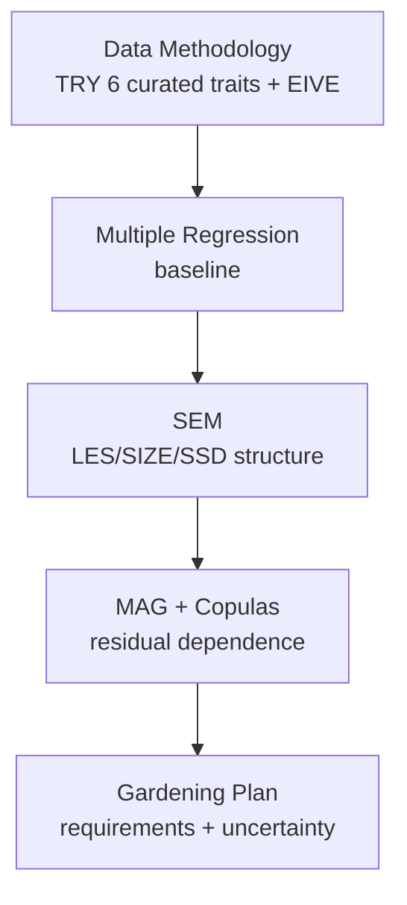

# From Plant Traits to Gardening Requirements

<p align="left">
  <a href="LICENSE"></a>
  
  
  
</p>
<p>
  <strong>Purpose:</strong> Build an initial model that maps TRY curated species‑level means (six numeric traits: Leaf area (LA), Nmass, LMA, Plant height (H), Diaspore/Seed mass (SM), Wood density (SSD) — Díaz et al., 2022) to EIVE (Ecological Indicator Values for Europe) indicators (0–10), and then convert those predictions into simple, expert‑aligned gardening recommendations with quantified uncertainty. These six traits are high‑quality and widely available, but on their own they are not sufficient to adequately predict all five EIVE axes. This first build is explicitly exploratory and diagnostic: we systematically measure what the six traits can and cannot explain, so we can identify the missing ingredients with evidence rather than guesswork. Accordingly, we plan to expand the model in upcoming iterations with additional traits and data as outlined in <a href="#future-developments">Future Developments</a>.
</p>

<p>
  This predictive model is especially useful for species with measured traits but no EIVE entry: the model predicts EIVE from traits and outputs clear recommendations with uncertainty. 
</p>

> [!IMPORTANT]
> Orientation — diagnostic first: The six professionally cleaned traits provide a strong, common baseline. Runs 1–7 are designed to isolate whether residual error comes from data gaps, biological theory, or model structure. The outcome is twofold: (1) a usable predictor now (strongest for M and N; modest for L and T; weaker for R), and (2) a targeted, evidence‑based list of additional traits to add next (see <a href="#future-developments">Future Developments</a>).

### Pipeline at a Glance



### Core Traits (Initial Model)

| Abbrev | Trait                   |
|:------:|-------------------------|
|  LA    | Leaf area               |
| Nmass  | Leaf nitrogen per mass  |
|  LMA   | Leaf mass per area      |
|   H    | Plant height            |
|  SM    | Diaspore/Seed mass      |
|  SSD   | Wood density            |


### Final SEM Equations (Adopted)

Composites
- LES_core: negative LMA, positive Nmass (trained as a composite; scaled within train folds)
- SIZE: +logH + logSM (used for L/T only; M/N use logH and logSM directly)

Equations (piecewise SEM; linear forms)
```
L ~ LES_core + SIZE + logLA
T ~ LES_core + SIZE + logLA
M ~ LES_core + logH + logSM + logSSD + logLA
R ~ LES_core + SIZE + logLA
N ~ LES_core + logH + logSM + logSSD + logLA + LES_core:logSSD
```

Notes
- Transforms: log10 for LA, H, SM, SSD; predictors standardized in training folds.
- Interaction: LES_core:logSSD kept for N only (optional for T; not adopted).
- Coefficients and composite recipe: see `results/MAG_Run8/mag_equations.json` and `results/MAG_Run8/composite_recipe.json`.

> [!NOTE]
> Planned expansions include root traits (SRL, diameter, RTD, N), light‑specific leaf traits (thickness, N per area), categorical syndromes (woodiness, growth form, phenology, mycorrhiza), and climate/soil covariates — see [Future Developments](#future-developments).

## Table of Contents
- [Quick Start — Non‑EIVE Species](#quick-start--non-eive-species)
- [Data Methodology](#data-methodology)
- [Multiple Regression — Predictive Baseline](#multiple-regression--predictive-baseline)
- [Structural Equation Modeling (SEM) — Structure, Fit, and Final Forms](#structural-equation-modeling-sem--structure-fit-and-final-forms)
- [Mixed Acyclic Graph (MAG) + Copulas — Residual Dependence for Joint Decisions](#mixed-acyclic-graph-mag--copulas--residual-dependence-for-joint-decisions)
- [Gardening Plan — Simple, Confidence‑Aware Recommendations](#gardening-plan--simple-confidence-aware-recommendations)
  - [How Gardening Requirements Are Derived](#how-gardening-requirements-are-derived)
  - [What The Outputs Contain](#what-the-outputs-contain)
- [Reproducibility — Effective Settings](#reproducibility--effective-settings)
- [Bottom Line](#bottom-line)
- [Future Developments](#future-developments)
  - [Light — Multi‑Regression vs SEM](#light--multi-regression-vs-sem)
  - [Future Additions To Improve L (beyond the six)](#future-additions-to-improve-l-beyond-the-six)
  - [Candidate Additions for L (table)](#candidate-additions-for-l-table)
  - [Temperature (T) — Gaps and Remedies](#temperature-t--gaps-and-remedies)
  - [Candidate Additions for T (table)](#candidate-additions-for-t-table)
  - [Reaction / Soil pH (R) — Gaps and Remedies](#reaction--soil-ph-r--gaps-and-remedies)
  - [Candidate Additions for R (table)](#candidate-additions-for-r-table)
  - [Root Traits — Future Additions](#root-traits--future-additions)
  - [Candidate Additions for Root Traits (table)](#candidate-additions-for-root-traits-table)
- [Traits → Strategies and Services](#traits--strategies-and-services)
- [License](#license)
- [References](#references)

## Quick Start — Non‑EIVE Species
- Prepare a CSV with columns: `LMA`, `Nmass`, `LeafArea`, `PlantHeight`, `DiasporeMass`, `SSD`. One row per species; include an identifier column (e.g., `Species`) if desired.
- Generate predictions from traits (MAG equations):

```bash
Rscript src/Stage_5_Apply_Mean_Structure/apply_mean_structure.R \
  --input_csv data/new_traits.csv \
  --output_csv results/mag_predictions_no_eive.csv \
  --equations_json results/MAG_Run8/mag_equations.json \
  --composites_json results/MAG_Run8/composite_recipe.json
```

- Turn predictions into gardening requirements (with joint options):

```bash
Rscript src/Stage_6_Gardening_Predictions/calc_gardening_requirements.R \
  --predictions_csv results/mag_predictions_no_eive.csv \
  --output_csv results/garden_requirements_no_eive.csv \
  --bins 0:3.5,3.5:6.5,6.5:10 \
  --borderline_width 0.5 \
  --copulas_json results/MAG_Run8/mag_copulas.json \
  --metrics_dir artifacts/stage4_sem_piecewise_run7 \
  --nsim_joint 20000 \
  --joint_requirement L=high,M=med,R=med \
  --joint_min_prob 0.6
```

<details>
<summary>Advanced: score multiple preset scenarios and annotate the best‑passing</summary>

```bash
Rscript src/Stage_6_Gardening_Predictions/joint_suitability_with_copulas.R \
  --predictions_csv results/mag_predictions_no_eive.csv \
  --copulas_json results/MAG_Run8/mag_copulas.json \
  --metrics_dir artifacts/stage4_sem_piecewise_run7 \
  --presets_csv results/garden_joint_presets_defaults.csv \
  --nsim 20000 \
  --summary_csv results/garden_joint_summary.csv
```

</details>

<p align="right"><a href="#from-plant-traits-to-gardening-requirements">Back to top ↑</a></p>

---

## Data Methodology

Sources and matching
- Traits: TRY curated species‑level means (six numeric traits): Leaf area (LA), Nmass, LMA, Plant height (H), Diaspore/Seed mass (SM), Wood density (SSD) (Díaz et al., 2022).
- Indicators: Ecological Indicator Values for Europe (EIVE) 1.0 — continuous 0–10 indicator values for five environmental gradients: Light (L), Temperature (T), Moisture (M), Reaction/soil pH (R), and Nutrients (N). EIVE quantifies each species’ realized niche position in European vegetation, harmonizing and extending the classic Ellenberg system to a continuous European scale. Higher values indicate preference toward the higher end of each gradient (e.g., high‑light, warmer, wetter, more alkaline, more fertile sites) (Dengler et al., 2023; Dengler et al., 2024 IAVS).
- Name alignment: WFO‑accepted names via `data/EIVE/EIVE_TaxonConcept_WFO_EXACT.csv`; unified normalization (hybrid sign ×/" x ", diacritics, whitespace/case).

Datasets (assembled)
- `artifacts/traits_matched.{rds,csv}` — ~5,800 rows; 5,799 unique species matched to EIVE.
- `artifacts/model_data_complete_case.csv` — 1,069 spp. with all six traits present (complete‑case; SSD combined).
- `artifacts/model_data_complete_case_observed_ssd.csv` — 389 spp. requiring observed SSD only (sensitivity set).
- SSD provenance in complete‑case: 389 observed; 680 imputed (from LDMC) and used via `SSD combined`; predictor column `SSD used` equals observed when present else imputed.

Assumptions and pipeline scripts
- Assumptions: species linked via WFO‑accepted names (`data/EIVE/EIVE_TaxonConcept_WFO_EXACT.csv`); curated TRY means provide six numeric traits per species; EIVE main table carries five indicator columns and derivatives (e.g., `.nw3`, `.n`).
- Extraction/assembly scripts: Excel→CSV converter (`src/Stage_1_Data_Extraction/convert_excel_to_csv.py`), EIVE→WFO normalization (`src/Stage_1_Data_Extraction/normalize_eive_to_wfo_EXACT.R`), TRY↔EIVE matcher (`src/Stage_1_Data_Extraction/match_trycurated_species_to_eive_wfo.R`), model dataset assembly (`src/Stage_2_Data_Processing/assemble_model_data.R`).
- Coverage snapshot (repo state): 5,799 unique species matched; complete‑case 1,069 spp (SSD combined) with SSD provenance 389 observed / 680 imputed; observed‑SSD‑only sensitivity set 389 spp.

Preprocessing (standard across stages unless noted)
- Transforms: log10 for LA, H, SM, SSD (small positive offsets recorded); z‑score predictors in train folds.
- Targets: EIVEres‑{L,T,M,R,N} (0–10); optional logit transform for lavaan fits.
- Validation: repeated, stratified CV — 5×5 (Stage 1, early SEM) or 10×5 (later SEM); seed 42/123 as recorded per run; no winsorization; no replicate‑aware weights by default.

Anchoring to prior work
- Extends Shipley et al. (2017, JVS) from ordinal Ellenberg ranks (1–9) with four traits to continuous EIVE (0–10) with six traits and structured SEM; leverages global trait spectra (Díaz et al., 2022) and wood economics (Chave et al., 2009) for SSD interpretation.

<p align="right"><a href="#from-plant-traits-to-gardening-requirements">Back to top ↑</a></p>

---

## Multiple Regression — Predictive Baseline

Setup
- Script: `src/Stage_3_Multi_Regression/run_multi_regression.R`; input: complete‑case (1,069 spp.).
- Predictors: LA, Nmass, LMA, H, SM, SSD used (Díaz et al., 2022); transforms/log‑z as above (cf. Shipley et al., 2017); CV 5×5.
- Targets: EIVEres‑{L,T,M,R,N} (Dengler et al., 2023; IAVS 2024).

Cross‑validated performance (mean ± SD)
- L: R² 0.152±0.045; RMSE 1.407±0.058; MAE 1.048±0.037 (n≈1,068)
- T: R² 0.102±0.039; RMSE 1.260±0.053; MAE 0.924±0.028 (n≈1,069)
- M: R² 0.130±0.049; RMSE 1.401±0.060; MAE 1.063±0.040 (n≈1,066)
- R: R² 0.036±0.029; RMSE 1.518±0.033; MAE 1.161±0.023 (n≈1,050)
- N: R² 0.356±0.039; RMSE 1.508±0.048; MAE 1.223±0.041 (n≈1,049)

Signals (standardized directions)
- L: +LMA, −Height; small −LA, −SM; +SSD (small)
- T: +Height, +SM (modest)
- M: +Height, +LA; −SSD, −SM; slight −LMA
- R: weak/noisy
- N: +Height, +LA, +Nmass; −LMA, −SSD

Additional diagnostics
- Out‑of‑fold correlations (r, ρ): L r=0.391 (ρ=0.434), T r=0.320 (ρ=0.310), M r=0.361 (ρ=0.366), R r=0.196 (ρ=0.169), N r=0.597 (ρ=0.604).
- Hit rates (|pred−true| in EIVE units):
  - L: ±1 → 60.4%; ±2 → 86.9%
  - T: ±1 → 65.9%; ±2 → 87.2%
  - M: ±1 → 57.9%; ±2 → 86.2%
  - R: ±1 → 54.7%; ±2 → 82.4%
  - N: ±1 → 47.1%; ±2 → 81.8%
- Collinearity: VIFs ≈ 1.3–2.4 across predictors — low.

Comparison to 2017 (Shipley et al., 2017)
- 2017 JVS (ordinal Ellenberg, four traits) reported mean predictive errors ≈ 1.3 (Light), 1.8 (Moisture), 1.8 (Nutrients), with ≈70–90% within ±1 rank and ≥90% within ±2 ranks.
- Our continuous EIVE baseline shows broadly comparable error magnitudes (RMSE) and moderate r, with lower “within‑1” hit rates expected from continuous targets and different scales. Ordinal comparators on binned EIVE (1–10 and 1–9) yield similar errors and bring hit rates closer to 2017, supporting that most disparity arises from target scaling rather than model misspecification.

Hit‑rate vs 2017 (ordinal Ellenberg)
```
Axis  ours±1  2017±1   ours±2  2017±2
L        60%    70–90%     87%     ≥90%
M        58%    70–90%     86%     ≥90%
N        47%    70–90%     82%     ≥90%

Notes: 2017 modeled L/M/N only; T and R not available. Our targets are continuous EIVE (0–10), so ±1/±2 are stricter than ordinal ranks.
```

Takeaway
- Feasible trait→indicator mapping with typical absolute error ≈1.0–1.2; strongest for N; weakest for R. Forms the predictive baseline for SEM.

Artifacts and reproducibility
- Artifacts: predictions, coefficients, VIFs, and metrics per target under `artifacts/stage3_multi_regression/eive_lm_{L,T,M,R,N}_*`.
- Repro cmd: `Rscript src/Stage_3_Multi_Regression/run_multi_regression.R --input_csv artifacts/model_data_complete_case.csv --targets=all --seed=123 --repeats=5 --folds=5 --stratify=true --standardize=true --winsorize=false --weights=none --min_records_threshold=0`.

<p align="right"><a href="#from-plant-traits-to-gardening-requirements">Back to top ↑</a></p>

---


## Structural Equation Modeling (SEM) — Structure, Fit, and Final Forms

Core constructs and forms
- Latent/composite axes: LES_core (−LMA, +Nmass) and SIZE (+logH, +logSM). CV uses training‑only composites.
- Baseline y‑equations: L/T/R ~ LES + SIZE + logSSD + logLA; M/N ~ LES + logH + logSM + logSSD + logLA; LES:logSSD kept for N only (T optional, not default).

Key run decisions and evidence
- Direct SSD effects (Run 2): Adopt SSD→M and SSD→N in both frameworks; keep L/T mediated; enable SSD→R in lavaan only. Woodiness moderation supported (SSD stronger in woody groups via grouped fit ranges) (Chave et al., 2009).
- Deconstructed SIZE for M/N (Run 2): Use logH and logSM directly in M/N y‑equations — improves piecewise CV into ~0.40–0.42 R² range.
- Co‑adapted LES in lavaan (Run 4): Replace directed inputs into LES with covariances (LES↔SIZE, LES↔logSSD); large ΔAIC/ΔBIC improvements across L/M/R/N despite modest absolute fit indices (Shipley & Douma, 2020; Douma & Shipley, 2021).
- Interaction policy (Run 5 + 6P): Keep LES:logSSD for N (tiny CV gain; IC modestly favorable; phylo‑supported). Optional for T. Omit for L/M/R (no CV benefit; IC penalties) (Shipley & Douma, 2020).
- Nonlinearity (Run 6): Reject s(logH) splines for M/R/N — consistent CV degradation and no IC support. Retain linear forms (cf. Kong et al., 2019).
- Refined measurement (Run 7): Adopt LES_core (negLMA,Nmass) and add logLA as a direct predictor for all targets. Improves M/N CV and strongly lowers piecewise full‑model AIC/BIC for M/N; neutral to slightly worse for L/T; mixed for R. Overall adopted (Douma & Shipley, 2021).

Run highlights 
- Run 1 baseline (CV; composites, seed=123, 5×5): piecewise outperformed lavaan proxies across axes — e.g., R² piecewise vs lavaan: L 0.224 vs 0.107; T 0.212 vs 0.103; M 0.342 vs 0.041; R 0.149 vs 0.024; N 0.371 vs 0.303. Piecewise d‑sep on full data supported mediation for L/T (C≈0.95–1.31, p≈0.62–0.52), was borderline for R (C≈4.61, p≈0.10), and saturated for M/N (df=0), indicating necessary direct SSD→{M,N}.
- Run 2 (WES‑backed SSD→{M,N,R}; woodiness groups): piecewise CV R² changes vs Run 1 are modest and concentrated in M/N due to deconstructing SIZE (≈+0.05 each); L/T are essentially unchanged (≈0 to +0.01) and R is near‑identical. Grouped lavaan fits: woody CFI≈0.67–0.76, RMSEA≈0.20–0.23; non‑woody CFI≈0.79–0.83, RMSEA≈0.14–0.17 — absolute fit still below conventional thresholds.
- Run 3 (Mycorrhiza groups added): n=1,068 complete‑case; 832 labeled. CV forms matched Run 2 (M/N deconstructed; L/T/R linear). Targeted myco‑specific SSD→R for `Pure_NM` and `Low_Confidence` improved d‑sep (final overall Fisher’s C p≈0.899 with selected groups saturated), while CV metrics remained consistent with Run 2.
- Run 4 (Co‑adapted LES↔SIZE in lavaan; seed=42, 10×5 CV): multi‑group lavaan fit indices ranged roughly CFI 0.53–0.65; RMSEA 0.25–0.28; SRMR 0.16–0.22. Decisive information‑criterion gains vs Run 3: ΔAIC/BIC (Run 4 − Run 3) — L −468/−393; M −498/−422; R −443/−372; N −436/−361 — strongly favoring co‑adaptation.
- Run 5 (LES×logSSD interaction in piecewise; seed=123, 10×5 CV): Added `LES:logSSD` to y‑equations. CV effects are small (tiny gains for T and N; neutral/slight negatives for L/M/R). Full‑model IC sums change little — modest improvement for N only (ΔAIC_sum ≈ −3; ΔBIC_sum ≈ +2). Adoption: keep for N; optional for T; omit for L/M/R.
- Run 6 (Nonlinearity via s(logH) in piecewise; seed=42, 10×5 CV): Introduced a spline on logH for M/R/N (with deconstructed SIZE for M/N). Strong CV degradation for M/R/N (e.g., M R² ↓ to ~0.13) confirms linear forms are superior. Full‑model IC sums also favor simpler models. Adoption: reject splines; keep linear equations.
- Run 6P (Phylogenetic GLS sensitivity): Brownian GLS on full data confirms coefficient sign stability (LES, SIZE/logH/logSM, logSSD) and supports the interaction policy (N yes; T optional). AIC_sum magnitudes differ from non‑phylo runs (different likelihood) — use for relative checks only.
- Run 7 (LES_core + logLA predictor; seed=42, 10×5 CV): Rebuilt LES from {negLMA, Nmass} and added logLA to y. Piecewise CV improves for M/N (R²≈0.415/0.424), holds for L/T, and modestly improves R. Full‑model IC sums drop sharply for M (ΔAIC_sum ≈ −92; ΔBIC_sum ≈ −82) and N (ΔAIC_sum ≈ −81; ΔBIC_sum ≈ −67); neutral/slightly worse for L/T; mixed for R. Single‑group lavaan fit indices remain below thresholds; N improves slightly.

Mini‑figure — piecewise full‑model IC (Run 7 vs Run 6)
```
Axis  AIC_sum7   ΔAIC   BIC_sum7   ΔBIC
L       8931.12  +1.06    9005.68  +6.03
T       8641.42  +1.57    8716.01  +6.54
M       8673.07 −92.38    8757.57 −82.41
R       9071.31  −0.75    9145.65  +4.21
N       9037.49 −81.29    9126.65 −67.33

Notes: Δ is Run7−Run6; lower is better. Strong IC improvements for M and N.
```

Final piecewise CV (Run 7; mean ± SD)
- L: R² 0.237±0.060; RMSE 1.333±0.064; MAE 1.001±0.039 (n=1065)
- T: R² 0.234±0.072; RMSE 1.145±0.079; MAE 0.862±0.050 (n=1067)
- R: R² 0.155±0.071; RMSE 1.428±0.076; MAE 1.077±0.048 (n=1049)
- M: R² 0.415±0.072; RMSE 1.150±0.079; MAE 0.889±0.050 (n=1065)
- N: R² 0.424±0.071; RMSE 1.423±0.090; MAE 1.143±0.072 (n=1047)

lavaan fit (co‑adapted; LES_core + logLA)
- Global absolute fit remains below conventional thresholds (single‑group CFI ≈0.49–0.59; RMSEA ≈0.30–0.32). We prioritize predictive CV + phylogenetic robustness for selection; lavaan paths align in sign/magnitude with piecewise.

Phylogenetic checks
- Full‑data GLS (Brownian/Pagel) retain core directions and practical significance; conclusions above are robust to phylogenetic non‑independence.

Adopted SEM mean structure (Directed Acyclic Graph, DAG)
- L/T/R: y ~ LES + SIZE + logSSD + logLA
- M: y ~ LES + logH + logSM + logSSD + logLA
- N: y ~ LES + logH + logSM + logSSD + logLA + LES:logSSD

Artifacts (SEM)
- Piecewise (per run dirs): `artifacts/stage4_sem_piecewise_run{2,3,4,5,6,6P,7}/sem_piecewise_{L,T,M,R,N}_{metrics.json,preds.csv,piecewise_coefs.csv,dsep_fit.csv[,multigroup_dsep.csv][,full_model_ic.csv][,full_model_ic_phylo.csv]}`.
- lavaan (per run dirs): `artifacts/stage4_sem_lavaan_run{2,4,7}/sem_lavaan_{L,T,M,R,N}_{metrics.json,preds.csv[,path_coefficients.csv][,fit_indices.csv][,fit_indices_by_group.csv]}`.
- Summaries:
  - `artifacts/stage4_sem_summary_run2/sem_metrics_summary_main.csv`, `.../piecewise_form_comparison.csv`.
  - `artifacts/stage4_sem_summary_run3/sem_metrics_summary_main.csv`.
  - `artifacts/stage4_sem_summary_run4/sem_metrics_summary_main.csv` (plus lavaan fit deltas/IC).
  - `artifacts/stage4_sem_summary_run5/piecewise_interaction_vs_baseline.csv`, `.../full_model_ic_comparison.csv`.
  - `artifacts/stage4_sem_summary_run7/sem_metrics_summary_main.csv`.

---

## Mixed Acyclic Graph (MAG) + Copulas — Residual Dependence for Joint Decisions

Core setup
- Mean equations: use the adopted MAG forms (above) for single‑axis predictions; copulas model residual dependence only.
- Detection: start from BH‑FDR (q=0.05) and |ρ|≥0.15, then manually refine using mixed‑effects, rank‑based m‑sep (Family random intercept; Kendall with rank‑PIT) to keep only practically meaningful spouses.
- Families: Gaussian copulas only for this run; selection by AIC.
- Estimation: rank‑PIT pseudo‑observations; Gaussian MLE via z‑correlation (Douma & Shipley, 2022).

Final spouse set (Run 8)
- L ↔ M: Gaussian, ρ≈−0.279, n=1063, AIC≈−84.11
- T ↔ R: Gaussian, ρ≈+0.328, n=1049, AIC≈−117.58
- T ↔ M: Gaussian, ρ≈−0.389, n=1064, AIC≈−172.57
- M ↔ R: Gaussian, ρ≈−0.269, n=1049, AIC≈−76.76
- M ↔ N: Gaussian, ρ≈+0.183, n=1046, AIC≈−33.65

Mini‑figure — copula fits (Run 8)
```
Pair   n     family    rho     loglik     AIC
L–M  1063   gaussian −0.279     43.05    −84.11
T–R  1049   gaussian  0.328     59.79   −117.58
T–M  1064   gaussian −0.389     87.28   −172.57
M–R  1049   gaussian −0.269     39.38    −76.76
M–N  1046   gaussian  0.183     17.82    −33.65
```

Diagnostics (Gaussian adequacy)
- Kendall’s tau: |τ_emp − τ_gauss| within ~0.02–0.03 for both pairs.
- Tails: high/low co‑occurrence within ~20% relative of Monte Carlo expectations.
- CV log‑copula per observation: positive for both districts.

Mini‑figure — adequacy checks
```
Pair  n     rho   tau_emp  tau_gauss   hi_emp  hi_mc   lo_emp  lo_mc   CV_logc/obs
T–R  1045  0.328    0.237     0.213     0.0172  0.0227  0.0287  0.0225     0.0569
L–M  1045 −0.279   −0.196    −0.180     0.0057  0.0034  0.0010  0.0032     0.0387
```

Repro commands
- Export MAG + run copulas (final spouse set):
  - `Rscript src/Stage_4_SEM_Analysis/export_mag_artifacts.R --input_csv artifacts/model_data_complete_case_with_myco.csv --out_dir results/MAG_Run8 --version Run8`.
  - `Rscript src/Stage_4_SEM_Analysis/run_sem_piecewise_copula.R --input_csv artifacts/model_data_complete_case_with_myco.csv --out_dir results/MAG_Run8 --version Run8 \
      --district L,M --district T,R --district T,M --district M,R --district M,N`.
- Copula‑aware m‑sep (mixed, rank‑based):
  - `Rscript src/Stage_4_SEM_Analysis/run_sem_msep_residual_test.R --input_csv artifacts/model_data_complete_case_with_myco.csv \
      --spouses_csv results/MAG_Run8/stage_sem_run8_copula_fits.csv --cluster_var Family --corr_method kendall --rank_pit true \
      --out_summary results/msep_test_summary_run8_mixedcop.csv --out_claims results/msep_claims_run8_mixedcop.csv`

Artifacts (Run 8)
- `results/MAG_Run8/mag_equations.json` — version Run 8.
- `results/MAG_Run8/mag_copulas.json` — 5 districts (final spouse set).
- `results/MAG_Run8/stage_sem_run8_residual_corr.csv` — 10 rows.
- `results/MAG_Run8/stage_sem_run8_copula_fits.csv` — 5 rows.

What the m‑sep test achieved 
- We stress‑tested the “no‑extra‑links” assumption after the mean equations by checking whether non‑spouse pairs of axes behave independently once traits are accounted for.
- Using rank‑based correlations and a random‑effects structure (to avoid false alarms from clustered species), we found a handful of strong, real leftover links — those became copulas (the spouses).
- The remaining links are tiny in size; we leave them out on purpose. This keeps the joint predictions simple and focused on the dependencies that actually move the needle.

<p align="right"><a href="#from-plant-traits-to-gardening-requirements">Back to top ↑</a></p>

---

## Gardening Plan — Simple, Confidence‑Aware Recommendations

Axis bins and labels (defaults)
- Bins per axis: Low [0, 3.5), Med [3.5, 6.5), High [6.5, 10]
- Labels: L — Shade/Partial/Full Sun; T — Cool/Temperate/Warm; M — Drought‑Tolerant/Average/Wet; R — Acidic/Neutral/Alkaline; N — Poor/Average‑Rich/Fertile.

Borderline handling and confidence
- Borderline zone: ±0.5 around each bin edge (i.e., [3.0,4.0] and [6.0,7.0]); reduces overconfident edge calls.
- Axis reliability: use Run 7 CV R² bands — L≈0.24, T≈0.23, R≈0.16, M≈0.42, N≈0.42 — to set per‑axis confidence (High where ≥0.35; Medium ≈0.20–0.35; Low <0.20).
- Decision policy maps each prediction to a bin + confidence tag; optional strict abstain for Low/Very‑Low cases.

Joint suitability (optional)
- Multi‑constraint gardening (e.g., L=High & M=Med & R=Med) applies MAG residual copulas (Run 8) to estimate joint probabilities via Monte Carlo; single‑axis predictions remain unchanged.
- Supports:
  - Single requirement gate: enforce `joint_min_prob`.
  - Batch presets: score common scenarios and annotate each species with best‑passing scenario.
  - Confidence‑oriented presets: when pH (R) predictions are the weakest axis, prefer R‑excluded presets for higher confidence (see `results/garden_presets_no_R.csv`).

Defaults and presets
- Bin edges: `[0,3.5), [3.5,6.5), [6.5,10]`; borderline width: `±0.5`.
- Joint threshold (presets): `0.6` (tunable) in `results/garden_joint_presets_defaults.csv`.
- Simulation: `nsim_joint` ≈ 20,000 (tunable); residual correlations from `results/MAG_Run8/mag_copulas.json`.
 - Preset sets:
   - Defaults (with R): `results/garden_joint_presets_defaults.csv` (e.g., SunnyNeutral, WarmNeutralFertile).
   - R‑excluded (more confident): `results/garden_presets_no_R.csv` (e.g., RichSoilSpecialist, LushShadePlant). Latest comparison in `results/summaries/PR_SUMMARY_Run8_Joint_Gardening.md`.

Repro commands (joint usage)
- Batch presets summary:
  - `Rscript src/Stage_6_Gardening_Predictions/joint_suitability_with_copulas.R --predictions_csv results/mag_predictions_no_eive.csv --copulas_json results/MAG_Run8/mag_copulas.json --metrics_dir artifacts/stage4_sem_piecewise_run7 --presets_csv results/garden_joint_presets_defaults.csv --nsim 20000 --summary_csv results/garden_joint_summary.csv`.
  - (R‑excluded presets) `Rscript src/Stage_6_Gardening_Predictions/joint_suitability_with_copulas.R --predictions_csv results/mag_predictions_no_eive.csv --copulas_json results/MAG_Run8/mag_copulas.json --presets_csv results/garden_presets_no_R.csv --nsim 20000 --summary_csv results/garden_joint_summary_no_R.csv`.
- Recommender with single gate or best scenario:
  - `Rscript src/Stage_6_Gardening_Predictions/calc_gardening_requirements.R --predictions_csv results/mag_predictions_no_eive.csv --output_csv results/garden_requirements_no_eive.csv --bins 0:3.5,3.5:6.5,6.5:10 --borderline_width 0.5 --copulas_json results/MAG_Run8/mag_copulas.json --metrics_dir artifacts/stage4_sem_piecewise_run7 --nsim_joint 20000 --joint_requirement L=high,M=med,R=med --joint_min_prob 0.6`.
  - or with presets: add `--joint_presets_csv results/garden_joint_presets_defaults.csv` to annotate best‑passing scenario fields.

Outputs (Stage 5–6)
- `results/garden_requirements_no_eive.csv` — per species: per‑axis bin, borderline flag, confidence, recommendation text; joint fields when gating/presets are used.
- `results/garden_joint_summary.csv` — species × scenario joint probabilities (defaults).
- `results/garden_joint_summary_no_R.csv` — species × scenario joint probabilities (R‑excluded presets).

Artifacts (Gardening)
- `results/garden_joint_presets_defaults.csv` — default scenarios (e.g., SunnyNeutral, WarmNeutralFertile) with threshold 0.6.
- `results/garden_requirements_no_eive.csv` — recommendations incl. `joint_requirement/joint_prob/joint_ok` and best‑scenario fields when presets are used.
 - `results/garden_presets_no_R.csv` — R‑excluded, confidence‑oriented presets (e.g., RichSoilSpecialist) with threshold 0.6.

### How Gardening Requirements Are Derived
1) Pick your site recipe (constraints):
   - Easy path: choose a preset scenario that matches your bed (e.g., RichSoilSpecialist = M=high & N=high). If soil pH is unknown or variable, prefer the R‑excluded presets in `results/garden_presets_no_R.csv`.
   - Custom path: set a single joint gate such as `--joint_requirement M=high,N=high --joint_min_prob 0.6` when running the recommender.
2) Read the per‑axis cards first (from `results/garden_requirements_no_eive.csv`):
   - Each axis shows: predicted value (0–10), bin (low/med/high), a `borderline` flag near cutoffs, and a qualitative confidence tag. Treat M/N as strongest, L/T as medium, R as weakest.
3) Use joint probability to decide multi‑constraint fit:
   - Presets: check `results/garden_joint_summary_no_R.csv` (or `..._summary.csv` for with‑R) and filter rows where `pass=TRUE` at your threshold (default 0.6). Higher `joint_prob` = better fit to that site recipe.
   - Recommender gate: if you supplied a single `--joint_requirement`, use the `joint_prob` and `joint_ok` columns directly in `garden_requirements_no_eive.csv`.
4) Pick winners and adjust if needed:
   - Start with species that pass your recipe. If too few pass, lower the threshold (e.g., 0.5) or drop a weaker axis (often R). Avoid requiring “all five” — that AND condition is usually too strict.

### What The Outputs Contain
- `results/garden_requirements_no_eive.csv` (per species):
  - Predictions: `L_pred,T_pred,M_pred,R_pred,N_pred` (0–10).
  - Per‑axis guidance: `{Axis}_bin`, `{Axis}_borderline`, `{Axis}_confidence`, `{Axis}_recommendation`.
  - Optional joint fields: `joint_requirement`, `joint_prob`, `joint_ok` (when a single gate is provided).
  - Preset annotation (when `--joint_presets_csv` is used): `best_scenario_label`, `best_scenario_prob`, `best_scenario_ok`.
- `results/garden_joint_summary_no_R.csv` (R‑excluded presets) and `results/garden_joint_summary.csv` (with‑R presets):
  - Columns: `species,label,requirement,joint_prob,threshold,pass`.
- Example: RichSoilSpecialist (M=high,N=high) passes for Cryptomeria japonica (0.663), Pinus densiflora (0.659), Sequoia sempervirens (0.654), Pinus ponderosa (0.640), Tsuga canadensis (0.622).

<p align="right"><a href="#from-plant-traits-to-gardening-requirements">Back to top ↑</a></p>

---

## Reproducibility — Effective Settings
- CV: 5×5 (Stage 1/early SEM) and 10×5 (later SEM), stratified by target deciles; seeds 123/42.
- Transforms: log10 for LA, H, SM, SSD (small offsets recorded); standardize predictors; optional lavaan logit on y.
- Grouping: `Myco_Group_Final` used where available; woodiness used in Run 2 by‑group checks (Douma & Shipley, 2021, Ecosphere).
- Piecewise vs lavaan: selection driven by CV + full‑model AIC/BIC (piecewise) and IC (lavaan); absolute fit documented for transparency (Shipley & Douma, 2020; Douma & Shipley, 2021).

Key paths for replication (selected)
- Stage 1 results: `results/summaries/stage1_multi_regression_summary.md`
- SEM runs: `results/summaries/stage2_sem_run1_summary.md`, `results/summaries/stage_sem_run{2,4,6,7}_summary.md`
- MAG + copulas: `results/summaries/stage_sem_run8_summary.md`, `results/summaries/stage_sem_run8_copula_diagnostics.md`
- Gardening plan: `results/summaries/gardening_plan.md`, `results/summaries/PR_SUMMARY_Run8_Joint_Gardening.md`


---

## Bottom Line
- We map six core plant traits to five EIVE indicators with modest to strong predictive skill (best for N; moderate for L/T/M; weak for R). SEM clarifies causal structure (LES, SIZE, SSD) and yields robust, linear final forms. Copulas capture modest residual co‑movement (T↔R positive; L↔M negative), enabling realistic multi‑axis decisions. The final gardening layer converts predictions into clear, confidence‑aware recommendations, with optional joint‑probability gating for multi‑constraint scenarios.
- Reminder — diagnostic first: this initial build deliberately measures the limits of the six curated traits and pinpoints what’s missing; see Future Developments for the evidence‑based additions prioritized next.

---


## Future Developments

## Light — Multi‑Regression vs SEM
- Baseline multiple regression (MR) shows Light (L) performing better than T and R (CV R²: L ≈ 0.15 > T ≈ 0.10 > R ≈ 0.04), but L still remains modest overall.
- In the final SEM (piecewise), L’s out‑of‑fold R² remains modest and does not improve as strongly as M/N. This reflects:
  - Structural parsimony: SEM imposes LES/SIZE/SSD structure and mediations that reduce degrees of freedom versus MR’s direct mapping.
  - Trait specificity: the six‑trait set captures broad spectra (LES, SIZE, SSD) but lacks light‑specific axes (e.g., thickness, N per area, phenology/syndromes) that better separate shade vs open habitats.
  - Linear/interaction checks: tested splines and LES×SSD showed no reliable CV gains for L, so the final forms remain linear and parsimonious.
  - Context noise: L is sensitive to canopy context and micro‑site variation that the current six traits do not fully encode.
- Takeaway: the MR→SEM “discrepancy” is expected from SEM’s constraints and missing light‑focused features rather than a modeling error. Targeted, high‑coverage additions are the likely lever to improve L.

## Future Additions To Improve L (beyond the six)
Overview: high‑coverage leaf, plant form, and mycorrhiza factors are prioritized; see the table for specific candidates and coverage. We intentionally exclude SLA/LeafArea variants (near‑duplicates of LMA/LeafArea with limited incremental value and higher collinearity). Categorical additions will need factor encoding in the pipeline.

### Candidate Additions for L (table)

| Priority | TraitID | Trait                                                         | AccSpecNum | Rationale                                   |
|---------:|--------:|---------------------------------------------------------------|-----------:|----------------------------------------------|
|        1 |      50 | Leaf nitrogen (N) content per leaf area                      |      10067 | Photosynthetic capacity; complements Nmass   |
|        2 |      46 | Leaf thickness                                               |       7773 | Shade tolerance/irradiance; complements LMA  |
|        3 |      42 | Plant growth form                                            |     233812 | Segments open vs forested light contexts     |
|        4 |      38 | Plant woodiness                                              |      77763 | High‑signal grouping; moderates allometry    |
|        5 |      37 | Leaf phenology type                                          |      29770 | Evergreen/deciduous → canopy persistence     |
|        6 |      22 | Photosynthesis pathway                                       |      37649 | C3/C4/CAM; aligns with open, high‑light      |
|        7 |      43 | Leaf type                                                    |      61206 | Needle vs broadleaf; shade/light strategies  |
|        8 |       7 | Mycorrhiza type                                              |       8028 | Forest affinity proxy (understory light)     |
|        9 |      21 | Stem diameter                                                |       8426 | Architecture proxy (with SSD already used)   |
|       10 |      47 | Leaf dry matter content (LDMC)                               |       9688 | Leaf economics; complements LMA              |
|       11 |     343 | Plant life form (Raunkiaer)                                  |      16558 | Syndrome: form/phenology                     |
|       12 |     154 | Leaf shape                                                   |      15527 | Leaf geometry/type                           |
|       13 |     144 | Leaf length                                                  |      11500 | Leaf geometry/type                           |
|       14 |     145 | Leaf width                                                   |      10859 | Leaf geometry/type                           |
|       15 |      55 | Leaf dry mass (single leaf)                                  |       8696 | Structure/mass proxy                         |
|       16 |      15 | Leaf phosphorus (P) content per leaf dry mass                |       8671 | Leaf economics (P limitation context)        |
|       17 |      13 | Leaf carbon (C) content per leaf dry mass                    |       7509 | Structure proxy; limited direct link to L    |

Primary are 1–8; 9–17 are secondary and should be added cautiously to avoid collinearity.

---

## Temperature (T) — Gaps and Remedies
- Why T underperforms with the six traits:
  - Weak trait–temperature determinism: the core six (LMA, Nmass, LeafArea, Height, Seed mass, SSD) are broad spectra signals, not temperature‑specific.
  - Missing cold/heat tolerance cues: freezing resistance/avoidance, overwintering strategies, and growing‑season timing are not captured explicitly.
  - Spatial/scale mismatch: realized temperature niche is governed by geography (latitude, elevation, continentality) more than by morphology alone.
- Helpful additions from TRY (high coverage where possible): see the candidate table for specific traits and coverage.
- Add exogenous climate covariates (recommended):
  - CHELSA/WorldClim bioclims: BIO1 (mean annual temp), BIO5/6 (max warmest, min coldest month), BIO7 (annual range), BIO10/11 (mean warm/cold quarter), isothermality.
  - Elevation and continentality indices. Derive species‑level summaries from GBIF occurrences (median, IQR). Use as exogenous predictors or to stratify model fits.

### Candidate Additions for T (table)

| Priority | TraitID | Trait                                            | AccSpecNum | Rationale                                   |
|---------:|--------:|--------------------------------------------------|-----------:|----------------------------------------------|
|        1 |      31 | Species tolerance to frost                      |      27829 | Direct cold‑tolerance signal for T gradient  |
|        2 |      22 | Photosynthesis pathway                          |      37649 | Warm/open‑habitat associations (C3/C4/CAM)   |
|        3 |      37 | Leaf phenology type                             |      29770 | Seasonality link; growing‑season timing      |
|        4 |      42 | Plant growth form                               |     233812 | Segments canopy/thermal contexts             |
|        5 |      38 | Plant woodiness                                 |      77763 | Broad thermal niche grouping                 |
|        6 |     343 | Plant life form (Raunkiaer)                     |      16558 | Syndrome: overwintering strategy             |

## Reaction / Soil pH (R) — Gaps and Remedies
- Why R underperforms with the six traits:
  - Missing edaphic signals: morphology alone has weak direct linkage to soil pH; R is driven by soil chemistry (base saturation, CaCO₃, CEC) and root nutrient uptake strategies.
  - Root/leaf chemistry absent: the six traits omit root economics (SRL, RTD, diameter) and base‑cation content (leaf Ca, Mg) that track acid vs base‑rich soils.
  - Habitat heterogeneity: micro‑edaphic variation and mycorrhizal associations are not encoded explicitly.
- Helpful additions from TRY (where coverage allows): see the candidate table for specific traits and coverage.
- Add exogenous soil covariates (recommended):
  - SoilGrids/WISE layers: pH (H₂O/CaCl₂), base saturation, cation exchange capacity (CEC), CaCO₃, soil organic carbon, texture (sand/clay).
  - Join via occurrences to compute species‑level exposure summaries; include as exogenous predictors or grouping variables in SEM.

### Candidate Additions for R (table)

| Priority | TraitID | Trait                                                                 | AccSpecNum | Rationale                                              |
|---------:|--------:|-----------------------------------------------------------------------|-----------:|---------------------------------------------------------|
|        1 |       7 | Mycorrhiza type                                                       |       8028 | EcM/ErM/AM patterns track soil acidity/base status       |
|        2 |     252 | Leaf calcium (Ca) content per leaf dry mass                           |       2540 | Base‑rich soil indicator (Ca)                            |
|        3 |     257 | Leaf magnesium (Mg) content per leaf dry mass                         |       2410 | Base‑rich soil indicator (Mg)                            |
|        4 |      65 | Root type, root architecture                                          |       5626 | Edaphic adaptation proxy                                 |
|        5 |       6 | Root rooting depth                                                    |       4032 | Access to deeper, buffered horizons                      |
|        6 |     614 | Fine root length per fine root dry mass (specific fine root length)  |       1308 | Root foraging strategy (SRL)                              |
|        7 |     896 | Fine root diameter                                                    |       1147 | Root uptake/soil interface proxy                          |
|        8 |    1781 | Fine root tissue density (fine root dry mass per fine root volume)    |        881 | Root economics; substrate association                     |
|        9 |     146 | Leaf carbon/nitrogen (C/N) ratio                                      |       5843 | Coarse nutrient/strategy proxy (pH‑related vegetation)    |
|       10 |      80 | Root nitrogen (N) content per root dry mass                           |        815 | Nutrient uptake strategy; indirectly pH‑linked            |

Implementation note: when adding categorical traits (e.g., growth form, woodiness, phenology, mycorrhiza), encode as factors with clear reference levels; for climate/soil covariates, compute occurrence‑weighted summaries with robust statistics (median/IQR) and document spatial filters (native range vs introduced).


## Root Traits — Future Additions

### Candidate Additions for Root Traits (table)

| Priority | TraitID | Trait                                                                 | AccSpecNum | Rationale                                         |
|---------:|--------:|-----------------------------------------------------------------------|-----------:|----------------------------------------------------|
|        1 |     614 | Fine root length per fine root dry mass (specific fine root length)  |       1308 | Foraging rate; core root economics axis (SRL)      |
|        2 |     896 | Fine root diameter                                                    |       1147 | Uptake interface; complements SRL and RTD          |
|        3 |    1781 | Fine root tissue density (fine root dry mass per fine root volume)    |        881 | Conservation axis; lifespan/protection proxy        |
|        4 |      80 | Root nitrogen (N) content per root dry mass                           |        815 | Nutrient uptake potential (bulk roots)              |
|        5 |     475 | Fine root nitrogen (N) content per fine root dry mass                 |        796 | Nutrient uptake potential (fine roots)              |
|        6 |    2062 | Absorptive fine root length per absorptive fine root dry mass (aSRL)  |        734 | Absorptive SRL variant; mechanism focus             |
|        7 |    1080 | Root length per root dry mass (specific root length, SRL)             |        720 | General SRL variant; cross‑dataset availability     |
|        8 |    2038 | Absorptive fine root diameter                                         |        594 | Absorptive diameter variant; complements aSRL       |

Notes: Root trait relationships frequently show nonlinearity due to anatomical allometry (Kong et al., 2019). When integrating these traits, prefer simple transforms vetted by cross‑validation and information criteria, and consider mycorrhiza‑aware grouping where supported. Keep linear defaults unless nonlinearity materially improves fit.


## Traits → Strategies and Services

- Traits → Strategies (CSR): build on Pierce et al. (2016, Functional Ecology) to compute global CSR strategy positions from core leaf economics and size traits, enabling strategy‑aware guidance (e.g., stress‑tolerators vs ruderals) alongside EIVE‑based requirements.
- Traits → Ecosystem Services: extend mapping from traits to ecosystem service indicators using syntheses such as Brown & Anand (“Plant functional traits as measures of ecosystem service provision”), linking predicted trait profiles to services like carbon storage, soil stabilization, pollinator support, and microclimate regulation.
- Data integration: incorporate GBIF occurrences to enrich geographic context and climate envelopes, and GloBI interaction records to surface biotic associations (pollinators, dispersers, mutualists). This will make recommendations more complete and locally useful for gardeners.
- Guild Builder module: develop an interactive “Guild Builder” that uses trait‑based predictions of gardening requirements (via EIVE) and ecosystem services to help users discover combinations of common, locally available plants that match their specific site conditions and goals.

---

## License
- Licensed under the GNU Affero General Public License, version 3 or later (AGPL‑3.0‑or‑later). Network use of a modified version must make corresponding source available to users. See `LICENSE` for full terms.

---

## References
- Chave, J., Coomes, D., Jansen, S., Lewis, S. L., Swenson, N. G., & Zanne, A. E. (2009). Towards a worldwide wood economics spectrum. Ecology Letters, 12(4), 351–366. https://doi.org/10.1111/j.1461-0248.2009.01285.x
- Dengler, J., Chusova, O., Jansen, F., Gillet, F., Berg, C., Karrer, G., Raus, T., Tyler, T., Aicher, S., Mankiewicz, A., Ostrowski, G., Widmer, S., & the EIVE Consortium (2023). Ecological Indicator Values for Europe (EIVE) 1.0. Vegetation Classification and Survey, 4, 7–29. https://doi.org/10.3897/VCS.98324
- Dengler, J., et al. (2024). Ecological Indicator Values for Europe (EIVE): recent developments and performance tests. IAVS 2024 contribution.
 - Díaz, S., et al. (2022). The global spectrum of plant form and function: enhanced species‑level trait dataset. Scientific Data. [Data descriptor used for TRY‑curated traits]
- Douma, J. C., & Shipley, B. (2021). A multigroup extension to piecewise path analysis. Ecosphere, 12(5), e03502. https://doi.org/10.1002/ecs2.3502
- Douma, J. C., & Shipley, B. (2021). Testing piecewise structural equation models in the presence of latent variables and including correlated errors. Structural Equation Modeling. https://doi.org/10.1080/10705511.2020.1871355
- Douma, J. C., & Shipley, B. (2022). Testing model fit in path models with dependent errors given non‑normality, non‑linearity and hierarchical data. Structural Equation Modeling. https://doi.org/10.1080/10705511.2022.2112199
- Kong, D., Wang, J., Wu, H., Valverde‑Barrantes, O. J., Wang, R., Zeng, H., Kardol, P., Zhang, H., & Feng, Y. (2019). Nonlinearity of root trait relationships and the root economics spectrum. Nature Communications, 10, 2203. https://doi.org/10.1038/s41467-019-10245-6
- Shipley, B., & Douma, J. C. (2020). Generalized AIC and chi‑squared statistics for path models consistent with directed acyclic graphs. Ecology, 101(3), e02960. https://doi.org/10.1002/ecy.2960
- Shipley, B., Belluau, M., Kühn, I., Soudzilovskaia, N. A., Bahn, M., Peñuelas, J., Kattge, J., Sack, L., Cavender‑Bares, J., Ozinga, W. A., Blonder, B., van Bodegom, P. M., Manning, P., Hickler, T., Sosinski, E., Pillar, V. D., Onipchenko, V., & Poschlod, P. (2017). Predicting habitat affinities of plant species using commonly measured functional traits. Journal of Vegetation Science, 28(5), 1082–1095. https://doi.org/10.1111/jvs.12554
 - Pierce, S., Negreiros, D., Cerabolini, B. E. L., Kattge, J., Díaz, S., Kleyer, M., Shipley, B., Wright, S. J., Soudzilovskaia, N. A., Onipchenko, V. G., van Bodegom, P. M., Frenette‑Dussault, C., Weiher, E., Pinho, B. X., Cornelissen, J. H. C., Grime, J. P., Thompson, K., Hunt, R., Wilson, P. J., … Tampucci, D. (2017). A global method for calculating plant CSR ecological strategies applied across biomes world‑wide. Functional Ecology, 31(2), 444–457. https://doi.org/10.1111/1365-2435.12722
 - Brown, L. M., & Anand, M. (2022). Plant functional traits as measures of ecosystem service provision. People and Nature, 4(3), 589–611. https://doi.org/10.1002/pan3.10318

---
