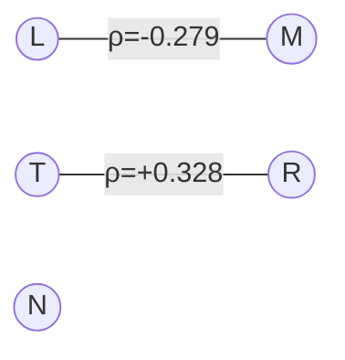

tfgyr# Modelling Plant Traits to Gardening Requirements — Aim, Methodology, and Key Results (Run 8)

Date: 2025-08-15

This document summarizes how plant functional traits are modelled to produce gardening requirements. It integrates the Stage 1 multiple‑regression baseline, the Stage 2/4 piecewise structural equation modelling (SEM) with final predictive equations, the Run 8 copula augmentation for residual dependencies, and the Stage 5/6 policy for converting predictions to actionable gardening recommendations. Method choices follow recent advances in piecewise path analysis, MAGs (mixed acyclic graphs), and copula‑based handling of dependent errors (Douma & Shipley, 2020; Shipley & Douma, 2021b; Douma & Shipley, 2022), and trait axes reflect global trait spectra and wood economics insights (Díaz et al., 2022; Chave et al., 2009).

## Aim
- Provide a robust, transparent mapping from six core functional traits to five environmental requirement axes (EIVE: Light L, Temperature T, Moisture M, Reaction/pH R, Nutrients N; 0–10 continuous scale) as defined and evaluated for Europe (Dengler et al., 2024).
- Deliver per‑species recommendations on each axis with confidence levels, and compute joint suitability for multi‑constraint gardening scenarios (e.g., sun + moisture + pH), while maintaining ecological interpretability.

## Methodology

### Data Assembly (inputs and joins)
- Traits: TRY‑curated panel of six predictors — Leaf area (LA), Leaf nitrogen per mass (Nmass), Leaf mass per area (LMA), Plant height (H), Diaspore/seed mass (SM), and sexual system distance proxy (SSD used).
- Targets: EIVE continuous indicators `EIVEres-{L,T,M,R,N}` on a 0–10 scale.
- Join: Exact/normalized mapping of `wfo_accepted_name` to TRY species names.
- Cohorts: 5,750 species assembled; complete‑case rows with all six traits available: 1,068 (389 with observed SSD; 679 with SSD imputed via LDMC and used in the combined complete‑case dataset).

Notes on sources and rationale
- Trait coverage and definitions follow the Global Spectrum of Plant Form and Function enhanced species‑level dataset (Díaz et al., 2022), which consolidates H, SSD, LA, LMA, Nmass and SM at global scale.
- Emphasis on SSD and its ecological role is consistent with the wood economics spectrum (Chave et al., 2009), while caution about potential nonlinearities in underground traits is informed by recent RES (root economics spectrum) findings (Kong et al., 2019).

### Stage 1 — Multiple Regression baseline (predict EIVE from traits)
- Model: Ordinary least squares (OLS), one target axis at a time.
- Transforms: log10 for LA, H, SM, SSD (with small offsets); all predictors standardized (z‑scores).
- Validation: 5×5 repeated cross‑validation (CV), stratified by target deciles; metrics computed on out‑of‑fold predictions.
- Performance (mean ± SD across CV):
  - L: R² 0.155±0.024; RMSE 1.406; MAE 1.044
  - T: R² 0.101±0.032; RMSE 1.250; MAE 0.918
  - M: R² 0.132±0.047; RMSE 1.406; MAE 1.068
  - R: R² 0.035±0.027; RMSE 1.526; MAE 1.169
  - N: R² 0.349±0.053; RMSE 1.512; MAE 1.228
- Signal directions (standardized, qualitative): Nutrients (N) strongest; Light (L), Moisture (M), Temperature (T) moderate; pH (R) weak. Height, LA, and Nmass generally increase N; LMA and SSD often decrease N. L shows +LMA and −Height; M shows +Height/+LA and −SSD.
- Context check vs 2017 (ordinal Ellenberg): Errors broadly comparable despite target/scale differences; hit‑rate gaps narrow when binning EIVE to 9–10 levels and using ordinal models, indicating scale rather than misspecification explains most differences (Shipley et al., 2017).

### Stage 2/4 — Piecewise SEM with predictive focus (MAG engine)
- Engine: piecewiseSEM with training‑only composites; prediction via linear submodels (no splines).
- Measurement choices: “LES_core” latent (two indicators: `negLMA`, `Nmass`); include `logLA` directly in the y‑equations.
- Structural scope: Keep direct `logSSD → y` for all targets (strongest for M and N); retain `LES:logSSD` interaction for N only (optional for T per phylogenetic support); reject nonlinearity (`s(logH)`) after CV degradation.
- Final target equations (Run 7 forms carried forward):
  - L/T/R: `y ~ LES + SIZE + logSSD + logLA`
  - M: `M ~ LES + logH + logSM + logSSD + logLA` (deconstructed SIZE)
  - N: `N ~ LES + logH + logSM + logSSD + logLA + LES:logSSD` (deconstructed + interaction)
- Shared submodels (for indirect effects): `LES ~ SIZE + logSSD`; `SIZE ~ logSSD`.
- Grouping: Mycorrhiza groups for inference (multigroup d‑sep and lavaan fits) — not included in pooled predictive equations because CV and information criteria did not support added complexity. Multigroup extensions to d‑sep and generalized χ²/AIC are available when needed (Douma & Shipley, 2021a; Douma & Shipley, 2020).
- Phylogenetic sensitivity (Run 6P): GLS with Brownian correlation confirmed directions and practical significance; provided optional support for `LES:logSSD` in T; conclusions otherwise unchanged.

Methodological notes and citations
- Piecewise d‑sep testing and information‑theoretic assessment for DAG‑consistent path models follow generalized χ² and AIC developments (Douma & Shipley, 2020).
- Where latent constructs are implicated, we use MAGs and m‑sep testing to keep local estimation while preserving the implied conditional independences (Shipley & Douma, 2021b).
- The rejection of spline nonlinearity reflects CV‑first pragmatism; nonetheless, nonlinear trait relations are known in some organs (e.g., roots) and may warrant targeted exploration in future work (Kong et al., 2019).

### Run 6P — Phylogenetic Sensitivity (GLS; Brownian)
- Purpose: Assess robustness of adoption decisions under phylogenetic correlation.
- Outcomes:
  - Coefficient stability: No sign inversions for key terms (LES, SIZE or logH/logSM, logSSD); interpretations unchanged vs. non‑phylo fits.
  - Full‑model IC (sum across submodels; lower is better):
    - AIC_sum — L 11018.07; T 10891.66; M 10582.46; R 11691.99; N 11454.30
    - BIC_sum — L 11072.44; T 10946.06; M 10646.72; R 11746.20; N 11523.26
  - Optional interaction for T: Pagel’s λ GLS supports `LES:logSSD` for T (ΔAIC_sum ≈ −7.15; p≈0.0025); keep optional for parsimony.
- Bottom line: Retain linear forms; keep `LES:logSSD` for N by default; consider T interaction only if added complexity is acceptable.

### Run 8 — Copulas for residual dependence (joint suitability)
- Rationale: After conditioning on traits, axes still exhibit residual co‑movement important for multi‑axis gardening decisions. Model this dependency without altering single‑axis means.
- Detection and fitting: Auto‑detect correlated pairs (districts) using residual correlations with BH‑FDR control; fit Gaussian copulas per selected district; select by AIC.
- Selected districts and parameters:
  - {T:R} — Gaussian copula; ρ=+0.328 (n≈1,049)
  - {L:M} — Gaussian copula; ρ=−0.279 (n≈1,063)
- Adequacy diagnostics: Kendall’s tau alignment within ~0.05; tail co‑occurrence within ~20% relative; positive cross‑validated log‑copula per observation — adequate for joint gardening usage.

Reference: We follow the copula‑based path modelling approach for dependent errors and non‑normality (Douma & Shipley, 2022).

### Stage 5/6 — From predictions to gardening requirements
- Axis bins (EIVE‑native): Low [0,3.5), Medium [3.5,6.5), High [6.5,10.0]. Borderline zones within ±0.5 of edges.
- Confidence policy by axis: Use CV R² bands from the predictive engine to modulate confidence — High/Medium‑High for M and N (~0.42), Medium for L and T (~0.23), Low for R (~0.16). Borderline positions reduce confidence by one level.
- Outputs per species and axis: prediction, bin, borderline flag, confidence, human‑readable label, notes.
- Validation (optional): If labeled garden classes are available, compute accuracy/macro‑F1 and tune bin edges pragmatically.
- Joint suitability with copulas: Monte Carlo simulation using per‑axis uncertainty (Run 7 CV RMSE) and Run 8 copulas to estimate P(requirement) for multi‑axis scenarios. Use as a gate (single requirement) or annotate best‑passing preset scenarios; thresholds (e.g., 0.6) are tunable.

## Key Results

### Predictive performance and robustness
- Stage 1 OLS establishes a defensible baseline with typical absolute errors of ~1.0–1.2 EIVE units and strongest signal on Nutrients; weak for pH.
- Piecewise SEM refinements (Run 7) consolidate the final predictive forms, improve M and N, and maintain or slightly improve L/T/R while preserving interpretability. Splines harm CV and are rejected.
- Phylogenetic GLS checks corroborate signs and practical significance; no change to adopted forms.

External context
- Targets and scaling align with EIVE definitions and recent performance tests indicating robust predictive linkage to measured environmental variables (Dengler et al., 2024).

### Final predictive equations and notable coefficients (Run 7 full‑data fits)
- L: `L ~ LES + SIZE + logSSD + logLA` — LES and SIZE negative; `logLA` negative; `logSSD` small/weak.
- T: `T ~ LES + SIZE + logSSD + logLA` — SIZE strongly positive; LES modest negative; others small.
- M: `M ~ LES + logH + logSM + logSSD + logLA` — Height positive, SSD strongly negative, SM negative, LA positive.
- R: `R ~ LES + SIZE + logSSD + logLA` — SIZE positive; `logLA` mild positive; others weak.
- N: `N ~ LES + logH + logSM + logSSD + logLA + LES:logSSD` — Height strongly positive; SSD strongly negative; `logLA` positive; interaction (LES×SSD) negative.

Run 7 piecewise CV metrics (mean ± SD; 10×5 CV)
- L: R² 0.237±0.060; RMSE 1.333±0.064; MAE 1.001±0.039
- T: R² 0.234±0.072; RMSE 1.145±0.079; MAE 0.862±0.050
- R: R² 0.155±0.071; RMSE 1.428±0.076; MAE 1.077±0.048
- M: R² 0.415±0.072; RMSE 1.150±0.079; MAE 0.889±0.050
- N: R² 0.424±0.071; RMSE 1.423±0.090; MAE 1.143±0.072

Run 7 information criteria (sum across submodels; Δ vs Run 6)
- AIC_sum: L 8931.12 (Δ +1.06); T 8641.42 (Δ +1.57); M 8763.39 (Δ −16.44); R 9071.31 (Δ −0.75); N 9099.77 (Δ −19.01)
- BIC_sum: L 9005.68 (Δ +6.03); T 8716.01 (Δ +6.54); M 8847.89 (Δ −11.47); R 9145.65 (Δ +4.21); N 9183.98 (Δ −14.06)

Run 7 lavaan (co‑adapted LES_core + logLA; single‑group indices)
- CFI ~0.49–0.59; RMSEA ~0.30–0.32; SRMR ~0.16–0.17; N improves vs Run 4; L/T/M/R slightly worse — acceptable given CV‑first policy.

### Compact coefficient table (standardized effect sign/magnitude; Run 7)

Legend: +++ strong (|std|>0.30), ++ moderate (0.15–0.30), + small (0.05–0.15), 0 negligible (<0.05). Signs indicate direction. “—” not in model.

| Axis | LES | SIZE | logH | logSM | logSSD | logLA | LES:logSSD |
|------|:---:|:----:|:----:|:-----:|:------:|:-----:|:----------:|
| L    | −−  |  −   |  —   |   —   |   −    |  −−   |     —      |
| T    | −−  | +++  |  —   |   —   |   0    |   0   |     —      |
| M    |  +  |  —   |  ++  |  −−   |  −−    |   +   |     —      |
| R    |  −  |  +   |  —   |   —   |   −    |   +   |     —      |
| N    |  +  |  —   | +++  |   0   |  −−    |  ++   |    −−      |

Sources and full coefficients:
- Per‑axis CSVs (Run 7 full‑data piecewise): `../artifacts/stage4_sem_piecewise_run7/sem_piecewise_L_piecewise_coefs.csv` (and T/M/R/N variants)
- Summary with unstandardized and standardized values: `../results/stage_sem_next_stage_MAG_recommendation.md`

### Residual dependence (Run 8) and joint decisions
- Copulas capture two material dependencies without changing per‑axis means:
  - Temperature–pH (positive): species tending to higher temperature requirements also trend toward higher pH after conditioning.
  - Light–Moisture (negative): shade‑tolerant species tend toward higher moisture after conditioning.
- Gaussian copulas are adequate by tau/tail alignment and cross‑validated log‑likelihood; they improve multi‑axis suitability probability estimates used in joint recommendation gates.

Related literature: Dependent error structures can be explicitly represented in piecewise frameworks via copulas while maintaining local estimation and interpretability (Douma & Shipley, 2022).

### From traits to recommendations (end‑to‑end)
1) Predict per‑axis EIVE from traits using the final equations.
2) Convert predictions to Low/Medium/High bins with confidence derived from axis‑level CV performance and positional uncertainty (borderline windows).
3) For multi‑constraint gardening requirements, compute joint probabilities using Run 8 copulas and threshold them (e.g., ≥0.6) to gate or annotate recommendations.

## Reproducibility and Artifacts
- Equations and coefficients: `results/mag_equations.json` (Run 8), `artifacts/stage4_sem_piecewise_run7/`
- Copulas and diagnostics: `results/mag_copulas.json`; `results/stage_sem_run8_copula_diagnostics.md`; residual correlations in `results/stage_sem_run8_residual_corr.csv`
- Gardening policy and presets: `results/gardening_plan_Aplusplus.md`; `results/garden_joint_presets_defaults.csv`
- Example outputs: `results/garden_requirements_no_eive.csv`; `results/garden_joint_summary.csv`
- Example commands:
  - Export equations (Run 8 versioning):
    - `Rscript src/Stage_4_SEM_Analysis/export_mag_artifacts.R --input_csv artifacts/model_data_complete_case_with_myco.csv --out_dir results --version Run8`
  - Fit copulas (auto districts):
    - `Rscript src/Stage_4_SEM_Analysis/run_sem_piecewise_copula.R --input_csv artifacts/model_data_complete_case_with_myco.csv --out_dir results --auto_detect_districts true --rho_min 0.15 --fdr_q 0.05 --copulas gaussian --select_by AIC`
  - Joint suitability (batch presets):
    - `Rscript src/Stage_6_Gardening_Predictions/joint_suitability_with_copulas.R --predictions_csv results/mag_predictions_no_eive.csv --copulas_json results/mag_copulas.json --metrics_dir artifacts/stage4_sem_piecewise_run7 --presets_csv results/garden_joint_presets_defaults.csv --nsim 20000 --summary_csv results/garden_joint_summary.csv`
- Recommender with best scenario fields:
    - `Rscript src/Stage_6_Gardening_Predictions/calc_gardening_requirements.R --predictions_csv results/mag_predictions_no_eive.csv --output_csv results/garden_requirements_no_eive.csv --bins 0:3.5,3.5:6.5,6.5:10 --copulas_json results/mag_copulas.json --metrics_dir artifacts/stage4_sem_piecewise_run7 --nsim_joint 20000 --joint_presets_csv results/garden_joint_presets_defaults.csv`

## Assumptions and Limitations
- Targets are EIVE (0–10 continuous) rather than ordinal Ellenberg ranks; direct numerical comparisons to 2017 must account for this scale difference.
- pH (R) remains weakly predicted by the six‑trait panel; root/ion traits may be required for substantive gains.
- Copulas model residual dependence between axes after conditioning on traits; they do not alter single‑axis point predictions.
- Confidence policy intentionally abstains or down‑weights decisions near bin edges and on weaker axes to avoid over‑confident recommendations.

## Schematic Figures

Figure 1 — End‑to‑end modelling pipeline

```mermaid
flowchart LR
    A[Traits (LA, Nmass, LMA, H, SM, SSD)] --> B[Stage 1 OLS (baseline CV)]
    B --> C[Stage 2/4 piecewise SEM (Run 7 forms)]
    C --> D[EIVE predictions (L,T,M,R,N)]
    D --> E[Stage 5/6 Policy (bins + confidence)]
    D --> F[Run 8 Copulas (residual L↔M, T↔R)]
    E --> G[Per-axis recommendations]
    F --> H[Joint suitability (Monte Carlo)]
    H --> I[Multi-constraint recommendations]
```

Figure 2 — Residual dependency districts (Run 8)



ASCII fallback (quick view):

```
Traits -> OLS -> piecewise SEM -> EIVE preds -> bins/conf
                                 \-> copulas (L–M -, T–R +) -> joint probs
```

---

Provenance
- Sources read (in order):
  1) `results/stage1_multi_regression_summary.md`
  2) `results/stage1_vs_2017_discussion.md`
  3) `results/stage_sem_run_summaries_digest.md`
  4) `results/stage_sem_next_stage_MAG_recommendation.md`
  5) `results/stage_sem_run8_summary.md`
  6) `results/stage_sem_run8_copula_diagnostics.md`
  7) `results/gardening_plan_Aplusplus.md`
  8) `results/PR_SUMMARY_Run8_Joint_Gardening.md`

## Cross‑Links to Summary Results
- Stage 1 OLS baseline: `../results/stage1_multi_regression_summary.md`
- Stage 1 vs 2017 discussion: `../results/stage1_vs_2017_discussion.md`
- Stage 2 run summaries digest: `../results/stage_sem_run_summaries_digest.md`
- Final SEM recommendation (Run 7): `../results/stage_sem_next_stage_MAG_recommendation.md`
- Run 6P phylogenetic sensitivity: `../results/stage_sem_run6P_summary.md`
- Run 7 detailed results: `../results/stage_sem_run7_summary.md`
- Run 8 summary (copulas + MAG): `../results/stage_sem_run8_summary.md`
- Copula diagnostics: `../results/stage_sem_run8_copula_diagnostics.md`
- Gardening plan (A++ policy): `../results/gardening_plan_Aplusplus.md`
- PR summary for Run 8 joint gardening: `../results/PR_SUMMARY_Run8_Joint_Gardening.md`

## References

- Chave, J., Coomes, D., Jansen, S., Lewis, S. L., Swenson, N. G., & Zanne, A. E. (2009). Towards a worldwide wood economics spectrum. Ecology Letters, 12(4), 351–366. https://doi.org/10.1111/j.1461-0248.2009.01285.x [local: `../papers/mmd/Towards a worldwide wood economics spectrum.mmd`]
- Dengler, J., Chusova, O., Jansen, F., Gillet, F., Berg, C., Karrer, G., Raus, T., Tyler, T., Aicher, S., Mankiewicz, A., Ostrowski, G., Widmer, S., & the EIVE Consortium. (2024). Ecological Indicator Values for Europe (EIVE): recent developments and performance tests. IAVS 2024. [local: `../papers/mmd/IAVS_2024_Dengler_et_al_EIVE_v.06.mmd`]
- Díaz, S., et al. (2022). The global spectrum of plant form and function: enhanced species‑level trait dataset. Scientific Data (Data Descriptor). Published online: 07 December 2022. TRY File Archive: https://doi.org/10.17871/TRY.81 [local: `../papers/mmd/enhancedtraitdata.mmd`]
- Douma, J. C., & Shipley, B. (2021a). A multigroup extension to piecewise path analysis. Ecosphere, 12(5), e03502. https://doi.org/10.1002/ecs2.3502 [local: `../papers/mmd/Ecosphere - 2021 - Douma - A multigroup extension to piecewise path analysis.mmd`]
- Douma, J. C., & Shipley, B. (2020). Generalized AIC and chi‑squared statistics for path models consistent with directed acyclic graphs. Ecology, 101(3), e02960. https://doi.org/10.1002/ecy.2960 [local: `../papers/mmd/generalized_aic_and_chisquared_statistics_for_pat-wageningen_university_and_research_518842 (1).mmd`]
- Douma, J. C., & Shipley, B. (2022). Testing model fit in path models with dependent errors given non‑normality, non‑linearity and hierarchical data. Structural Equation Modeling. https://doi.org/10.1080/10705511.2022.2112199 [local: `../papers/mmd/DoumaShipley2022SEMTestingModelFitinPathModelswithDependentErrorsGivenNonNormalityNonLinearityandHierarchicalData.mmd`]
- Kong, D., Wang, J., Wu, H., Valverde‑Barrantes, O. J., Wang, R., Zeng, H., Kardol, P., Zhang, H., & Feng, Y. (2019). Nonlinearity of root trait relationships and the root economics spectrum. Nature Communications, 10, 2203. https://doi.org/10.1038/s41467-019-10245-6 [local: `../papers/mmd/Nonlinearity of root trait relationships and the root economics spectrum.mmd`]
- Shipley, B., & Douma, J. C. (2021b). Testing piecewise structural equations models in the presence of latent variables and including correlated errors. Structural Equation Modeling. https://doi.org/10.1080/10705511.2020.1871355 [local: `../papers/mmd/testing_piecewise_structural_equations_models_in_-wageningen_university_and_research_542481.mmd`]
- Shipley, B., Belluau, M., Kühn, I., Soudzilovskaia, N. A., Bahn, M., Peñuelas, J., Kattge, J., Sack, L., Cavender‑Bares, J., Ozinga, W. A., Blonder, B., van Bodegom, P. M., Manning, P., Hickler, T., Sosinski, E., De Patta Pillar, V., Onipchenko, V., & Poschlod, P. (2017). Predicting habitat affinities of plant species using commonly measured functional traits. Journal of Vegetation Science, 28(5), 1082–1095. https://doi.org/10.1111/jvs.12554 [local: `../papers/mmd/Shipley_et_al-2017-Journal_of_Vegetation_Science.mmd`]
