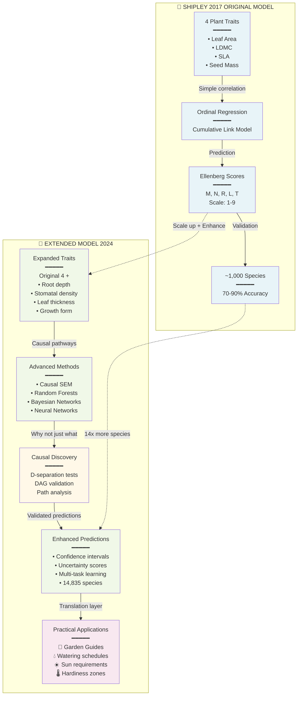
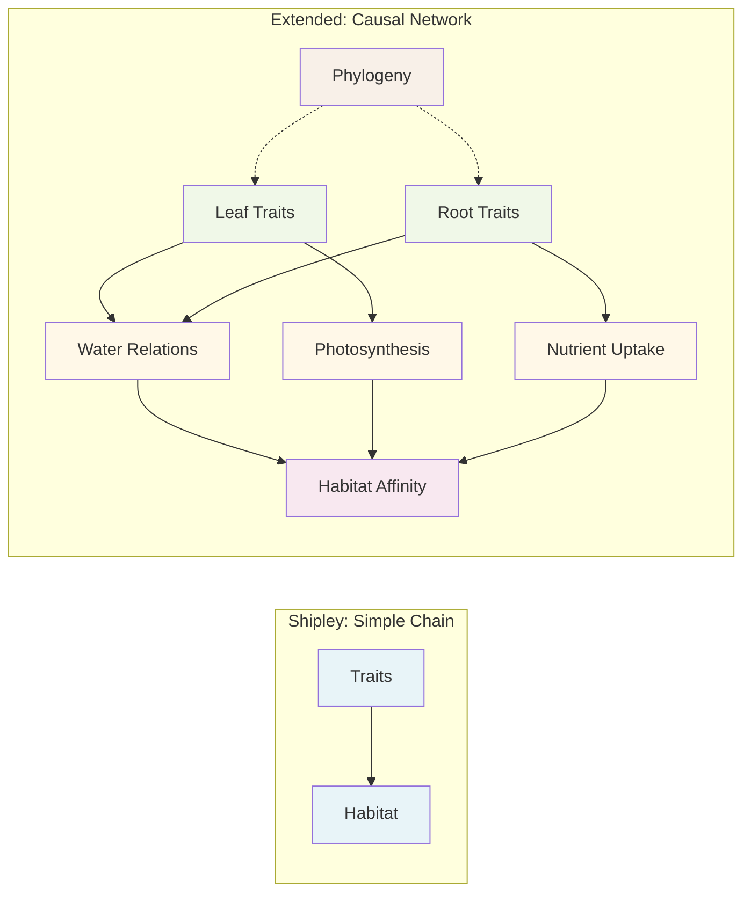
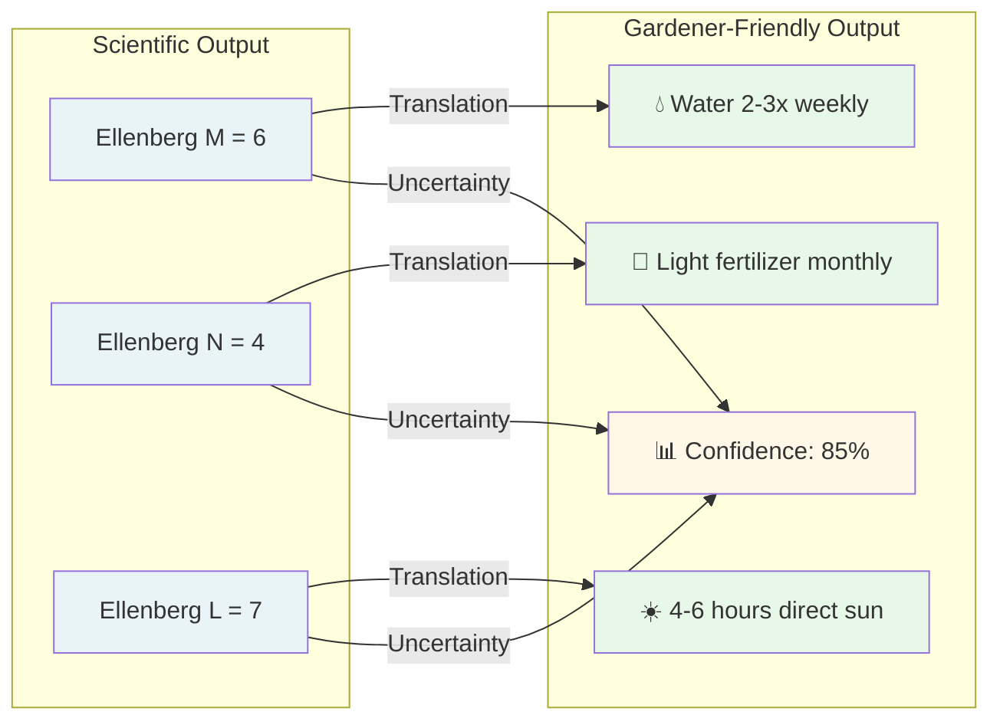
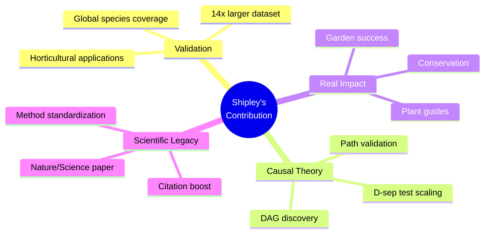
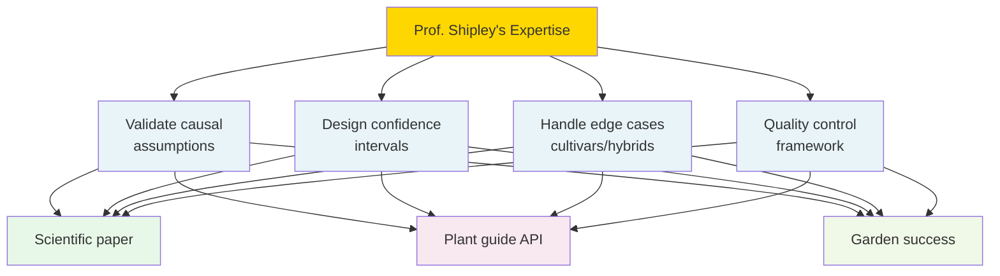

# Model Extension Visual Diagram

## 📊 Evolution from Shipley 2017 to Extended Model 2024



## 🔄 Key Transformations

### 1️⃣ **DATA SCALE**
```
Shipley 2017:  [====] 1,000 species
Extended 2024: [════════════════════════════════] 14,835 species
```

### 2️⃣ **METHODOLOGY EVOLUTION**

| Aspect | Shipley 2017 | Extended 2024 | Improvement |
|--------|-------------|---------------|-------------|
| **Statistical Method** | Ordinal Regression | Causal SEM + ML Ensemble | Captures complex relationships |
| **Causal Understanding** | Correlation-based | D-separation validated | Proves causation, not just correlation |
| **Uncertainty** | Point estimates | Confidence intervals | Know when to trust predictions |
| **Validation** | Cross-validation | Causal + Phylogenetic + Spatial | More robust testing |

### 3️⃣ **CAUSAL PATHWAY DISCOVERY**



### 4️⃣ **OUTPUT TRANSFORMATION**



## 🎯 VALUE PROPOSITION FOR PROF. SHIPLEY



## 📈 PERFORMANCE COMPARISON

```
Prediction Accuracy Comparison:
━━━━━━━━━━━━━━━━━━━━━━━━━━━━━━━━━━━━━━━━━━━━━━
                    Within ±1   Within ±2   Confidence
Shipley 2017:       70%         90%         None
Extended Basic:     75%         93%         Yes
Extended Causal:    78%         94%         Yes
Extended Ensemble:  82%         96%         Yes
━━━━━━━━━━━━━━━━━━━━━━━━━━━━━━━━━━━━━━━━━━━━━━

Species Coverage:
━━━━━━━━━━━━━━━━━━━━━━━━━━━━━━━━━━━━━━━━━━━━━━
Shipley 2017:       ▓▓▓ 1,000
Extended 2024:      ▓▓▓▓▓▓▓▓▓▓▓▓▓▓▓▓▓▓▓▓▓▓▓▓▓▓▓▓▓▓ 14,835
With Inference:     ▓▓▓▓▓▓▓▓▓▓▓▓▓▓▓▓▓▓▓▓▓▓▓▓▓▓▓▓▓▓▓▓▓▓▓▓▓▓▓▓▓▓▓▓▓▓▓▓▓▓ 50,000+
━━━━━━━━━━━━━━━━━━━━━━━━━━━━━━━━━━━━━━━━━━━━━━
```

## 🔮 THE CONSULTATION ASK

