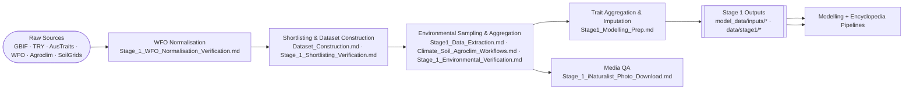

# Stage 1 — Data Pipeline Index

Date: 2025-10-21  
Maintainer: Stage 1 data engineering

This index stitches together every **current** Stage 1 summary (legacy notes live under `Stage_1/legacy/`). Use it as the master map when you need to regenerate artefacts, rerun QA, or explain the provenance of the modelling inputs.

---

## 1. End-to-end Flow

---

## 2. Pipeline Checkpoints

| Step | Summary | What it covers | Key artefacts |
|------|---------|----------------|---------------|
| WFO normalisation & merges | `Stage_1_WFO_Normalisation_Verification.md` | Cross-dataset WFO reconciliation, synonym audits, legacy ID tracking | `data/stage1/master_taxa_union.parquet` |
| Shortlisting & dataset stats | `Dataset_Construction.md` · `Stage_1_Shortlisting_Verification.md` | Rules for shortlist tiers (master, ≥30 GBIF, modelling 1 273/1 084) and QA queries | `data/stage1/stage1_shortlist_with_gbif*.parquet` |
| Environmental sampling | `Stage1_Data_Extraction.md` (historical steps) · `Climate_Soil_Agroclim_Workflows.md` | `sample_env_terra.R` usage, aggregation commands, quantiles | `data/stage1/{worldclim,soilgrids,agroclime}_*.parquet` |
| Environmental QA | `Stage_1_Environmental_Verification.md` | Checklist outputs, null sweeps, join rehearsals | Logs in `logs/stage1_environment/<date>/` |
| Trait aggregation & imputation | `Stage1_Modelling_Prep.md` | TRY/AusTraits merges, BHPMF reruns, coverage deltas | `model_data/inputs/traits_model_ready_*` · BHPMF diagnostics |
| Media QA | `Stage_1_iNaturalist_Photo_Download.md` | vetted photo workflow, iNaturalist download QA | `logs/stage1_media/*` |

---

## 3. Quick Reference — Commands

| Task | Command (2025-10-21 rerun) |
|------|---------------------------|
| Rebuild environmental summaries | `conda run -n AI --no-capture-output python scripts/aggregate_stage1_env_summaries.py worldclim soilgrids agroclime` |
| Regenerate quantiles | DuckDB helper in `Climate_Soil_Agroclim_Workflows.md` (loops over datasets) |
| Rebuild trait tables + modelling shortlist | `conda run -n AI --no-capture-output python scripts/rebuild_stage1_trait_tables.py --stamp <YYYYMMDD>` |
| Run BHPMF on modelling shortlist | `R_LIBS_USER=/home/olier/ellenberg/.Rlib Rscript src/Stage_2_Data_Processing/phylo_impute_traits_bhpmf.R --input_csv=..._modelling_shortlist_<stamp>.csv ...` |
| Archive QA evidence | `logs/stage1_environment/<date>/qa_report.md` · `logs/stage1_modelling_prep/<date>/qa_report.md` |

---

## 4. When to Visit Which File

- **Need shortlist thresholds or GBIF coverage numbers?** → `Dataset_Construction.md`  
- **Re-running environmental QA?** → `Stage_1_Environmental_Verification.md` (and update the QA log)  
- **Preparing modelling inputs / trait provenance?** → `Stage1_Modelling_Prep.md`  
- **Explaining WFO merge decisions?** → `Stage_1_WFO_Normalisation_Verification.md`  
- **Media assets for the encyclopedia?** → `Stage_1_iNaturalist_Photo_Download.md`

Keep this index aligned with any new summaries or major pipeline changes. If a document moves to `legacy/`, update the mermaid diagram and table accordingly so readers always land on the canonical guidance.
