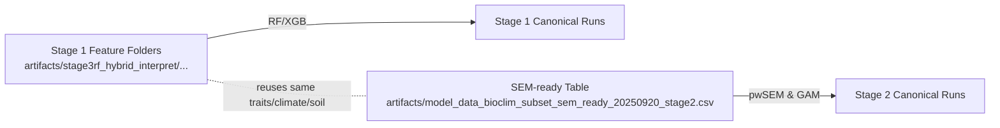

# Canonical Data Preparation — Trait + Climate + Soil Pipeline (2025-09-21)

## Purpose
- Document the full provenance of the canonical datasets used in Stage 1 (RF/XGB discovery) and Stage 2 (pwSEM/GAM structured regression) for the phylotraits axes (T, M, L, N, R).
- Provide reproducible commands to rebuild each dataset from raw traits, climate extractions, aridity indices, and SoilGrids pH summaries.
- Centralize references to the imputation workflow and soil extraction notes so future reruns follow the same path.

## Canonical Outputs
- **Stage 1 feature matrices (discovery):**
  - `artifacts/stage3rf_hybrid_interpret/phylotraits_cleanedAI_discovery_gpu_nosoil_20250917/{T,M,L,N}_{pk,nopk}/features.csv`
  - `artifacts/stage3rf_hybrid_interpret/phylotraits_cleanedAI_discovery_gpu_withph_quant_sg250m_20250917/R_{pk,nopk}/features.csv`
- **Stage 2 SEM-ready tables (structured regression):**
  - `artifacts/model_data_bioclim_subset_sem_ready_20250920_stage2.csv`
  - `artifacts/model_data_bioclim_subset_sem_ready_20250920_stage2_pcs.csv` (includes fold-safe PCs for GAM formulas)
- **Climate + aridity summaries feeding both stages:**
  - Non-soil axes: `data/bioclim_extractions_cleaned/summary_stats/species_bioclim_summary_with_aimonth.csv`
  - Soil axis (R): `data/bioclim_extractions_cleaned/summary_stats/species_bioclim_summary_with_aimonth_phq_sg250m_20250916.csv`
- **SoilGrids species summaries (canonical pH stack):**
  - `data/bioclim_extractions_bioclim_first/summary_stats/species_soil_summary_global_sg250m_ph_20250916.csv`

### Data Flow Overview

```mermaid
graph TD
  TRY[TRY & Myco Traits] -->|merge + WFO| T1[Enhanced Traits<br/>artifacts/model_data_bioclim_subset_enhanced.csv]
  T1 -->|BHPMF numeric| T2[Numeric Imputed Traits]
  T2 -->|Phylo kNN categorical| T3[Imputed Traits (numeric + categorical)]

  GBIF[GBIF Occurrences] -->|bioclim aggregate| C1[species_bioclim_summary.csv]
  C1 -->|add AI annual + monthly| C2[species_bioclim_summary_with_aimonth.csv]

  SoilTiles[SoilGrids 250 m GeoTIFF] -->|warp + aggregate| S1[data/bioclim_extractions_bioclim_first/summary_stats/species_soil_summary_global_sg250m_ph_20250916.csv]
  S1 -->|join with AI monthly| C3[data/bioclim_extractions_cleaned/summary_stats/species_bioclim_summary_with_aimonth_phq_sg250m_20250916.csv]

  T3 -->|Stage 1 export| F1[Stage 1 features per axis]
  C2 --> F1
  C3 --> F1

  T3 -->|SEM-ready prep| P1[SEM-ready dataset<br/>artifacts/model_data_bioclim_subset_sem_ready_20250920_stage2.csv]
  C2 --> P1
  C3 --> P1
```

### Stage 1 vs Stage 2 Products



## High-Level Workflow
1. **Trait assembly & cleaning** → `artifacts/model_data_bioclim_subset_enhanced.csv`
2. **Trait imputation (numeric + categorical)** → `artifacts/model_data_bioclim_subset_enhanced_imputed.csv`
3. **Climate summarization** → `data/bioclim_extractions_cleaned/summary_stats/species_bioclim_summary.csv`
4. **Aridity augmentation (AI mean + monthly)** → `species_bioclim_summary_with_ai.csv`, `species_bioclim_summary_with_aimonth.csv`
5. **SoilGrids extraction (pH-focused)** → `data/bioclim_extractions_bioclim_first/summary_stats/species_soil_summary_global_sg250m_ph_20250916.csv`
6. **Join climate + soil** → `data/bioclim_extractions_cleaned/summary_stats/species_bioclim_summary_with_aimonth_phq_sg250m_20250916.csv`
7. **Stage 1 feature export** via `hybrid_trait_bioclim_comprehensive.R`
8. **Stage 2 SEM-ready assembly** (trait normalization + fold-safe PCs)

The following sections detail each step with provenance and repro commands.

## 1. Trait Assembly & WFO Alignment
- Source scripts: `Makefile` (targets `try_extract_traits`, `try_merge_enhanced_subset`).
- Inputs: TRY v6 traits, MycoDB augmentation, WFO taxonomic backbone.
- Canonical output: `artifacts/model_data_bioclim_subset_enhanced.csv` (654 species × curated trait columns).
- Repro:
  - `make try_extract_traits`
  - `make try_merge_enhanced_subset`

## 2. Trait Imputation (Numeric + Categorical)
- Documentation: `results/summaries/hybrid_axes/phylotraits/repro_phylotraits_imputation_run.md`
- Numeric imputation: BHPMF (patched) on three key gaps.
  - `OMP_NUM_THREADS=1 make phylotraits_impute IMPUTE_USED_LEVELS=0`
- Categorical imputation: phylo-weighted kNN (Leaf_phenology, Photosynthesis_pathway).
  - `make phylotraits_impute_categorical TRAITS_CAT=Leaf_phenology,Photosynthesis_pathway`
- Outputs:
  - `artifacts/model_data_bioclim_subset_enhanced_imputed.csv`
  - `artifacts/model_data_bioclim_subset_enhanced_imputed_cat.csv`

## 3. Climate Extraction & Summaries
- Base extraction already performed (GBIF occurrences filtered, bioclim variables summarised).
- Canonical species summary: `data/bioclim_extractions_cleaned/summary_stats/species_bioclim_summary.csv`
- Key script: `src/Stage_1_Data_Extraction/gbif_bioclim/aggregate_bioclim_summaries.R`
- Repro (if needed): `make bioclim_summary`

## 4. Aridity Augmentation (AI)
- Monthly AI rasters staged under `data/PET/Global_AI__monthly_v3_1/`
- Make targets: `bioclim_add_ai` (annual) and `bioclim_add_ai_monthly` (monthly series)
  - Example: `make bioclim_add_ai_monthly BIOCLIM_SUMMARY=data/bioclim_extractions_cleaned/summary_stats/species_bioclim_summary.csv`
- Outputs:
  - `species_bioclim_summary_with_ai.csv`
  - `species_bioclim_summary_with_aimonth.csv`

## 5. SoilGrids Extraction (Canonical pH Stack)
- Documentation: `results/summaries/hybrid_axes/phylotraits/canonical_soil_extraction_R_20250916.md`
- Steps:
  1. Download + warp SoilGrids 250 m GeoTIFF tiles.
  2. Aggregate to species means/quantiles via `scripts/aggregate_soilgrids_species.R`
     - Output: `data/bioclim_extractions_bioclim_first/summary_stats/species_soil_summary_global_sg250m_ph_20250916.csv`
  3. Join with AI monthly summary:
     ```bash
     Rscript scripts/augment_bioclim_summary_with_soil.R \
       --bioclim_summary data/bioclim_extractions_cleaned/summary_stats/species_bioclim_summary_with_aimonth.csv \
       --soil_summary data/bioclim_extractions_bioclim_first/summary_stats/species_soil_summary_global_sg250m_ph_20250916.csv \
       --output data/bioclim_extractions_cleaned/summary_stats/species_bioclim_summary_with_aimonth_phq_sg250m_20250916.csv
     ```
- Optional variants (archived): bilinear resample, full SoilGrids stack; kept for comparison but not canonical.

## 6. Stage 1 Feature Export (Per Axis)
- Script: `src/Stage_3RF_Hybrid/hybrid_trait_bioclim_comprehensive.R`
- Helper: `scripts/run_interpret_axes_tmux.sh`
- Dataset labels:
  - Non-soil axes: `phylotraits_cleanedAI_discovery_gpu_nosoil_20250917`
    - `--bioclim_summary data/bioclim_extractions_cleaned/summary_stats/species_bioclim_summary_with_aimonth.csv`
  - Soil axis R: `phylotraits_cleanedAI_discovery_gpu_withph_quant_sg250m_20250917`
    - `--bioclim_summary data/bioclim_extractions_cleaned/summary_stats/species_bioclim_summary_with_aimonth_phq_sg250m_20250916.csv`
- Canonical export command (non-soil example):
  ```bash
  conda run -n AI bash scripts/run_interpret_axes_tmux.sh \
    --label phylotraits_cleanedAI_discovery_gpu_nosoil_20250917 \
    --trait_csv artifacts/model_data_bioclim_subset_enhanced_imputed.csv \
    --bioclim_summary data/bioclim_extractions_cleaned/summary_stats/species_bioclim_summary_with_aimonth.csv \
    --axes T,M,L,N --folds 10 --x_exp 2 --k_trunc 0 \
    --run_rf true --run_xgb true --xgb_gpu true --xgb_estimators 3000 --xgb_lr 0.02 --clean_out true
  ```
- Resulting feature matrices incorporate pk/no_pk variants and are reused by Stage 1 RF/XGB interpretability runs.

## 7. Stage 2 SEM-Ready Tables
- Pipeline script: `src/Stage_4_SEM_Analysis/prepare_sem_ready_dataset.R` (invoked via Makefile targets under `Makefile.stage2_structured_regression`).
- Key operations: fold-safe scaling, principal components (pc_trait_1..4), stacking of aridity and soil summaries, join of phylogenetic covariates.
- Outputs:
  - `artifacts/model_data_bioclim_subset_sem_ready_20250920_stage2.csv`
  - `artifacts/model_data_bioclim_subset_sem_ready_20250920_stage2_pcs.csv`
- Repro target:
  ```bash
  make -f Makefile.stage2_structured_regression prepare_sem_ready
  ```
  (If the target is implicit inside other commands, ensure scripts are up to date before regenerating.)

## 8. Provenance References
- **Trait imputation log:** `results/summaries/hybrid_axes/phylotraits/repro_phylotraits_imputation_run.md`
- **Soil extraction rationale:** `results/summaries/hybrid_axes/phylotraits/canonical_soil_extraction_R_20250916.md`
- **Stage 1 canonical summary:** `results/summaries/hybrid_axes/phylotraits/Stage_1/Stage1_canonical_summary.md`
- **Stage 2 methodology:** `results/summaries/hybrid_axes/phylotraits/overall_methodology_sem_aic_discovery_20250920.md`

## Quick Rebuild Checklist
1. Run trait extraction + imputation (Section 1–2) ➜ ensure `_imputed.csv` exists.
2. Confirm climate + AI joins (Section 3–4) ➜ `species_bioclim_summary_with_aimonth.csv`.
3. Recompute SoilGrids summary (Section 5) ➜ `species_soil_summary_global_sg250m_ph_20250916.csv`.
4. Export Stage 1 features via tmux helper (Section 6).
5. Generate Stage 2 SEM-ready tables (Section 7).

Once these data assets are in place, the Stage 1 `canonical_stage1_rf_tmux` / `canonical_stage1_xgb_seq` targets and Stage 2 `gam_ALL` / `aic_ALL` commands can be rerun with full provenance confidence.
