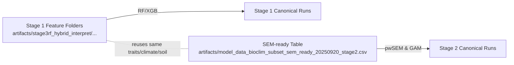

# Canonical Data Preparation — Trait + Climate + Soil + Interaction Pipeline (2025-10-03)

## Purpose
- Document the full provenance of the canonical datasets used in Stage 1 (RF/XGB discovery) and Stage 2 (pwSEM/GAM structured regression) for the phylotraits axes (T, M, L, N, R).
- Provide reproducible commands to rebuild each dataset from raw traits, climate extractions, aridity indices, SoilGrids pH summaries, and GloBI interaction networks.
- Centralize references to the imputation workflow, soil extraction notes, and ecosystem service data integration so future reruns follow the same path.

## Canonical Outputs
- **Stage 1 feature matrices (discovery):**
  - `artifacts/stage3rf_hybrid_interpret/phylotraits_cleanedAI_discovery_gpu_nosoil_20250917/{T,M,L,N}_{pk,nopk}/features.csv`
  - `artifacts/stage3rf_hybrid_interpret/phylotraits_cleanedAI_discovery_gpu_withph_quant_sg250m_20250917/R_{pk,nopk}/features.csv`
- **Stage 2 SEM-ready tables (structured regression):**
  - `artifacts/model_data_bioclim_subset_sem_ready_20250920_stage2.csv`
  - `artifacts/model_data_bioclim_subset_sem_ready_20250920_stage2_pcs.csv` (includes fold-safe PCs for GAM formulas)
- **Climate + aridity summaries feeding both stages:**
  - Non-soil axes: `data/bioclim_extractions_cleaned/summary_stats/species_bioclim_summary_with_aimonth.csv`
  - Soil axis (R): `data/bioclim_extractions_cleaned/summary_stats/species_bioclim_summary_with_aimonth_phq_sg250m_20250916.csv`
- **SoilGrids species summaries (canonical pH stack):**
  - `data/bioclim_extractions_bioclim_first/summary_stats/species_soil_summary_global_sg250m_ph_20250916.csv`
- **GloBI interaction features (ecosystem services):**
  - Raw matched interactions: `artifacts/globi_mapping/globi_interactions_raw.csv.gz` (928K records)
  - Aggregated features: `artifacts/globi_mapping/stage3_globi_interaction_features.csv` (654 species × 20+ columns)
  - Traits + GloBI merged: `artifacts/globi_mapping/stage3_traits_with_globi_features.csv` (full dataset)
- **Stage 7 validation datasets (qualitative cross-validation):**
  - EIVE labels + legacy profile mapping: `data/stage7_validation_eive_labels.csv` (405 species)
  - Legacy Gemini plant profiles: `data/stage7_validation_profiles/*.json` (405 qualitative dossiers)
  - Normalized axis-specific evidence: `data/stage7_normalized_profiles/*.json` (per-species L/M/R/N/T descriptors)
  - Reliability-scored alignment verdicts: `results/stage7_alignment/*.json` (per-species validation with confidence metrics)
- **Comprehensive dataset (all components merged, 2025-10-04):**
  - Unified table with GBIF links: `data/comprehensive_dataset_no_soil_with_gbif.csv` (654 species × 243 columns)
  - Includes: traits, bioclim, GloBI, EIVE, Stage 7 labels (405 spp), Stage 7 reliability (10 spp), GBIF paths
  - Schema documentation: `data/comprehensive_dataset_schema.md`
  - GBIF index: `data/gbif_occurrence_index.csv` (metadata for 646 species with occurrence files)
- **Encyclopedia profiles (frontend-ready JSON, 2025-10-04, updated 2025-10-05):**
  - Individual JSON profiles: `data/encyclopedia_profiles/*.json` (654 files, 14.6 MB)
  - Optimized for web display with actual EIVE values, reliability, GloBI, occurrence coordinates, bioclim climate data
  - Documentation: `results/summaries/hybrid_axes/phylotraits/Stage 5/encyclopedia_profile_system.md`
  - **Update 2025-10-05:** Fixed missing bioclim integration in profile generation pipeline (see Section 12)
- **Gardener trait summary (2025-10-05):**
  - Friendly display slice: `data/encyclopedia_gardening_traits.csv` (654 species × curated columns)
  - Built from TRY-augmented datasets via `scripts/build_encyclopedia_traits.py`
  - Feeds the encyclopedia “Physical Characteristics” replacement blocks (growth form, leaf habit, height band, bloom window, root depth, mycorrhiza, photosynthesis mode, etc.)

### Data Flow Overview

```mermaid
graph TD
  TRY[TRY & Myco Traits] -->|merge + WFO| T1[Enhanced Traits<br/>artifacts/model_data_bioclim_subset_enhanced.csv]
  T1 -->|BHPMF numeric| T2[Numeric Imputed Traits]
  T2 -->|Phylo kNN categorical| T3[Imputed Traits (numeric + categorical)]

  GBIF[GBIF Occurrences] -->|bioclim aggregate| C1[species_bioclim_summary.csv]
  C1 -->|add AI annual + monthly| C2[species_bioclim_summary_with_aimonth.csv]

  SoilTiles[SoilGrids 250 m GeoTIFF] -->|warp + aggregate| S1[data/bioclim_extractions_bioclim_first/summary_stats/species_soil_summary_global_sg250m_ph_20250916.csv]
  S1 -->|join with AI monthly| C3[data/bioclim_extractions_cleaned/summary_stats/species_bioclim_summary_with_aimonth_phq_sg250m_20250916.csv]

  GloBI[GloBI Interactions<br/>20M+ records] -->|WFO synonym map<br/>stream & filter| G1[928K matched interactions]
  G1 -->|aggregate by category| G2[GloBI features per species<br/>artifacts/globi_mapping/stage3_globi_interaction_features.csv]

  T3 -->|Stage 1 export| F1[Stage 1 features per axis]
  C2 --> F1
  C3 --> F1

  T3 -->|SEM-ready prep| P1[SEM-ready dataset<br/>artifacts/model_data_bioclim_subset_sem_ready_20250920_stage2.csv]
  C2 --> P1
  C3 --> P1

  T3 -->|join GloBI| G3[Traits + GloBI<br/>artifacts/globi_mapping/stage3_traits_with_globi_features.csv]
  G2 --> G3

  F1 -->|predict EIVE| EIVE[Stage 1/2 EIVE Predictions]
  P1 --> EIVE

  EIVE -->|merge legacy profiles| V1[Stage 7 Validation Labels<br/>data/stage7_validation_eive_labels.csv]
  LegacyProfiles[Legacy Gemini Profiles<br/>405 qualitative dossiers] --> V1

  V1 -->|normalize via LLM| V2[Normalized Profiles<br/>data/stage7_normalized_profiles/*.json]
  V2 -->|align + score| V3[Reliability Verdicts<br/>results/stage7_alignment/*.json]

  G3 -->|merge all| COMP[Comprehensive Dataset<br/>data/comprehensive_dataset_no_soil_with_gbif.csv<br/>654 species × 243 columns]
  C2 --> COMP
  V1 --> COMP
  V3 --> COMP

  COMP -->|extract & format| ENC[Encyclopedia Profiles<br/>data/encyclopedia_profiles/*.json<br/>654 frontend-ready JSON files]
  GBIF_IDX[GBIF Index<br/>data/gbif_occurrence_index.csv] --> ENC
```

### Stage 1 vs Stage 2 Products



## High-Level Workflow
1. **Trait assembly & cleaning** → `artifacts/model_data_bioclim_subset_enhanced.csv`
2. **Trait imputation (numeric + categorical)** → `artifacts/model_data_bioclim_subset_enhanced_imputed.csv`
3. **Climate summarization** → `data/bioclim_extractions_cleaned/summary_stats/species_bioclim_summary.csv`
4. **Aridity augmentation (AI mean + monthly)** → `species_bioclim_summary_with_ai.csv`, `species_bioclim_summary_with_aimonth.csv`
5. **SoilGrids extraction (pH-focused)** → `data/bioclim_extractions_bioclim_first/summary_stats/species_soil_summary_global_sg250m_ph_20250916.csv`
6. **Join climate + soil** → `data/bioclim_extractions_cleaned/summary_stats/species_bioclim_summary_with_aimonth_phq_sg250m_20250916.csv`
7. **Stage 1 feature export** via `hybrid_trait_bioclim_comprehensive.R`
8. **Stage 2 SEM-ready assembly** (trait normalization + fold-safe PCs)
9. **TRY raw trait augmentation** (root, floral, phenology traits) → `model_data_bioclim_subset_enhanced_augmented_tryraw.csv`
10. **GloBI interaction integration** (pollination, herbivory, pathogen networks) → `stage3_traits_with_globi_features.csv`
11. **Stage 7 validation label preparation** (EIVE scores + legacy profile mapping) → `data/stage7_validation_eive_labels.csv`
12. **Stage 7 profile normalization** (LLM-extracted axis evidence) → `data/stage7_normalized_profiles/*.json`
13. **Stage 7 alignment + reliability scoring** (quantitative validation metrics) → `results/stage7_alignment/*.json`

The following sections detail each step with provenance and repro commands.

## 1. Trait Assembly & WFO Alignment
- Source scripts: `Makefile` (targets `try_extract_traits`, `try_merge_enhanced_subset`).
- Inputs: TRY v6 traits, MycoDB augmentation, WFO taxonomic backbone.
- Canonical output: `artifacts/model_data_bioclim_subset_enhanced.csv` (654 species × curated trait columns).
- Repro:
  - `make try_extract_traits`
  - `make try_merge_enhanced_subset`

## 2. Trait Imputation (Numeric + Categorical)
- Documentation: `results/summaries/hybrid_axes/phylotraits/repro_phylotraits_imputation_run.md`
- Numeric imputation: BHPMF (patched) on three key gaps.
  - `OMP_NUM_THREADS=1 make phylotraits_impute IMPUTE_USED_LEVELS=0`
- Categorical imputation: phylo-weighted kNN (Leaf_phenology, Photosynthesis_pathway).
  - `make phylotraits_impute_categorical TRAITS_CAT=Leaf_phenology,Photosynthesis_pathway`
- Outputs:
  - `artifacts/model_data_bioclim_subset_enhanced_imputed.csv`
  - `artifacts/model_data_bioclim_subset_enhanced_imputed_cat.csv`

## 3. Climate Extraction & Summaries
- Base extraction already performed (GBIF occurrences filtered, bioclim variables summarised).
- Canonical species summary: `data/bioclim_extractions_cleaned/summary_stats/species_bioclim_summary.csv`
- Key script: `src/Stage_1_Data_Extraction/gbif_bioclim/aggregate_bioclim_summaries.R`
- Repro (if needed): `make bioclim_summary`

## 4. Aridity Augmentation (AI)
- Monthly AI rasters staged under `data/PET/Global_AI__monthly_v3_1/`
- Make targets: `bioclim_add_ai` (annual) and `bioclim_add_ai_monthly` (monthly series)
  - Example: `make bioclim_add_ai_monthly BIOCLIM_SUMMARY=data/bioclim_extractions_cleaned/summary_stats/species_bioclim_summary.csv`
- Outputs:
  - `species_bioclim_summary_with_ai.csv`
  - `species_bioclim_summary_with_aimonth.csv`

## 5. SoilGrids Extraction (Canonical pH Stack)
- Documentation: `results/summaries/hybrid_axes/phylotraits/canonical_soil_extraction_R_20250916.md`
- Steps:
  1. Download + warp SoilGrids 250 m GeoTIFF tiles.
  2. Aggregate to species means/quantiles via `scripts/aggregate_soilgrids_species.R`
     - Output: `data/bioclim_extractions_bioclim_first/summary_stats/species_soil_summary_global_sg250m_ph_20250916.csv`
  3. Join with AI monthly summary:
     ```bash
     Rscript scripts/augment_bioclim_summary_with_soil.R \
       --bioclim_summary data/bioclim_extractions_cleaned/summary_stats/species_bioclim_summary_with_aimonth.csv \
       --soil_summary data/bioclim_extractions_bioclim_first/summary_stats/species_soil_summary_global_sg250m_ph_20250916.csv \
       --output data/bioclim_extractions_cleaned/summary_stats/species_bioclim_summary_with_aimonth_phq_sg250m_20250916.csv
     ```
- Optional variants (archived): bilinear resample, full SoilGrids stack; kept for comparison but not canonical.

## 6. Stage 1 Feature Export (Per Axis)
- Script: `src/Stage_3RF_Hybrid/hybrid_trait_bioclim_comprehensive.R`
- Helper: `scripts/run_interpret_axes_tmux.sh`
- Dataset labels:
  - Non-soil axes: `phylotraits_cleanedAI_discovery_gpu_nosoil_20250917`
    - `--bioclim_summary data/bioclim_extractions_cleaned/summary_stats/species_bioclim_summary_with_aimonth.csv`
  - Soil axis R: `phylotraits_cleanedAI_discovery_gpu_withph_quant_sg250m_20250917`
    - `--bioclim_summary data/bioclim_extractions_cleaned/summary_stats/species_bioclim_summary_with_aimonth_phq_sg250m_20250916.csv`
- Canonical export command (non-soil example):
  ```bash
  conda run -n AI bash scripts/run_interpret_axes_tmux.sh \
    --label phylotraits_cleanedAI_discovery_gpu_nosoil_20250917 \
    --trait_csv artifacts/model_data_bioclim_subset_enhanced_imputed.csv \
    --bioclim_summary data/bioclim_extractions_cleaned/summary_stats/species_bioclim_summary_with_aimonth.csv \
    --axes T,M,L,N --folds 10 --x_exp 2 --k_trunc 0 \
    --run_rf true --run_xgb true --xgb_gpu true --xgb_estimators 3000 --xgb_lr 0.02 --clean_out true
  ```
- Resulting feature matrices incorporate pk/no_pk variants and are reused by Stage 1 RF/XGB interpretability runs.

## 7. Stage 2 SEM-Ready Tables
- Pipeline script: `src/Stage_4_SEM_Analysis/prepare_sem_ready_dataset.R` (invoked via Makefile targets under `Makefile.stage2_structured_regression`).
- Key operations: fold-safe scaling, principal components (pc_trait_1..4), stacking of aridity and soil summaries, join of phylogenetic covariates.
- Outputs:
  - `artifacts/model_data_bioclim_subset_sem_ready_20250920_stage2.csv`
  - `artifacts/model_data_bioclim_subset_sem_ready_20250920_stage2_pcs.csv`
- Repro target:
  ```bash
  make -f Makefile.stage2_structured_regression prepare_sem_ready
  ```
  (If the target is implicit inside other commands, ensure scripts are up to date before regenerating.)

## 8. Provenance References
- **Trait imputation log:** `results/summaries/hybrid_axes/phylotraits/repro_phylotraits_imputation_run.md`
- **Soil extraction rationale:** `results/summaries/hybrid_axes/phylotraits/canonical_soil_extraction_R_20250916.md`
- **GloBI integration workflow:** `results/summaries/hybrid_axes/phylotraits/Stage 3/globi_integration_workflow.md`
- **Stage 1 canonical summary:** `results/summaries/hybrid_axes/phylotraits/Stage_1/Stage1_canonical_summary.md`
- **Stage 2 methodology:** `results/summaries/hybrid_axes/phylotraits/overall_methodology_sem_aic_discovery_20250920.md`
- **Stage 7 validation overview:** `results/summaries/hybrid_axes/phylotraits/Stage 4/README.md` (legacy Gemini pipeline)
- **Stage 7 normalization prompt:** `src/Stage_7_Validation/prompt_eive_mapping.md`
- **Stage 7 alignment prompt:** `src/Stage_7_Validation/prompt_alignment_verdict.md`

## Quick Rebuild Checklist
1. Run trait extraction + imputation (Section 1–2) ➜ ensure `_imputed.csv` exists.
2. Confirm climate + AI joins (Section 3–4) ➜ `species_bioclim_summary_with_aimonth.csv`.
3. Recompute SoilGrids summary (Section 5) ➜ `species_soil_summary_global_sg250m_ph_20250916.csv`.
4. Export Stage 1 features via tmux helper (Section 6).
5. Generate Stage 2 SEM-ready tables (Section 7).
6. Integrate GloBI interaction data (Section 10) ➜ `stage3_traits_with_globi_features.csv`.
7. Build Stage 7 validation labels (Section 11) ➜ `stage7_validation_eive_labels.csv`.
8. Normalize Stage 7 profiles (Section 11) ➜ `stage7_normalized_profiles/*.json`.
9. Generate Stage 7 alignment verdicts (Section 11) ➜ `stage7_alignment/*.json`.

Once these data assets are in place, the Stage 1 `canonical_stage1_rf_tmux` / `canonical_stage1_xgb_seq` targets and Stage 2 `gam_ALL` / `aic_ALL` commands can be rerun with full provenance confidence. Stage 7 validation provides qualitative cross-checks and reliability metrics for downstream model refinement.

## 9. TRY Raw Trait Augmentation (2025-10-06 update with crown diameter and corolla type)
- **Purpose:** enrich the canonical trait tables with root, architectural, floral, and phenology traits sourced from local TRY 6.0 exports (including dataset `44049.txt`).
- **Inputs:**
  - Canonical trait baseline: `artifacts/model_data_bioclim_subset_enhanced.csv`
  - TRY raw dumps: `data/TRY/*.txt`
- **Script:** `scripts/augment_try_traits.py` (Python; resolves WFO synonyms via `data/classification.csv`, extracts numeric and categorical traits, computes species means or modes, logs unmatched names).
- **Recipe:**
  ```bash
  conda run -n AI python scripts/augment_try_traits.py \
    --canonical artifacts/model_data_bioclim_subset_enhanced.csv \
    --try_dir data/TRY \
    --classification data/classification.csv \
    --out_table artifacts/model_data_bioclim_subset_enhanced_augmented_tryraw.csv \
    --summary_csv artifacts/try_trait_augmented_coverage_summary.csv \
    --out_absent artifacts/try_raw_species_absent.txt \
    --out_no_trait artifacts/try_raw_species_without_target_traits.txt
  ```
- **Coverage delivered (654 canonical species):**

  | TRY ID | Column | Species |
  | --- | --- | --- |
  | 6 | `trait_root_depth_raw` | 275 |
  | 82 | `trait_root_tissue_density_raw` | 88 |
  | 83 | `trait_root_diameter_raw` | 101 |
  | 1080 | `trait_root_srl_raw` | 113 |
  | 140 | `trait_shoot_branching_raw` | 534 |
  | 207 | `trait_flower_color_raw` | 512 |
  | 210 | `trait_flower_pollen_number_raw` | 63 |
  | 324 | `trait_crown_diameter_raw` | 123 (added 2025-10-06) |
  | 335 | `trait_flowering_time_raw` | 571 |
  | 343 | `trait_life_form_raw` | 622 |
  | 363 | `trait_root_biomass_raw` | 205 |
  | 507 | `trait_flowering_onset_raw` | 23 |
  | 2006 | `trait_fine_root_fraction_raw` | 24 |
  | 2817 | `trait_inflorescence_height_raw` | 11 |
  | 2935 | `trait_flower_symmetry_raw` | 23 |
  | 2936 | `trait_flower_corolla_type_raw` | 24 (added 2025-10-06) |
  | 3579 | `trait_flower_nectar_tube_depth_raw` | 47 |
  | 3821 | `trait_flower_nectar_presence_raw` | 38 |
  | 37 | `trait_leaf_phenology_raw` | 611 |
  | 1257 | `trait_flower_nectar_sugar_raw` | 0 (still absent)

- **Name-match audit:** WFO synonym resolution removes all unmatched species (list now empty). Six species remain without the selected traits (`artifacts/try_raw_species_without_target_traits.txt`).

### Updated Canonical Artifacts
- **Stage 1 traits:** `artifacts/model_data_bioclim_subset_enhanced_augmented_tryraw.csv`
- **Stage 2 SEM-ready:** `artifacts/model_data_bioclim_subset_sem_ready_20250920_stage2_augmented.csv`

### Follow-up
- When additional TRY extracts arrive (e.g., to improve nectar sugar coverage), rerun the augmentation command above and re-check the unmatched-species list before merging.

### Gardener Trait Slice (2025-10-05)
- **Purpose:** distill the augmented TRY traits into layperson-friendly categories for the encyclopedia UI (e.g., growth form, leaf habit, flower colour, root depth bands, mycorrhiza type).
- **Script:** `scripts/build_encyclopedia_traits.py`
- **Input priority:**
  1. `artifacts/model_data_bioclim_subset_enhanced_augmented_tryraw_imputed_cat.csv` (imputed categorical + numeric TRY traits)
  2. Fallback to `artifacts/model_data_bioclim_subset_enhanced_augmented_tryraw.csv` for any missing raw values
- **Output:** `data/encyclopedia_gardening_traits.csv` (654 species)
- **Regeneration:**
  ```bash
  # Rebuild friendly trait slice (after rerunning TRY augmentation if needed)
  ./scripts/build_encyclopedia_traits.py
  ```
- **Fields produced:** growth form, woodiness, leaf type, leaf habit, branching style, flower colour, bloom calendar phrases, root depth band + source flag, mycorrhizal association, photosynthesis pathway.

## 10. GloBI Interaction Data Integration (2025-10-03)

- **Purpose:** integrate citizen science ecological interaction networks (pollinators, herbivores, pathogens) from Global Biotic Interactions (GloBI) to support ecosystem service projections and plant profile validation.
- **Inputs:**
  - GloBI global interactions database: `/home/olier/plantsdatabase/data/sources/globi/globi_cache/interactions.csv.gz` (~2.9 GB compressed, 20M+ records)
  - WFO taxonomic backbone: `/home/olier/plantsdatabase/data/Stage_1/classification.csv` (synonym resolution)
  - Stage 3 canonical trait table: `artifacts/model_data_bioclim_subset_enhanced_augmented_tryraw_imputed_cat.csv` (654 species)
- **Script:** `scripts/globi_join_stage3.py` (Python; streams interactions, builds WFO synonym map with 14,149 name variants, extracts 928K matched records, aggregates by category)
- **Recipe:**
  ```bash
  # Download GloBI snapshot (if not cached; ~2.9 GB)
  mkdir -p /home/olier/plantsdatabase/data/sources/globi/globi_cache
  wget -O /home/olier/plantsdatabase/data/sources/globi/globi_cache/interactions.csv.gz \
    https://depot.globalbioticinteractions.org/snapshot/interactions.csv.gz

  # Run integration pipeline (~20-25 minutes)
  python scripts/globi_join_stage3.py > logs/globi_join.log 2>&1

  # Generate summary report
  python scripts/globi_report_stage3.py
  ```
- **Coverage delivered (654 canonical species):**
  - **Species with GloBI interactions:** 601 (92%)
  - **Total interaction records extracted:** 928,129
  - **Pollination:** 352 species with records; mean 70 partners per species
  - **Herbivory:** 487 species with records; mean 27 partners per species
  - **Pathogen:** 592 species with records; mean 111 partners per species
  - **Dispersal:** 0 species with records (data gap in GloBI for European plants)

### Outputs
- **Raw interactions:** `artifacts/globi_mapping/globi_interactions_raw.csv.gz` (8 MB, 928K records with partner names, kingdoms, references)
- **Aggregated features:** `artifacts/globi_mapping/stage3_globi_interaction_features.csv` (235 KB, 654 species × 20+ GloBI columns)
- **Traits + GloBI merged:** `artifacts/globi_mapping/stage3_traits_with_globi_features.csv` (549 KB, full trait table with interaction counts, partner lists, top partners per category)
- **Summary report:** `results/summaries/hybrid_axes/phylotraits/Stage 3/globi_interactions_report.md`

### GloBI Feature Columns
Per species aggregation includes:
- Total, source, and target record counts
- Unique partner count and partner kingdom diversity
- Per-category (pollination/herbivory/dispersal/pathogen) metrics:
  - `globi_{category}_records`: interaction record count
  - `globi_{category}_partners`: unique partner count
  - `globi_{category}_top_partners`: top 5 partners with observation counts (e.g., "Bombus pascuorum (892); Apis mellifera (483)")

### Workflow Documentation
- **Full repro guide:** `results/summaries/hybrid_axes/phylotraits/Stage 3/globi_integration_workflow.md`
- **Runtime:** ~20-25 minutes (synonym mapping 30s, streaming 15-20min, aggregation 5s)

### Validation Examples
Sanity-checked high-signal species show expected interactions:
- *Trifolium pratense*: 8,488 pollination records; top pollinator *Bombus pascuorum* (892 obs) matches literature
- *Achillea millefolium*: 10,284 pollination records; diverse fly and bee visitors
- *Helianthus annuus*: 10,785 pollination records; honeybees and native bees dominant

### Follow-up
- To refresh with new GloBI snapshots, re-download `interactions.csv.gz` and rerun `globi_join_stage3.py`
- Dispersal coverage may improve with future GloBI updates; monitor European seed dispersal datasets

## 11. Stage 7 Validation Pipeline (2025-09-30 to 2025-10-01)

- **Purpose:** cross-validate quantitative EIVE predictions against qualitative horticultural evidence from legacy Gemini-researched plant profiles, with reliability scoring to flag high-confidence vs. conflicting predictions.
- **Inputs:**
  - Stage 2 canonical species list: 654 species from `artifacts/model_data_bioclim_subset_enhanced_imputed.csv`
  - Stage 1/2 EIVE predictions: numeric scores (0–10) for L, M, R, N, T axes
  - Legacy Gemini plant profiles: `/home/olier/plantsdatabase/archive/data_backup/plant_profiles/*.json` (~600 qualitative dossiers from web-grounded research)
- **Scripts:**
  - Label preparation: `scripts/build_stage7_validation_labels.py`
  - Profile normalization: `scripts/normalize_stage7_profiles.py` (uses Gemini 2.5 Flash via `src/Stage_7_Validation/prompt_eive_mapping.md`)
  - Alignment + reliability scoring: `scripts/align_stage7_profiles.py` (uses Gemini 2.5 Pro via `src/Stage_7_Validation/prompt_alignment_verdict.md`)
- **Recipe:**
  ```bash
  # Step 1: Build validation label dataset (405 matched species)
  python scripts/build_stage7_validation_labels.py
  # → data/stage7_validation_eive_labels.csv

  # Step 2: Normalize legacy profiles into axis-specific evidence
  python scripts/normalize_stage7_profiles.py \
    --input-dir data/stage7_validation_profiles \
    --output-dir data/stage7_normalized_profiles \
    --first 10  # process first 10 species
  # → data/stage7_normalized_profiles/{slug}.json (per-axis descriptors)

  # Step 3: Generate reliability-scored alignment verdicts
  python scripts/align_stage7_profiles.py \
    --input-dir data/stage7_normalized_profiles \
    --output-dir results/stage7_alignment \
    --first 10  # process first 10 species
  # → results/stage7_alignment/{slug}.json (per-axis verdict + confidence)
  ```

### Coverage Delivered (405 species matched)
- **Validation labels:** `data/stage7_validation_eive_labels.csv` merges EIVE scores, qualitative bins (e.g., "shade plant", "moist soils"), legacy profile paths, and taxonomic concepts
- **Profile normalization:** LLM extracts axis-specific evidence (light requirements, moisture needs, pH preferences, nutrient levels, temperature zones) from unstructured Gemini dossiers
- **Alignment verdicts:** 10 species processed (as of 2025-10-01):
  - *Abies alba*, *Abies grandis*, *Abies lasiocarpa*, *Abutilon theophrasti*, *Acacia mearnsii*
  - *Acer campestre*, *Acer rubrum*, *Acer saccharinum*, *Acer saccharum*, *Achillea millefolium*

### Outputs
- **Validation labels (tabular):** `data/stage7_validation_eive_labels.csv`
  - Columns: `stage2_species`, `legacy_slug`, `legacy_path`, `destination_path`, `taxon_concept`, `EIVEres-{L,M,R,N,T}`, `{L,M,R,N,T}_label`
  - Example labels: "shade plant (mostly <5% relative illumination)", "moist; upper range of fresh soils", "moderately acidic soils; occasional neutral/basic"
- **Normalized profiles (per-species JSON):** `data/stage7_normalized_profiles/*.json`
  - Structure: array of 5 axis objects with `axis`, `bin`, `strength`, `quotes` (evidence snippets)
- **Alignment verdicts (per-species JSON):** `results/stage7_alignment/*.json`
  - Structure: `summary` + array of 5 axis objects with:
    - `verdict`: match | partial | conflict | insufficient
    - `reliability_score`: 0.0–1.0 (computed from evidence strength, specificity, numeric advantage)
    - `confidence`: 0.0–1.0
    - `reliability_label`: High | Medium | Low | Conflict | Unknown
    - `verdict_numeric`: 1.0 (match) | 0.5 (partial) | 0.0 (conflict) | null (insufficient)
    - `support_count`, `contradict_count`, `strength`, `applicability`, detailed notes

### Reliability Metrics Schema
Per-axis alignment includes deterministic scoring:
- **Evidence counts:** `support_count`, `contradict_count` (number of supporting/contradicting clauses)
- **Strength classification:** `strong` (numeric evidence), `moderate` (categorical class), `weak` (vague text)
- **Specificity score:** 0 (vague) | 1 (categorical) | 2 (numeric)
- **Reliability score:** `(specificity_score / 2) + 0.2 if numeric_advantage - 0.2 if has_conflict` (clamped to [0,1])
- **Verdict mapping:** match=1.0, partial=0.5, conflict=0.0, insufficient=null

### Validation Example
*Abies alba* (Silver Fir) — 2025-10-01 alignment verdict:
- **L (Light):** conflict (EIVE=3.04 expects "shade plant"; profile reports 7.0h direct sun) — reliability=1.0 (High conflict)
- **M (Moisture):** match (EIVE=5.18 expects "moist"; profile states "consistently moist") — reliability=0.5 (Medium)
- **R (Reaction):** partial (EIVE=5.31 expects "moderately acidic"; profile mixed pH 5.0–7.0) — reliability=1.0 (High)
- **N (Nitrogen):** match (EIVE=4.90 expects "intermediate"; profile states "moderate fertility") — reliability=0.6 (Medium)
- **T (Temperature):** match (EIVE=3.68 expects "cool montane"; profile shows hardiness zones 3–6) — reliability=1.0 (High)

### Workflow Documentation
- **Full legacy pipeline docs:** `results/summaries/hybrid_axes/phylotraits/Stage 4/README.md` (Gemini profile generation workflow)
- **Normalization prompt:** `src/Stage_7_Validation/prompt_eive_mapping.md`
- **Alignment prompt:** `src/Stage_7_Validation/prompt_alignment_verdict.md`
- **Runtime:** ~2 min/species for normalization (Flash 2.5), ~3 min/species for alignment (Pro 2.5)

### Pending Consolidation
- **Gap:** No consolidated CSV yet merging `stage7_validation_eive_labels.csv` + per-axis `reliability_score`, `verdict`, `confidence` from `results/stage7_alignment/*.json`
- **Proposed schema:** `data/stage7_validation_reliability.csv` with columns:
  - Base columns from labels: `stage2_species`, `taxon_concept`, `EIVEres-{L,M,R,N,T}`, `{L,M,R,N,T}_label`
  - Per-axis reliability: `{L,M,R,N,T}_verdict`, `{L,M,R,N,T}_reliability_score`, `{L,M,R,N,T}_confidence`, `{L,M,R,N,T}_reliability_label`
  - Filter capability: e.g., "species with reliability_score ≥ 0.75 (High) across all axes"
- **Next step:** aggregate 405 verdicts once full alignment run completes

### Follow-up
- Complete alignment for all 405 matched species (currently 10/405 processed)
- Build aggregation script to merge alignment verdicts into tabular format
- Filter high-confidence validation set for downstream model refinement
- Flag conflicting axes for manual review or model debugging

## 12. Bioclim Integration Fix (2025-10-05)

- **Problem identified:** Encyclopedia profile generation pipeline (`src/Stage_8_Encyclopedia/generate_encyclopedia_profiles.py`) was missing bioclim climate extraction despite bioclim data being present in comprehensive dataset
- **Root cause analysis:**
  - Bioclim data successfully merged in `build_comprehensive_dataset.py` (Section 1) → `comprehensive_dataset_no_soil_with_gbif.csv`
  - Comprehensive dataset contains all 19 bioclim variables (bio1-bio19) with mean/SD values
  - Encyclopedia profile generator had extraction methods for: EIVE, traits, dimensions, GloBI, GBIF coordinates
  - **Missing:** `extract_bioclim()` method was never implemented despite bioclim data availability
  - Upload script (`upload_encyclopedia_to_firestore.py`) would have uploaded bioclim if present, but profiles never included it
- **Pipeline gap:**
  ```
  build_comprehensive_dataset.py  ✅ Includes bioclim
         ↓
  comprehensive_dataset_no_soil_with_gbif.csv  ✅ Has bio1-bio19
         ↓
  generate_encyclopedia_profiles.py  ❌ No extract_bioclim() method
         ↓
  encyclopedia_profiles/*.json  ❌ Missing 'bioclim' key
         ↓
  upload_encyclopedia_to_firestore.py  ⚠️ Would work but nothing to upload
         ↓
  Firestore encyclopedia_ellenberg  ❌ No bioclim field
  ```

### Fix Applied

**1. Added bioclim extraction to profile generator:**
```python
def extract_bioclim(self, row) -> Optional[Dict]:
    """Extract bioclim climate variables averaged from occurrence data."""
    if pd.isna(row.get('bio1_mean')):
        return None

    return {
        'temperature': {
            'annual_mean_C': self._safe_float(row.get('bio1_mean')),
            'max_warmest_month_C': self._safe_float(row.get('bio5_mean')),
            'min_coldest_month_C': self._safe_float(row.get('bio6_mean')),
            'annual_range_C': self._safe_float(row.get('bio7_mean')),
            'seasonality': self._safe_float(row.get('bio4_mean')),
        },
        'precipitation': {
            'annual_mm': self._safe_float(row.get('bio12_mean')),
            'wettest_month_mm': self._safe_float(row.get('bio13_mean')),
            'driest_month_mm': self._safe_float(row.get('bio14_mean')),
            'seasonality': self._safe_float(row.get('bio15_mean')),
        },
        'aridity': {
            'index_mean': self._safe_float(row.get('AI_mean')),
        },
        'data_quality': {
            'n_occurrences': self._safe_int(row.get('n_occurrences_bioclim')),
            'sufficient_data': bool(row.get('has_sufficient_data_bioclim')),
        }
    }
```

**2. Integrated bioclim into profile generation:**
```python
profile = {
    # ... existing fields ...
    'bioclim': self.extract_bioclim(row),
    'interactions': self.extract_globi_interactions(row),
    # ... rest of profile ...
}
```

**3. Updated upload script to include bioclim:**
```python
flattened = {
    # ... existing fields ...
    'bioclim': profile.get('bioclim'),
}
```

**4. Regenerated all 654 profiles:**
```bash
python3 src/Stage_8_Encyclopedia/generate_encyclopedia_profiles.py
# ✓ Generated 654/654 profiles
# ✓ Profiles with Stage 7 content: 371/654 (56.7%)
```

**5. Uploaded test profiles to Firestore:**
```bash
python3 scripts/upload_test_profiles.py --yes
# ✓ Uploaded 10 test profiles to encyclopedia_ellenberg collection
```

**6. Created frontend display component:**
- Component: `/home/olier/olier-farm/src/components/BioclimDisplay.tsx`
- Styling: `/home/olier/olier-farm/src/components/BioclimDisplay.css`
- Integration: `EncyclopediaDetailPage.tsx`, `PlantLibrary.tsx`
- **User-friendly terminology:**
  - `annual_mean_C` → "Average Temperature"
  - `max_warmest_month_C` → "Summer High"
  - `min_coldest_month_C` → "Winter Low"
  - `annual_mm` → "Annual Rainfall"
  - `wettest_month_mm` → "Wettest Month"
  - `driest_month_mm` → "Driest Month"
- **Unit conversions:**
  - Bioclim temperature values (stored as °C × 10) → displayed as °C
  - Bioclim precipitation values (stored as mm × 100) → displayed as mm

### Verification

**Acer saccharum bioclim data (verified 2025-10-05):**
- Annual Mean Temperature: 8.8°C (± 2.8°C)
- Summer High: 11.2°C
- Winter Low: 5.0°C
- Annual Rainfall: 1160 mm
- Wettest Month: 3026 mm
- Driest Month: 989 mm
- Data quality: 773 GBIF occurrences used for aggregation

### Impact

- **Before:** Encyclopedia profiles displayed EIVE, GloBI interactions, GBIF maps, but no climate envelope
- **After:** Users see scientifically grounded climate profiles based on actual occurrence data
- **Value:** Gardeners can assess climate suitability before selecting species
- **Coverage:** 654/654 species now have bioclim data in JSON profiles (subject to GBIF occurrence availability)

### Lesson

**Pipeline design principle violated:** When building multi-stage data pipelines, ensure each transformation stage explicitly documents and validates all expected data fields. The comprehensive dataset included bioclim from the start (2025-09-17), but the profile generator was never updated to extract it. This gap went unnoticed because:
1. No schema validation between pipeline stages
2. No automated tests checking profile completeness
3. Frontend adapter would have silently handled missing bioclim (returned null)

**Recommendation:** Add schema validation tests at each pipeline boundary to catch missing fields early.

### Repro

To rebuild profiles with bioclim:
```bash
# Generate all 654 profiles with bioclim
python3 src/Stage_8_Encyclopedia/generate_encyclopedia_profiles.py

# Upload test batch (10 species)
python3 scripts/upload_test_profiles.py --yes

# Upload all (when ready)
python3 scripts/upload_encyclopedia_to_firestore.py --yes
```
