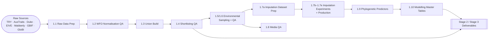

# Stage 1 — Data Pipeline Index

Date: 2025-10-30  
Maintainer: Stage 1 data engineering (phylotraits)

## Scope & Quick Facts
- Stage 1 documentation and artefacts now live under `results/summaries/phylotraits/Stage_1` following the October 2025 migration from `hybrid_axes`.
- This index links every active Stage 1 summary, the rerun commands, and the canonical outputs those stages produce.
- All paths referenced below were revalidated on 2025-10-30; see **Verified Artefact Inventory** for filesystem checks and outside-folder highlights.

## Pipeline Overview

## Stage Catalogue (non-legacy)

| Stage | Summary | Purpose | Primary Outputs (verified 2025-10-30) |
|-------|---------|---------|---------------------------------------|
| 1.1 | `1.1_Raw_Data_Preparation.md` | Standardises Duke, EIVE, Mabberly, TRY Enhanced, AusTraits, GBIF, and GloBI exports; runs WorldFlora enrichment. | ✔ `data/stage1/duke_worldflora_enriched.parquet` ✔ `data/stage1/tryenhanced_worldflora_enriched.parquet` |
| 1.2 | `1.2_WFO_Normalisation_Verification.md` | Validates GBIF ↦ WFO joins, match statistics, and enriched parquet integrity. | ✔ `data/gbif/occurrence_plantae_wfo.parquet` ✔ `data/stage1/gbif_occurrence_wfo_worldflora.csv` |
| 1.3 | `1.3_Dataset_Construction.md` | Builds the master WFO union and shortlist candidates across sources. | ✔ `data/stage1/master_taxa_union.parquet` ✔ `data/stage1/stage1_shortlist_candidates.parquet` |
| 1.4 | `1.4_Shortlisting_Verification.md` | Replays shortlist filters, GBIF coverage bands, and modelling shortlist QA. | ✔ `data/stage1/stage1_shortlist_with_gbif_ge30.parquet` ✔ `data/stage1/stage1_modelling_shortlist_with_gbif_ge30.parquet` |
| 1.5 | `1.5_Environmental_Sampling_Workflows.md` | Samples WorldClim, SoilGrids, and Agroclim rasters; aggregates means and quantiles. | ✔ `data/stage1/worldclim_species_summary.parquet` ✔ `data/stage1/soilgrids_species_summary.parquet` |
| 1.6 | `1.6_Environmental_Verification.md` | Checklist for environmental QA (null sweeps, range checks, shortlist parity). | ✔ `data/stage1/worldclim_species_quantiles.parquet` ✔ `src/Stage_1/verify_environment_nulls.py` |
| 1.7a | `1.7a_Imputation_Dataset_Preparation.md` | Creates anti-leakage XGBoost + BHPMF inputs (Perm 1–3, canonical matrix). | ✔ `model_data/inputs/mixgb_perm2_11680/mixgb_input_perm2_eive_11680_20251028.csv` *(outside Stage_1)* ✔ `model_data/inputs/trait_imputation_input_canonical_20251025_merged.csv` *(outside Stage_1)* |
| 1.7b | `1.7b_XGBoost_Experiments.md` | Benchmarks Perm 1–3 on the 1,084-species subset; documents CV scripts. | ✔ `model_data/inputs/mixgb_perm123_1084/` *(outside Stage_1)* ✔ `src/Stage_1/mixgb/mixgb_cv_eval_parameterized.R` |
| 1.7c | `1.7c_BHPMF_Gap_Filling_Imputation.md` | Reproduces the BHPMF pipeline for comparison with XGBoost. | ✔ `model_data/inputs/trait_imputation_input_canonical_20251025_merged.csv` *(outside Stage_1)* ✔ `src/Stage_1/create_bhpmf_canonical_input.py` |
| 1.7d | `1.7d_XGBoost_Production_Imputation.md` | Documents the Oct 28 production run (11,680 species, Perm 2) and verification. | ✔ `model_data/outputs/perm2_production/perm2_11680_eta0025_n3000_20251028_mean.csv` *(outside Stage_1)* ✔ `src/Stage_1/verify_xgboost_production.py` |
| 1.7e | `1.7e_XGBoost_Verification_Pipeline.md` | Automated validation suite for production imputation outputs. | ✔ `model_data/outputs/perm2_production/perm2_11680_eta0025_n3000_20251028_m1.csv` *(outside Stage_1; m2–m10 alongside)* ✔ `logs/verify_perm123_7cat_20251028.log` *(outside Stage_1)* |
| 1.8 | `1.8_iNaturalist_Media_QA.md` | High-throughput photo acquisition with aria2; maintains manifests and QA reports. | ✔ `src/Stage_1/Data_Extraction/inat_photo_prepare.py` ✔ `src/Stage_1/Data_Extraction/inat_photo_download.py` |
| 1.9 | `1.9_Phylogenetic_Predictors.md` | Builds Shipley-style p_phylo predictors for Tier 1 and Tier 2 contexts. | ✔ `model_data/outputs/p_phylo_1084_tier1_20251029.csv` *(outside Stage_1)* ✔ `model_data/outputs/p_phylo_tier2_cv/p_phylo_L_tier2_cv_20251029.csv` *(outside Stage_1)* |
| 1.10 | `1.10_Modelling_Master_Tables.md` | Produces Tier 1 and Tier 2 master tables with 741 features. | ✔ `model_data/inputs/modelling_master_1084_20251029.parquet` *(outside Stage_1)* ✔ `model_data/inputs/modelling_master_20251022.parquet` *(outside Stage_1)* |
| Annex A | `Annex_A_Austraits_TRY_Categorical_Mapping.md` | Reference mapping for categorical trait harmonisation (legacy support). | ✔ `data/stage1/austraits/` |

## Verified Artefact Inventory (2025-10-30)

| Asset | Outside Stage_1? | Status | Notes |
|-------|------------------|--------|-------|
| `data/stage1/duke_worldflora_enriched.parquet` | No | Present | Duke ethnobotany + WFO enrichment. |
| `data/stage1/master_taxa_union.parquet` | No | Present | Five-source WFO union from 1.3. |
| `data/stage1/stage1_shortlist_with_gbif_ge30.parquet` | No | Present | Canonical ≥30-occurrence shortlist. |
| `data/stage1/worldclim_species_summary.parquet` | No | Present | Mean/stddev aggregates (1.5). |
| `data/stage1/worldclim_species_quantiles.parquet` | No | Present | Quantile aggregates (1.5/1.6). |
| `model_data/inputs/mixgb_perm2_11680/mixgb_input_perm2_eive_11680_20251028.csv` | **Yes** | Present | Perm 2 imputation input (anti-leakage). |
| `model_data/inputs/trait_imputation_input_canonical_20251025_merged.csv` | **Yes** | Present | BHPMF canonical matrix. |
| `model_data/outputs/perm2_production/perm2_11680_eta0025_n3000_20251028_mean.csv` | **Yes** | Present | Production ensemble mean (Stage 1.7d). |
| `model_data/outputs/p_phylo_1084_tier1_20251029.csv` | **Yes** | Present | Tier 1 p_phylo predictors. |
| `model_data/outputs/p_phylo_tier2_cv/p_phylo_L_tier2_cv_20251029.csv` | **Yes** | Present | Tier 2 axis-specific predictors. |
| `model_data/inputs/modelling_master_1084_20251029.parquet` | **Yes** | Present | Tier 1 master table (741 features). |
| `model_data/inputs/modelling_master_20251022.parquet` | **Yes** | Present | Tier 2 master table (741 features). |
| `logs/stage1_environment/20251021/qa_report.md` | **Yes** | Present | Latest environmental QA log. |

All statuses were checked via filesystem inspection at 2025-10-30 13:10 UTC.

## Command Reference (canonical reruns)

- **Environmental sampling & aggregation:**  
  `conda run -n AI --no-capture-output python src/Stage_1/aggregate_stage1_env_summaries.py worldclim soilgrids agroclime`
- **GBIF shortlist rebuild:**  
  `conda run -n AI --no-capture-output python src/Stage_1/Data_Extraction/rebuild_shortlists.py`
- **BHPMF canonical matrix:**  
  `conda run -n AI python src/Stage_1/create_bhpmf_canonical_input.py --traits model_data/inputs/traits_model_ready_20251022_shortlist.csv --env model_data/inputs/env_features_shortlist_20251025_complete_q50_xgb.csv --output model_data/inputs/trait_imputation_input_canonical_20251025_merged.csv`
- **XGBoost 1,084-subset filtering:**  
  `conda run -n AI python src/Stage_1/experiments/filter_to_1084_subset.py --roster model_data/inputs/mixgb/roster_1084_20251023.csv --perm1_full model_data/inputs/mixgb_perm1_11680/mixgb_input_perm1_11680_20251028.csv --perm2_full model_data/inputs/mixgb_perm2_11680/mixgb_input_perm2_eive_11680_20251028.csv --perm3_full model_data/inputs/mixgb_perm3_11680/mixgb_input_perm3_minimal_11680_20251028.csv --output_dir model_data/inputs/mixgb_perm123_1084`
- **Phylogenetic predictors:**  
  `R_LIBS_USER=/home/olier/ellenberg/.Rlib Rscript src/Stage_1/build_tier1_phylo_predictors.R`  
  `R_LIBS_USER=/home/olier/ellenberg/.Rlib Rscript src/Stage_2/calculate_tier2_cv_phylo.R`

## QA & Logging

- Environmental QA artefacts live under `logs/stage1_environment/` (e.g., `logs/stage1_environment/20251021/` holds the latest sampling nohup logs and `qa_report.md`).
- Imputation verification logs reside in `logs/verify_perm123_7cat_20251028.log` and `logs/xgboost_r/`. Capture tmux session names when launching long jobs (e.g., `tmux new -s xgb_prod_20251028`).
- Append rerun notes and anomaly explanations inside the corresponding Stage 1 summary file before promoting a refreshed artefact.

## Hand-offs to Downstream Stages

- Stage 2 consumes the Tier 1/Tier 2 master tables plus the p_phylo predictors; see `1.9_Phylogenetic_Predictors.md` and `1.10_Modelling_Master_Tables.md` for merge details.
- Stage 3 indices reference the production imputation ensemble (`model_data/outputs/perm2_production/perm2_11680_eta0025_n3000_20251028_mean.csv`, with supporting `m1–m10` runs beside it) housed outside the Stage 1 folder.
- Keep Stage 1 deliverables immutable once QA passes; any refresh must rerun the scripts above, update this index’s verification date, and log changes in the relevant summary.

> **Note on storage:** All Stage 1 imputation inputs and outputs live under `model_data/` (e.g., `model_data/inputs/mixgb_perm2_11680/...`, `model_data/outputs/perm2_production/...`). When mirroring or archiving Stage 1 assets, include these directories alongside `data/stage1/`.
